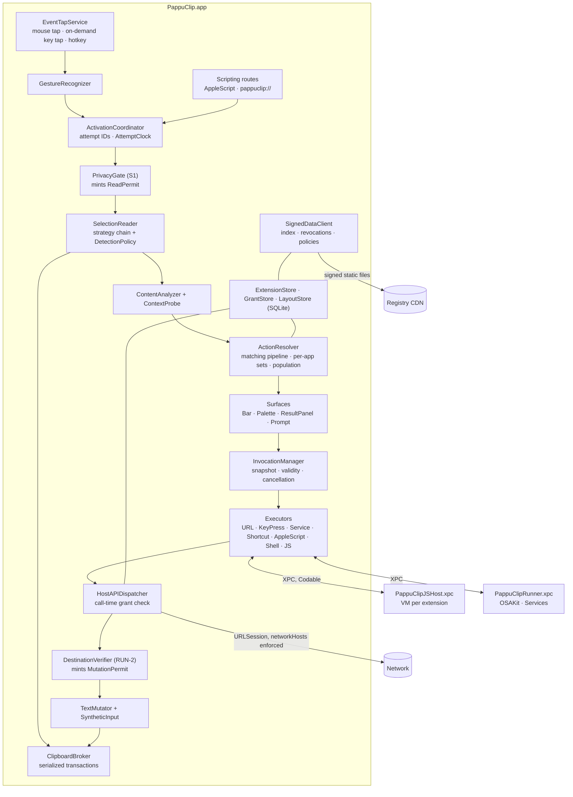
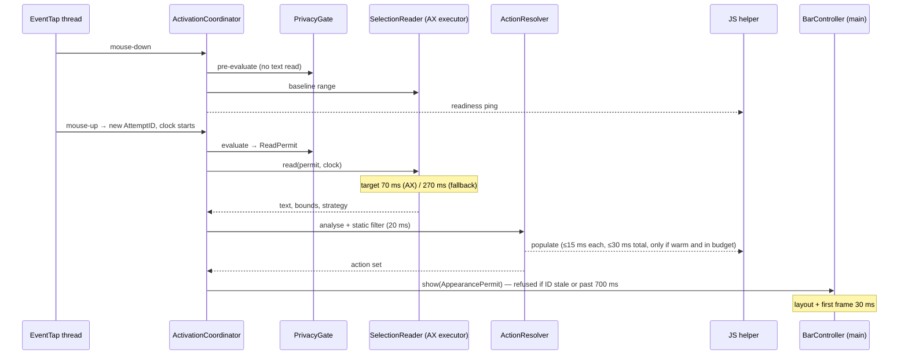
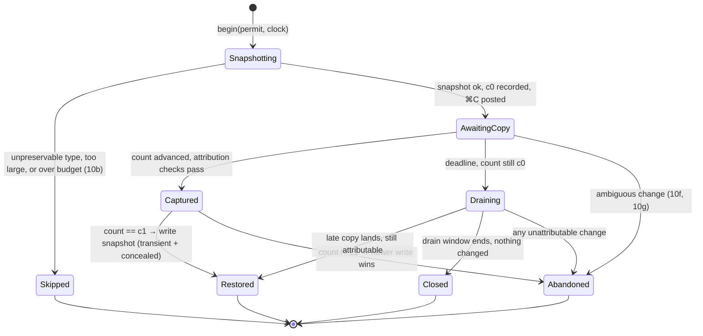
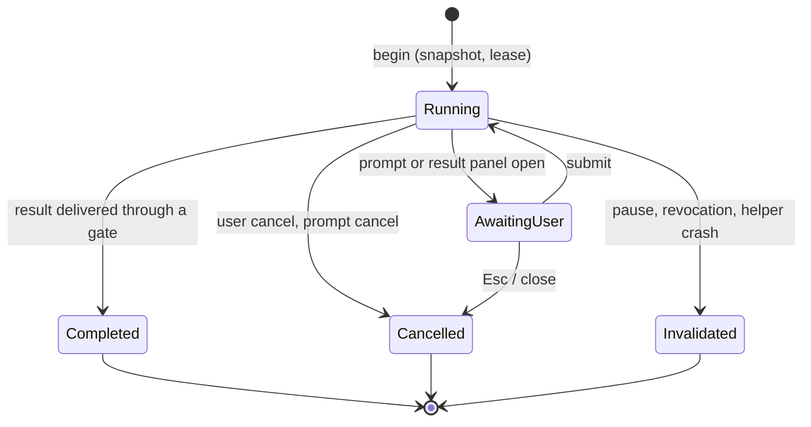

# PappuClip — Architecture

| | |
|---|---|
| **Status** | Draft v0.1, derived from PRD v0.4 |
| **Date** | 2026-09-20 |
| **Companion documents** | [PRD](PRD.md), [Extension platform specification](spec/extension-platform.md), [Safety specification](spec/safety.md), [Implementation plan](implementation-plan.md) |

**How to read this document.** It turns the PRD's §12 recommendation into a concrete design: processes, modules, data model, protocols and the mechanisms that enforce each safety requirement. Requirement IDs (ACT-10, RUN-2, SEC-7) point to the PRD and the two specifications. Statements marked *(M0)* are hypotheses that a spike in the implementation plan must confirm; statements marked *(unverified)* are platform facts I could not confirm from documentation alone. §19 lists the places where the PRD needs a decision or a small revision.

---

## 1. Architecture drivers

These are the requirements that shape the design most. Everything else fits inside them.

| Driver | Source | Design consequence |
|---|---|---|
| Zero wrong-destination mutations, zero lost clipboard writes, zero privacy-block violations | §3.3, RUN-1–5, ACT-10, ACT-12, ACT-17 | Safety rules are enforced by **types and chokepoints**, not by convention: a selection cannot be read, a bar shown, text mutated or extension code loaded without a permit object that only the responsible gate can create (§3) |
| ≤ 150 ms p95 mouse-up to first frame; 700 ms hard cutoff | §3.3, §11.1 | One monotonic clock per attempt; pre-work on mouse-down; pre-built panel; cached icons and parsed manifests; population only against a warm helper |
| Late work must never have an effect | ACT-16, RUN-3 | Every unit of work carries an attempt or invocation ID. **Work is not cancelled reliably, so effects are gated instead**: a stale ID cannot pass a gate |
| Third-party code must not crash or stall the bar | SEC-1, §11.2 | JavaScript in a sandboxed XPC helper; AppleScript and Services in a second helper; shell and Shortcuts as child processes. The app process never runs extension code |
| Consent reflects what code can do, checked when it does it | EXM-5, SEC-7 | One capability analyser shared by the app and registry CI; every host call is authorised against local grants at call time |
| No server to run | G3, §9 | Registry is a git repo; CI signs; the app reads signed static files and verifies them with pinned keys |
| Sync arrives in 1.x without migration | §7.9, SYN-1 | Stable IDs, logical revisions, tombstones and fractional ordering keys are in the 1.0 store |
| A rename must be cheap | §14 | App name, bundle-ID prefix, file extensions, URL scheme and reserved identifier prefix live in one `AppIdentity` constant set |
| One developer | §15, §17 | Few processes, one SwiftPM package, permissively licensed dependencies, tests that run without a GUI wherever possible |

---

## 2. System overview

### 2.1 Processes

| Process | Sandbox | Role | Lifetime |
|---|---|---|---|
| **PappuClip.app** | None (required for Accessibility and event posting). Hardened runtime, Apple Events entitlement | Event taps, selection reading, UI, storage, consent, host API, network on behalf of extensions, child-process execution (shell, `shortcuts`) | Login item (`SMAppService`), menu bar agent (`LSUIElement`) |
| **PappuClipJSHost.xpc** | App Sandbox, **no** network, **no** file entitlements, no JIT entitlement | Runs all extension JavaScript: one `JSVirtualMachine` + `JSContext` + thread per extension (SEC-1b). Also hosts the tooling VM (sucrase transpile, acorn capability scan) | Warm while any enabled extension is `dynamic` (JS-19); otherwise lazy. Restarted on crash |
| **PappuClipRunner.xpc** | None, hardened runtime | Executes AppleScript (OSAKit) and `NSPerformService`. Exists so blocking, uncancellable system calls never run in the app, and so cancellation can kill the process (RUN-3d) | Lazy; exits when idle |
| Child processes | Inherit | Shell Script actions and `/usr/bin/shortcuts run` | Per invocation |
| **pappuclip** CLI | None | `pappuclip run` harness (DEV-2); registry checks and packaging (`pappuclip registry …`) used by CI | Per command |

The JS helper never touches disk or network. The app sends it source text and receives host-call requests back; bundled libraries ship inside the helper's own bundle, which the sandbox can read.

### 2.2 Component map



### 2.3 Trust boundaries

| Boundary | What crosses it | Check on entry |
|---|---|---|
| Other apps → app (Accessibility, pasteboard, events) | Selection text, bounds, pasteboard contents | PrivacyGate before any read; ClipboardBroker ownership rules; size bounds (ACT-13) |
| Extension code → app (XPC host calls) | Method name, arguments, invocation ID | Invocation still valid (RUN-3b); method within grants (SEC-7b); arguments validated; mutation needs a `MutationPermit` |
| Registry CDN → app | Index, packages, revocations, policies | Pinned-key signature, sequence number ≥ stored (SEC-9), declarative schema that cannot express a loosening |
| Files, snippets, URL scheme, sync, import → app | Extension packages | Staged validation, identity resolution (SEC-8), consent before any code loads (EXM-5a) |
| AppleScript / URL scheme → app | Activation and settings commands | Same PrivacyGate as every other route (S1); installs always confirmed in-app (SCR-2) |

---

## 3. Core mechanisms

These five mechanisms are used everywhere. They are the reason the "0 occurrences" metrics in §3.3 are testable.

### 3.1 Permit types

A permit is a small, non-copyable value whose initialiser is visible only inside the module that owns the rule. APIs with side effects take a permit as a parameter, so a code path that skips the rule does not compile.

| Permit | Minted only by | Required by | Rule it carries |
|---|---|---|---|
| `ReadPermit` | `PrivacyGate.evaluate(route:target:)` | `SelectionReader.read`, `ContextProbe`, `BrowserMetadata.read` | S1 steps 1–3: secure input, hard blocks, pause, activation mode. Holds route, target pid and the gate's decision trace (for DIA-2) |
| `SyntheticCopyPermit` | `DetectionPolicyStore` + `CoexistenceMonitor` | `ClipboardBroker.captureSelectionByCopy` | ACT-10j: policy allows it on this path and PopClip is not running |
| `ExecutionApproval` | `GrantStore` | `ExtensionLoader.loadCode`, population, every executor | EXM-5a, EXM-15d, SEC-8c: this identity and content digest are approved and not revoked |
| `MutationPermit` | `DestinationVerifier.verify(invocation:)` | `TextMutator`, `SyntheticInput`, Cut | RUN-2a–h: tier, freshness, privacy recheck (RUN-2f). Single use; expires with the verification |
| `AppearancePermit` | `ActivationCoordinator` | `BarController.show` | ACT-16b: the attempt is current and inside the hard cutoff |

Permits are `~Copyable` structs consumed by the call that uses them. Remote data has no API that produces a permit, which is how SEC-9's "cannot loosen" rule is kept.

### 3.2 IDs and validity

- `AttemptID` — one per selection attempt, monotonically increasing. `ActivationCoordinator` holds the single current ID. A newer attempt, a focus change, a privacy-state change or the cutoff replaces it (ACT-16a).
- `InvocationID` — one per action run. `InvocationManager` holds each invocation's state (`running`, `cancelled`, `completed`, `invalidated`). Cancellation, pause and revocation flip it synchronously (RUN-3a, RUN-3f).
- Every async result, XPC message and clipboard transaction is tagged with its ID. Gates compare IDs; nothing else decides staleness.

### 3.3 AttemptClock

One `ContinuousClock` instant is captured at mouse-up (or at hotkey press). It exposes `remaining(in: .targetBudget)`, `remaining(in: .stage(.read))` and `isPastHardCutoff`. Stage budgets from §11.1 are data in one table, so M0 can retune them without touching code. A fallback strategy inherits elapsed time; it never starts a new timer.

### 3.4 InputEpoch

A counter incremented by the event taps on every mouse-down, key-down and scroll that did **not** land on a PappuClip surface and was not posted by PappuClip. The quiescence tier (RUN-2) is then a cheap comparison: `epoch == snapshot.epoch`.

- Events on our own surfaces are recognised by the window number under the pointer (`kCGMouseEventWindowUnderMousePointer`) matching one of our panels.
- Events we post are tagged in `CGEventField.eventSourceUserData` with a per-launch random value and ignored by the counter.

### 3.5 Effect chokepoints

All side effects leave through four functions, each of which demands a permit and re-checks the ID: `BarController.show`, `ClipboardBroker.write/restore`, `TextMutator.apply`, `HostAPIDispatcher.perform`. The lifecycle test suite instruments exactly these four.

---

## 4. Activation and selection detection

### 4.1 Event taps (ACT-15, ACT-19)

| Tap | Events | Type | Installed |
|---|---|---|---|
| Mouse tap | left down, dragged, up, scroll wheel | Session tap. Active (`.defaultTap`) and pass-through if M0 spike 2 confirms that the Accessibility grant alone authorises it; listen-only taps are gated by Input Monitoring, which would mean a second prompt *(M0)* | Always, while not paused and permission is granted |
| Key tap | key-down | Active, so BAR-9 navigation keys can be consumed | Only while a bar is visible or an invocation that may mutate text is in flight (ACT-19, RUN-2g). Created and destroyed by a reference-counted `KeyTapLease` |
| Hotkey | — | `RegisterEventHotKey` (no permission, not a tap) | While a shortcut is configured |

- Both taps run on a dedicated thread with its own run loop, so a busy main thread cannot get the tap disabled. The callback copies a small value (type, location, flags, click count, timestamp, window number, user data) and returns; all logic runs elsewhere.
- Health: the callback handles `tapDisabledByTimeout` and `tapDisabledByUserInput` by re-enabling. `CGEvent.tapIsEnabled` is also checked on wake, session-active and app-activation notifications, and the tap is rebuilt if it is gone. No timer polls it.
- Modifier state for ACT-7 and BAR-11 is read from mouse-event flags, never from a key tap.

### 4.2 Gesture recogniser (ACT-1–3, 7, 8, 14)

A pure state machine (`Idle → Pressed → Dragging → Released`, plus `LongPressArmed`) fed by the copied event values. It has no AppKit or AX dependency, so recorded gesture corpora replay through it in unit tests.

| Output gesture | Evidence |
|---|---|
| `dragSelect(direction)` | Down → movement beyond slop → up. Direction is kept for BAR-3 |
| `multiClick(count, dragged)` | Click state 2 or 3 at mouse-up, including click-and-hold-then-drag (ACT-2) |
| `shiftClick` | Shift flag at mouse-down following a plain click in the same window |
| `longPress` | One-shot 0.5 s timer armed at mouse-down, cancelled by movement or mouse-up |
| `suppressed` | ⌘ held at any point in the gesture (ACT-7) |

Keyboard-only selection never reaches the recogniser because no key tap exists at that time (ACT-8, ACT-19).

**False-positive control (ACT-14).** A gesture is only a candidate. The decision to show a bar uses several signals: the gesture type; the AX role of the element under the mouse-down point; whether the selected range differs from a **baseline range read at mouse-down** (range only, never text, and only after the PrivacyGate allows reading); and, as a weak signal only, cursor shape. The synthetic-copy path demands stronger evidence than the AX path because it has side effects.

### 4.3 Mouse-down pre-work

At mouse-down, off the latency budget: resolve the frontmost app and its `DetectionPolicy`, run PrivacyGate steps 1–3, read the baseline range, and ping the JS helper (JS-19). Secure input is rechecked at mouse-up because it is cheap and can change mid-gesture.

### 4.4 PrivacyGate (S1, ACT-12, 17, 18)

One function serves all four routes (automatic, hotkey, AppleScript, URL scheme):

1. `IsSecureEventInputEnabled()` or a focused `AXSecureTextField` → deny.
2. App hard block or pause → deny. Pause is an absolute expiry date in defaults, so it survives relaunch (ACT-18).
3. Activation mode: appearance exclusions and per-app Automatic / Hotkey only. The hotkey route may pass here; routes never pass steps 1–2.
4. Website hard blocks (ACT-17b): if any are configured and the frontmost app is a browser, the gate returns a `ReadPermit` restricted to **metadata only**. The URL is read first; an unknown URL fails closed with an explanation. A full `ReadPermit` follows only if the URL is allowed.

Every denial produces a reason code that feeds the bar message (BAR-13), the hotkey explanation (ACT-18) and the inspector (DIA-2). No reason code ever contains selection text.

### 4.5 Selection reader (ACT-9, 11, 13)

Each strategy implements `SelectionStrategy.read(permit:clock:) async -> SelectionReadResult` and reports timing and outcome for DIA-2.

| # | Strategy | Mechanism | Notes |
|---|---|---|---|
| 1 | AX attributes | Focused element → `AXSelectedText`, `AXSelectedTextRange`, `AXBoundsForRange` | All AX calls run on a dedicated serial executor with `AXUIElementSetMessagingTimeout` set from the stage budget, because AX calls block on the target app |
| 2 | WebKit text markers | `AXSelectedTextMarkerRange`, `AXStringForTextMarkerRange`, `AXBoundsForTextMarkerRange` | Safari, Mail, WKWebView hosts |
| 3 | AX-tree enabling | `AXManualAccessibility` for Electron; `AXEnhancedUserInterface` for Chromium, set narrowly and recorded per pid | Side effects and the enable/disable window are decided by M0 spike 4 |
| 4 | AppleScript | Browser-specific scripts | Needs Automation consent and, for page JavaScript, a user-enabled browser setting, so expected coverage is low *(M0 spike 3 measures it)* |
| 5 | Synthetic ⌘C | `ClipboardBroker.captureSelectionByCopy` | Needs a `SyntheticCopyPermit`; never automatic for unlisted apps, whole-line-copy apps, or while PopClip runs |

- **Bounds.** AX bounds use a top-left origin; they are converted to AppKit coordinates against the primary display. Unknown bounds fall back to the pointer location (BAR-3).
- **Large selections (ACT-13).** Text longer than a threshold is held as one `String` with analysis bounded to a prefix window and detections capped; nothing copies it per action.
- **Invalidation (ACT-16).** While an attempt is pending, an `AXObserver` on the focused element (`selected-text-changed`, `focused-element-changed`), `NSWorkspace` activation notifications and the mouse tap can each retire the `AttemptID`. See §19 item 1 for the one gap this leaves.

### 4.6 Detection policies (ACT-11)

Bundled JSON, schema-versioned, one record per bundle identifier plus a `default`:

```json
{
  "schema": 1,
  "sequence": 1,
  "default": { "strategies": ["ax", "webkitMarkers", "axEnable", "appleScript"],
               "autoAppear": true, "autoSyntheticCopy": false,
               "hotkeySyntheticCopy": true, "quiescence": true },
  "apps": {
    "com.microsoft.VSCode": { "axEnable": "manualAccessibility",
                              "copiesLineWhenEmpty": true, "autoSyntheticCopy": false },
    "com.jetbrains.intellij": { "autoAppear": false, "copiesLineWhenEmpty": true }
  }
}
```

The effective policy is `min(bundled-or-remote policy, user rules)`. The merge function takes the more restrictive value field by field, and the schema has no field that could express a privacy rule, so a remote update (ACT-11b) cannot loosen anything (SEC-9, RUN-2h).

### 4.7 Auto-appear timeline



---

## 5. ClipboardBroker (ACT-10, ACT-16)

The broker is the only code that touches `NSPasteboard.general`. It is an actor with an explicit **single open-transaction slot**; actor isolation alone is not enough, because reentrancy at suspension points would let two transactions interleave (ACT-10c).



- **Snapshot (10a, 10b).** Every item and every representation is copied. Lazily provided data is read under the remaining budget; file promises and any type that cannot be faithfully rewritten cause `Skipped`. A size ceiling applies.
- **Attribution (10d, 10g).** A change counts as ours only if all hold: it arrived inside the window after our tagged ⌘C; the frontmost app and window are unchanged; `InputEpoch` has not advanced; the change-count delta is within the policy's expected range for that app; and the pasteboard holds a text type. Anything else is ambiguous, which means abandon and leave the pasteboard as found.
- **Restore (10e, 10f).** Restoration happens only if the count still equals the value recorded at capture. The broker records its own post-restore count so it can recognise its own write.
- **Draining (16c).** A timed-out transaction stays open for a short drain window so that a delayed copy cannot be mistaken for a user copy by the next transaction. New transactions wait; they never overlap.
- **Waiting for the copy** uses a bounded, short-interval check of `changeCount` inside the open transaction. `NSPasteboard` offers no notification, so this is the one deliberate exception to "no polling"; it never runs while idle.
- **Marking (10h).** Broker-owned temporary writes carry `org.nspasteboard.TransientType` and `org.nspasteboard.ConcealedType`. The beep from ⌘C with nothing selected is avoided by checking the app's Copy menu item through AX first (`EditMenuProbe`, §6.2) where that is reliable.
- **Other clients.** `paste-result`, Paste-as-plain, `restorePasteboard` and `pasteboard.*` host calls all go through the same broker and the same ownership rules. Pasting requires a settle delay before restoration because an app's read after ⌘V cannot be observed; the delay is policy data.

The pasteboard is behind a `PasteboardProviding` protocol, so the race suite drives the state machine with scripted interleavings and a seeded scheduler (§17).

**What M0 spike 6 found, not yet designed in.** The state machine and rules above are as they were before the spike. Its pasteboard half is answered (`docs/spikes/spike-6-clipboard.md`, one Mac, macOS 26.4.1) and these change the design; they are to be folded in before the broker is built in M1 week 3:

- The change count moves when a writer *clears*, not when it has written. "Count advanced" and "holds a text type" are therefore two moments, 0.14–0.28 ms apart at p50 for a prompt writer and as far apart as the app likes. As written, Attribution abandons a good copy it looks at too early. It needs a short wait for the text, spent from the same window, with the length as policy data.
- A lazy provider is served by the source app's main thread, and a read of a hung provider blocks until the provider answers or dies (over 12 s seen) with no way to cancel. The snapshot has to run on a thread the broker can walk away from, with a deadline that ends in `Skipped`. A representation that is listed and returns no data also means `Skipped`.
- Between Restore's count check and its `clearContents` there is a gap (p95 0.13–0.15 ms idle, 0.36 ms with another writer at work) in which a newer write can be destroyed. It cannot be prevented. It can be known, by comparing what `clearContents` returns with the checked count plus one, and is a safety event (ACT-10f).
- A state is missing after `Restored`: keep watching for the rest of the drain window. Without it a transaction that captured the wrong write leaves the app's real copy on the clipboard.
- Two holes the pasteboard alone cannot close: a copy that lands after any finite drain window, and a write from another program that lands between the ⌘C and the app's copy, which passes every Attribution check above. The first is a matter of per-app copy latency, not yet measured. **The second needs a decision**; the candidates are in the report.
- Snapshot and restore cost about 0.6 ms a megabyte, so the size ceiling is a matter of memory and not of time.

---

## 6. Content analysis and action resolution

### 6.1 ContentAnalyzer (FLT-2)

`NSDataDetector` for links and emails, plus custom detectors for scheme-less domains (against a bundled TLD list), non-http schemes (the scheme list is data, §7.4) and file paths (`~` and `..` expanded, existence checked off the main thread with a time cap). Each detection records its ranges. Output is an immutable `AnalyzedSelection`.

### 6.2 ContextProbe (FLT-3, FLT-6)

| Fact | Source |
|---|---|
| App name, bundle identifier | `NSRunningApplication` |
| Editable | `AXUIElementIsAttributeSettable(AXSelectedText)`, element role, Chromium/WebKit editable-ancestor attributes |
| `canCut`, `canCopy`, `canPaste` | Editability plus `EditMenuProbe`: the app's Cut/Copy/Paste menu items located once per pid by command character (not localised title), cached, then only their `enabled` state is read |
| `hasFormatting` | AX attributed-string support on the element |
| Browser URL and title | `BrowserMetadata`: AX first (`AXWebArea` → `AXURL`, window title), AppleScript second (needs Automation consent, ONB-5). A per-browser capability table records what each browser supports (§11.5) |

HTML, RTF and Markdown forms are captured only when a visible action sets `captureHtml` or `captureRtf` (FLT-4), following the documented fallback chain. Sanitising uses an allow-list sanitiser in the app; Markdown is generated from the sanitised HTML.

### 6.3 ActionResolver (FLT-1, FLT-5, §8.5, ALM-8)

Pure function over `(AnalyzedSelection, Context, LayoutSnapshot, OptionValues, GrantSnapshot)`:

1. Drop items whose extension lacks an `ExecutionApproval`, is disabled, suspended or revoked.
2. Apply `requiredApps`, `excludedApps` and option-value conditions.
3. Evaluate `requirements` with negation and the legacy synonyms; narrow and normalise the text.
4. Apply `regex` (ICU via `NSRegularExpression`) to the narrowed text.
5. Apply per-app visibility, which can only remove items (ALM-8).
6. Ask `dynamic` extensions to populate, within the remaining budget and only if the helper is warm (JS-16). Reserved slots are laid out first, and late population is dropped rather than shifting buttons.

The bar and the palette call the same resolver, so they always show the same effective set (ALM-8, BAR-16).

---

## 7. The bar and interactive surfaces

| Surface | Window | Key focus | Content |
|---|---|---|---|
| **Bar** (BAR-1–13) | One pre-built `NSPanel`, `.nonactivatingPanel`, borderless, `canBecomeKey == false`, joins all Spaces, full-screen auxiliary. Level and collection behaviour set by M0 spike 1 | Never | AppKit views drawn directly; `NSVisualEffectView` background; callout arrow; pre-rendered template icons |
| **Palette** (BAR-16) | Non-activating panel that **can** become key | Yes, without activating PappuClip, so the source app stays frontmost | Search field + list; ranking is prefix, then word-boundary, then subsequence, with ties in user order |
| **Result panel** (BAR-17) | Same as palette | Yes | `NSTextView` (TextKit 2), selectable; Markdown via swift-markdown and our own renderer |
| **Prompt** (JS-18) | Same as palette | Yes | One labelled field, Submit and Cancel |
| Settings, consent sheets, Manage Extensions | Normal activating windows | Yes | SwiftUI |

- **Focus (BAR-1, RUN-1c).** Because the key-capable panels are non-activating, the source app remains the active application and its focused element does not change. That makes focus restoration trivial and keeps destination verification meaningful while our surface is open. `InvocationManager` records "PappuClip surface is key" as its own state, not as a destination change. *(M0 spike 1 confirms the AX focused element is stable in this state.)*
- **Keyboard mode (BAR-9).** The bar has no focus, so navigation keys are consumed by the key tap and routed to `BarController`; any other key dismisses the bar and passes through (BAR-10).
- **Placement (BAR-2–5).** A pure `BarLayout` function takes selection bounds, pointer, drag direction, position preference, the target screen's visible frame and measured button widths, and returns the frame, arrow position and page split. It is unit tested across display arrangements. `wantsPrimaryDisplay` offsets the frame so that button sits under the pointer.
- **Safe Markdown (BAR-17).** The renderer emits attributed text only. Raw HTML is shown as text, images are never loaded, and links are inert until clicked, then opened through an explicit confirmation of the destination host.
- **Feedback (BAR-12a).** Spinner, "Copied", tick and shaking X are states of one `BarFeedback` view; each change posts an accessibility announcement. Reduce Motion replaces the shake with a static state.
- **Accessibility (BAR-14).** Every control has a label and role; the bar posts layout-changed and announcement notifications when it appears. VoiceOver access to a panel that never becomes key is a known difficulty and has its own test item in M1.
- **Dismissal (BAR-10).** Event-driven only: outside mouse-down (mouse tap), ordinary key (key tap), pointer departure (tracking area) and scroll (mouse tap).

---

## 8. Invocation lifecycle and text mutation (RUN-1–5)

### 8.1 Snapshot

`InvocationManager.begin` captures, immutably: input text and detections, modifiers, option values, the extension's identity digest, and a `DestinationSnapshot` — pid, bundle identifier, focused window element, focused element, selected range, a hash of the selected text, the strategy that read it, `InputEpoch`, and the monotonic time (RUN-1a). If the action may mutate text, the manager takes a `KeyTapLease` for its whole life (RUN-2g).



### 8.2 DestinationVerifier (RUN-2)

| Tier | Check |
|---|---|
| Accessibility-verified | Same pid, window and focused element (`CFEqual`); element still editable; selected range and text hash unchanged |
| Quiescence-verified | Read strategy was 4 or 5; same frontmost pid and window; `InputEpoch` unchanged; elapsed ≤ policy window (initially 3 s); policy allows the tier |
| Unverifiable | Anything else. No permit. The result goes to the result surface for explicit copy and is **not** written to the clipboard (RUN-2c, 2d) |

The verifier re-runs PrivacyGate steps 1–2 every time (RUN-2f). Replace and Insert buttons call it at click time and show why they are disabled when it fails (RUN-2e).

### 8.3 TextMutator (RUN-4)

Mutation is "put text on the pasteboard through the broker, then issue Paste", because that is what gives one native Undo step in the widest set of apps. Paste is issued by synthetic ⌘V, or by pressing the cached Paste menu item where the policy says that is more reliable. Insert first collapses the selection to its end through AX, which is only possible at the Accessibility-verified tier; otherwise Insert is disabled. Setting `AXSelectedText` directly is not used by default because most apps do not register it with Undo. Unsupported targets are listed in the compatibility guide.

### 8.4 Cancellation (RUN-3)

`cancel(id)` flips the state first, then stops owned work: terminates child processes (SIGTERM, then SIGKILL), asks the Runner to abort and kills it if it does not, and tells the JS helper to drop the invocation. Any later host call or result carrying that ID is rejected at `HostAPIDispatcher` and at the result gate. If a delegated action (Shortcut, Service, AppleScript, shell) had already started, the UI says it may have completed (RUN-3e).

---

## 9. Extension subsystem

### 9.1 Parsing (FMT-1–6, §8.3, Appendix A)

| Stage | Component | Notes |
|---|---|---|
| Detect form | `SnippetDetector`, `PackageInspector` | Marker rules, 5,000-character limit for selected-text installs (EXM-2), exactly one `Config.*` file |
| Decode | YAML (Yams with a **YAML 1.2 core-schema resolver**, because libYAML's 1.1 defaults would read `yes`, `no` and `on` as booleans), JSON, plist (`<false/>` → null) | Tabs rejected as indentation |
| Normalise keys | `KeyNormalizer` | FMT-5 rules, then the legacy map; table-driven and tested against every spelling |
| Build model | `ManifestBuilder` → `ExtensionManifest` | Top-level action keys become defaults; `dynamic` exclusivity; module restrictions; API-level gate (§8.1) |
| Code snippets | `CodeSnippetParser` (FMT-2) | Comment-header extraction for `//`, `--` and `#` |

`ExtensionManifest` is a plain `Sendable`, `Codable` value. The parser lives in the UI-free core module, so the CLI and registry CI use exactly the same code.

### 9.2 Identity and provenance (SEC-8)

- Each installed extension gets a `LocalIdentity` (UUID). The manifest `identifier` is an attribute, never the key.
- `Provenance` is either `registry(namespace, publisherRecord, keyID)` or `local(originKind, contentDigest)`, where the digest is SHA-256 over a canonical list of file paths and hashes.
- Grants and Keychain items are keyed by `LocalIdentity` + instance ID, and each grant stores the identity digest it was given to. A content change in local code no longer matches, so the extension returns to "pending approval" before it can run (SEC-8c).
- `IdentityResolver` implements the EXM-2 and SEC-8d collision table: same identifier and same trusted provenance → offer replacement; anything else → separate install with a new `LocalIdentity`, or an explicit trust transition (SEC-8e–g).

### 9.3 Capabilities and consent (EXM-5, EXM-15, SEC-7)

`CapabilityAnalyzer.effective(manifest, files) -> CapabilitySet`:

- **Non-JavaScript actions:** derived from the action type and its keys — fixed or option-derived URL host, key combinations, Service or Shortcut name, shell and AppleScript (always gated), and applications named in AppleScript `tell` blocks as known destinations (SEC-7a).
- **JavaScript:** entitlements, `networkHosts`, and the set of reachable host methods. The scan runs acorn in the helper's tooling VM over the transpiled source **as data**; the extension's code does not execute. Any access it cannot bound — computed member access, aliasing the `popclip` object, `eval`, `Function` — marks the extension "cannot be bounded", which is gated once and lists the sensitive methods (EXM-5f, SEC-7c).
- **Registry packages** carry a signed capability record that replaces the scan as the bound (EXM-5e).

The analysis exists for **disclosure**. **Enforcement** is separate and happens at call time in `HostAPIDispatcher` (§10.4), so a scan that misses something cannot grant anything.

`ConsentPresenter` turns a `CapabilitySet` into the two-level sheet using the phrase table in safety spec §S4. The batch sheet (EXM-15) uses the same model: one confirmation for listed-only extensions and one default-off switch per gated extension.

### 9.4 Install pipeline (EXM-1, 2, 9, 12)

`stage → validate form → resolve identity → verify signature (registry) → analyse capabilities → consent → activate → record`.

Staging happens in `Staging/<uuid>` on the same volume. Activation is one `rename(2)` into `Extensions/<LocalIdentity>/<versionDigest>/` plus one SQLite transaction that moves the `active_version` pointer and snapshots non-secret options. Version folders are immutable; the previous one is retained for rollback (EXM-13). A failure at any step deletes the staging folder and changes nothing. M2 builds this shape; M5 adds downloads, update policy, rollback UI and safe mode on top of it.

### 9.5 Executors

| Type | Where it runs | Mechanism | Cancel |
|---|---|---|---|
| URL | App | Template expansion with encoding options; `NSWorkspace.open` with the current browser if known, `activates = false` for background tabs; adjacent-tab control through per-browser AppleScript (P1) | — |
| Key Press | App | Combo parser → tagged `CGEvent`s to session, pid or HID target; needs a `MutationPermit` | Stops the remaining sequence |
| Service | Runner | `NSPerformService` with a unique private pasteboard | Kill Runner |
| Shortcut | Child process | `/usr/bin/shortcuts run <name>` with stdin/stdout files; never brings Shortcuts forward | Terminate |
| AppleScript | Runner | OSAKit; placeholder substitution or handler call with parameters; structured error numbers (502 → settings) | Kill Runner |
| Shell Script | Child process | `Process` with `POPCLIP_*` and `PAPPUCLIP_*` variables, package working directory, `shellMode` and interpreter rules from §8.4; exit 2 → settings | Terminate, then kill |
| JavaScript | JS helper | §10 | Drop invocation; kill helper if it does not yield |
| `builtin` (reserved) | App | Native implementations for bundled extensions only (§19 item 2) | Per action |

`StepPipeline` runs `before`, the executor, then `after`, checking invocation validity between steps; every step that writes the clipboard or mutates text goes through the broker and the verifier (§8.6 of the extension spec).

### 9.6 Options, secrets, icons

- **Options UI (ALM-6, §8.9).** A SwiftUI form generated from the option schema. Values are stored per instance. `secret` values go to the Keychain under `LocalIdentity` + instance + option ID; `password` values exist only for the duration of an `auth` call.
- **Icons (§8.11).** `IconSpecifierParser` → `IconSpec` (modifiers + base) → `IconRenderer` → template `NSImage`, cached in memory and on disk by specifier hash and scale. Iconify lookups are made by the app, cached, and disclosed in the privacy policy.

---

## 10. JavaScript runtime (JS-1–19, SEC-1–3, SEC-6)

### 10.1 Helper structure

- One `ExtensionVM` per extension: its own `JSVirtualMachine`, `JSContext`, thread, module cache and timer queue. Nothing is shared (SEC-1b).
- One tooling VM for sucrase (TypeScript, `import`/`export` → `require`) and the acorn scan. Transpiled output is cached by the app, keyed by content digest.
- No JIT entitlement: JavaScriptCore runs in its interpreter tiers. *(M0 spike 5: population fits with room to spare, p95 0.2 ms for the slowest fixture against 15 ms. The interpreter is 8 to 13 times slower than the JIT on calls and regular expressions, which matters for heavy actions and not for population. See `docs/spikes/spike-5-js-helper.md`.)*

### 10.2 Bridge

Transport is the Swift `XPCSession` API (macOS 14+) with `Codable` messages. *(M0 spike 5 found no problem with it, including a blocking host call made while the app is waiting on the helper, so the `NSXPCConnection` fallback is dropped.)*

The helper's listener takes `XPCReceivedMessage` and answers with `handoffReply(to:)` from the VM's own queue. The plain handler, `Codable` in and `Encodable` out, answers in line and is used only for messages that never touch a VM (`ping`, status). Without this, §10.1's thread per VM does not make the VMs independent: one busy VM held a 0.1 ms `populate` for another extension, and `ping`, for 549 ms *(measured, spike 5)*.

Messages:

| Direction | Message | Purpose |
|---|---|---|
| App → helper | `load(extension, sources, approvalDigest)` | Create or refresh a VM. Sent only with an `ExecutionApproval` |
| App → helper | `populate(extension, attemptID, input, context, deadline)` | JS-13; options are sent without secrets |
| App → helper | `invoke(extension, invocationID, action, input, context, options)` | Run an action; secrets included for the owning extension only |
| App → helper | `drop(invocationID)`, `ping`, `unload(extension)` | Cancellation, warm-up, teardown |
| Helper → app | `hostCall(invocationID, callID, method, args)` → reply | Every `popclip.*`, `pasteboard.*`, XHR, module resolution and external-script call |
| Helper → app | `log(extension, line)` | `print()` → Debug Console (DIA-1) |

Host calls come in blocking form (the VM's own thread waits for the reply; used by synchronous APIs such as `pasteboard.text`) and promise form (XHR, `promptText`, `runShellScript`). Pure utilities — hashing, Base64, query building, UUIDs — are implemented inside the helper and never cross the bridge. Dictionary and spelling lookups are host calls.

### 10.3 Module loading (JS-10, JS-14)

The helper asks the app to resolve `(extension, specifier, fromPath)`. The app enforces containment (no absolute paths, no escape from the package), returns the source text, and the helper caches the result. Bare specifiers fall through to the bundled libraries in the helper's bundle.

### 10.4 HostAPIDispatcher (SEC-7b)

For every host call, in order: the invocation is still valid (RUN-3b) → the call kind is permitted in this phase (population rejects everything, JS-13) → the method and its arguments fall within this identity's grants → for mutating methods, obtain a `MutationPermit` → perform. A refusal rejects the JavaScript promise or throws, and is written to the Debug Console without selection content.

Examples of argument-level checks: `openUrl` host against the reviewed capability record; XHR host against `networkHosts` and the https rule (JS-8); `pressKey` against the gated synthetic-input grant; `runShellScript` against the `script` grant.

### 10.5 Network (SEC-1c, SEC-6)

`XMLHttpRequest` in the helper is a shim over a `httpRequest` host call. The app performs it with an ephemeral `URLSession` — no cookies, no credential storage, no redirects to hosts outside `networkHosts` — and streams back status, headers and body.

### 10.6 Population and the warm helper (JS-13, 16, 19)

- The app starts the helper at launch if any enabled extension is `dynamic`, and loads those modules. It re-creates them after a crash or a memory-pressure teardown.
- A population request carries a deadline computed from `AttemptClock`. The app does not wait past it; late replies are dropped by `AttemptID`. If the helper is cold, population is skipped for that appearance and the omission is recorded (without content) for DIA-2. *(M0 spike 5: a cold helper reaches a first populated reply in about 50 ms at p95, against a 30 ms stage, so skipping is right. It is also shorter than a drag selection, so mouse-down pre-work (§4.3) could start and warm a cold helper, not only notice that it is cold. Proposed for M3.)*
- During population the VM runs with a phase flag: no timers, no `popclip` methods, no secrets, and the dispatcher rejects any host call tagged with a population ID.
- Population cost is linear in the selection's length, and one regular-expression extension over 100 KB used a whole function's 15 ms *(spike 5, 15.9–16.2 ms at p95, all of it inside the helper)*. **Proposed:** population is given at most the first 16 KB of the selection's text with the full length alongside (2.5 ms for the same fixture); invocation always gets the full text. To be checked in M2 against the corpus for population functions that look at the end of the text. Until that is settled the deadline is the only bound.

### 10.7 Watchdog and crash handling (SEC-1d, SEC-2)

JavaScriptCore's execution-time limit is private API, so the watchdog is process-level. While any VM is executing, the app samples the helper's CPU and memory footprint; a runaway kills the helper. The app always knows which extensions had code running, so it attributes the failure, fails those invocations with an explanation, restarts the helper and re-warms it. Three attributed crashes within a window suspend the extension (state `suspended`, shown in Extension Info). Killing the helper also fails unrelated invocations that were in flight; that is rare and accepted in exchange for a single warm process. User-initiated actions have no fixed timeout.

launchd does not restart a helper that died before it was ten seconds old until those ten seconds are up; after that a restart takes about 25 ms *(M0 spike 5)*. Three things follow. "Cold, population skipped" (§10.6) is the state for the whole of that wait and is not a second failure. The suspension window is counted in attempts to run the extension, not in wall-clock retries, because every retry inside the wait fails the same way. And an extension whose code was loading when the helper died is suspended on the first attributed crash, not the third, since a crash loop during warm-up costs ten seconds a lap.

### 10.8 Developer support (DEV-1, DEV-2)

Development mode sets `JSContext.isInspectable` for Safari Web Inspector and enables verbose logging for an approved development folder. `pappuclip run <file> [function]` loads a module in the same helper code, with host calls served by a headless stub, and exits 0 or 1.

---

## 11. Storage and data model

| Data | Store | Reason |
|---|---|---|
| General and App settings, pause expiry, hotkey | `UserDefaults` | Simple, scriptable, local by definition |
| Extensions' files | `~/Library/Application Support/PappuClip/Extensions/<LocalIdentity>/<versionDigest>/` | Immutable version folders enable atomic activation and rollback |
| Layout, instances, options, grants, rules, provenance | SQLite through GRDB, `Store/pappuclip.sqlite` | Transactions for atomic install; explicit control over merge semantics, which SwiftData's CloudKit mirroring does not give (SYN-2) |
| Secrets | Keychain (`sync` or `local` per option) | SEC-3 |
| Caches (icons, transpiled code, index) | `~/Library/Caches/PappuClip/` | Rebuildable |
| Highest seen sequence numbers for signed data | SQLite | Rollback protection (SEC-9) |

**Main tables.**

| Table | Key columns | Sync-ready fields |
|---|---|---|
| `extension` | `local_identity`, `manifest_identifier`, `origin`, `provenance`, `active_version`, `state` (enabled, pending-approval, disabled, suspended, revoked), `updates_paused` | — |
| `extension_version` | `id`, `local_identity`, `version`, `content_digest`, `signature_status`, `capability_record`, `retained` | — |
| `instance` | `id` (UUID), `local_identity`, `action_key`, `name`, `icon`, `show_as`, `color` | `revision`, `device_id`, `deleted_at` |
| `list_item` | `id` (UUID), `parent_id`, `kind` (action, folder, section, page-break), `order_key`, `instance_id`, `enabled` | `revision`, `device_id`, `deleted_at` |
| `option_value` | `instance_id`, `option_id`, `value` | `revision`, `device_id` |
| `grant` | `local_identity`, `identity_digest`, `capability`, `scope`, `decision`, `decided_at` | Never synced or exported |
| `app_rule`, `site_rule`, `app_action_override` | bundle ID or pattern, mode | Local only |
| `config_snapshot` | `local_identity`, `version_id`, non-secret options | For rollback and import recovery |

- `order_key` is a fractional-index string, so concurrent reorders merge without renumbering (SYN-2).
- Deletions set `deleted_at` rather than removing rows (SYN-1).
- List edits are recorded as commands on an undo stack that maps to `NSUndoManager` (ALM-3a).
- `ConfigArchive` (CFG-1–3) is a versioned zip of a JSON document plus local package folders. The exporter reads from tables that contain no secrets or grants, so exclusion is structural rather than a filter.

---

## 12. Signing, remote data, registry and updates

### 12.1 Signatures (§8.13, SEC-9)

- Ed25519 through CryptoKit. The app pins a set of `(keyID, publicKey, role)`; roles are `package` and `data`. A rotation statement signed by a pinned key can introduce a new key; app releases can also add or retire keys.
- **Package signature:** a reserved file (`_PappuSignature.json`) holding a canonical-JSON manifest — identifier, version, every file path with its SHA-256, the reviewed capability record, any registry-supplied `networkHosts`, key ID — and the signature over it. PopClip's `_Signature.plist` is ignored.
- **Signed data documents** (index, revocation list, detection policies): `{schema, sequence, issuedAt, payload}` plus a detached signature. `SignedDataClient` verifies the signature, requires `sequence` ≥ the stored maximum, decodes into a declarative type, and only then hands it on.
- The app refuses a package version lower than the installed one unless the user started a rollback (EXM-13).

### 12.2 Registry and CI (§9.3, §9.6)

| Piece | Form |
|---|---|
| `registry` repo | `entries/<identifier>.yaml` (source repo, tag, pinned commit, optional `networkHosts`, capability record), review policy, merger list |
| Pull-request workflow | Runs `pappuclip registry check` on a macOS runner: PUB-4 limits, identifier stability, licence file, write-access proof for the pull-request author (PUB-2), and the **same** `CapabilityAnalyzer` the app uses, posting the capability summary as a check |
| Release workflow (default branch, protected environment, required approval) | `pappuclip registry build` from the pinned commit → strip files → sign → upload package → regenerate index, revocation list and website |
| Hosting | Packages as release assets, which gives per-file download counts for DIR-5 with no service of ours; index, detail files and website on static hosting behind a CDN |
| Website | Static site generated from the index; search runs in the browser over a prebuilt index |

Using one Swift code base for parsing and capability analysis in both the app and CI is deliberate: the consent a user sees and the record a reviewer approves cannot drift apart.

### 12.3 Updates, rollback, revocation, safe mode (§9.4, EXM-12–14, SEC-5)

- `UpdateService` downloads the whole static index and compares locally, so the server never learns what is installed.
- An update runs the install pipeline in the background up to the consent step. If `CapabilitySet` grew, it pauses and shows the delta (EXM-5h); the working version stays active.
- Rollback re-validates trust and capabilities, refuses revoked versions, and restores the matching option snapshot without touching newer secrets.
- The revocation list is fetched with each update check. A revoked version is disabled at once and its invocations are invalidated (RUN-3f); this still happens while updates are paused.
- **Safe mode** is decided in `main` before any store or extension code initialises: a held modifier at launch, a launch argument, or automatic entry after repeated early crashes. Only bundled extensions load; settings and Manage Extensions remain usable.

---

## 13. Settings, scripting, onboarding, diagnostics

- **Settings (§7.5).** SwiftUI over observable stores; the Actions list is an outline backed by `list_item` with drag and drop, undo and search.
- **AppleScript (SCR-1).** An `.sdef` whose command handlers call `ActivationCoordinator` with `route: .script`, so they meet the same gate as the hotkey.
- **URL scheme (SCR-2).** `pappuclip://install`, `settings`, `appear`. Install always ends in the in-app consent flow.
- **Onboarding (ONB-1–6).** Accessibility status uses `AXIsProcessTrusted` plus the distributed notification posted when the trust database changes, then verifies by creating the tap; a stale grant is detected when the process is trusted but tap creation fails (ONB-4). `CoexistenceMonitor` watches `NSWorkspace` launch and termination notifications for PopClip's bundle identifier and withholds `SyntheticCopyPermit` while it runs (ONB-6).
- **Debug Console (DIA-1)** subscribes to the log stream from both helpers and the install pipeline.
- **Inspector (DIA-2).** Every attempt writes an `AttemptTrace` — gesture, policy, gate decision, each strategy with outcome and duration, population skips, final outcome — into a small ring buffer. It holds no text.
- **Crash reports and beta diagnostics (DIA-3, DIA-4).** Opt-in. Payload types have no field that could hold text, app names or option values; latency is reported as histogram buckets from `OSSignposter` intervals.

---

## 14. Concurrency model

Swift 6 language mode with complete concurrency checking.

| Isolation domain | Owns |
|---|---|
| Event-tap thread (plain thread + run loop) | Tap callbacks only; hands copied values to the recogniser |
| `ActivationCoordinator` (actor) | Gesture recogniser state, current `AttemptID`, `InputEpoch` |
| `AXActor` (global actor on a dedicated serial executor) | Every Accessibility call; blocking is confined here |
| `ClipboardBroker` (actor + explicit transaction slot) | `NSPasteboard.general` |
| `InvocationManager` (actor) | Invocation states, key-tap leases |
| `ExtensionStore`, `GrantStore` (actors over GRDB) | Persistence |
| `MainActor` | All surfaces and Settings |

Rules: no `Task.detached` without an ID; no effect without a permit; nothing on `MainActor` awaits an AX or XPC call directly — it receives results.

---

## 15. Repository layout

```
PappuClip/
├── App/                          Xcode project (XcodeGen, `project.yml`): app, two XPC services, CLI
│   ├── SpikeLab/                 throwaway host for the M0 spikes; deleted when M0 closes
│   ├── PappuClip/                entry point, Info.plist, .sdef, entitlements
│   ├── PappuClipJSHost/          XPC service target (sandboxed)
│   ├── PappuClipRunner/          XPC service target
│   └── pappuclip-cli/
├── Packages/PappuKit/            one SwiftPM package, several targets
│   ├── PappuCore                 IDs, clock, permits, models, manifest parsing, key normalisation,
│   │                             matching pipeline, CapabilityAnalyzer, signing. No AppKit
│   ├── PappuSelection            taps, gestures, PrivacyGate, strategies, policies, ClipboardBroker
│   ├── PappuAnalysis             ContentAnalyzer, ContextProbe, BrowserMetadata
│   ├── PappuExtensions           store, identity, install pipeline, grants, consent model, options, icons
│   ├── PappuRuntime              InvocationManager, DestinationVerifier, TextMutator, executors, StepPipeline
│   ├── PappuJSBridge             XPC message types shared by app and helper; HostAPIDispatcher
│   ├── PappuJSHost               helper side: VMs, globals, polyfills, module loader
│   ├── PappuSurfaces             bar, palette, result panel, prompt
│   ├── PappuSettings             SwiftUI settings, consent sheets, Manage Extensions
│   ├── PappuRegistry             SignedDataClient, UpdateService, revocation; registry CLI commands
│   ├── PappuDiagnostics          console, AttemptTrace, signposts, opt-in reporting
│   ├── PappuTestSupport          fakes: clock, pasteboard, AX world, event source, scheduler
│   ├── PappuHarness              dev only: results format, latency recorder, Tier A app matrix
│   └── PappuDevTools, pappu-dev  dev only: traceability checker, results digest (CI runs it)
├── Resources/                    BuiltinExtensions/, DetectionPolicies/, url-schemes.json, JS libraries
├── Tests/                        corpus/ (pinned submodule), gestures/, conformance/, FixtureApp/, results/, traceability.yaml
├── Scripts/                      dev-signing setup, build, run-spike, layering lint, release, notarize
└── docs/
```

The shipping app links neither `PappuHarness` nor `PappuDevTools`. The harness names apps (the Tier A matrix, per-app results), and diagnostics payloads may never carry an app name (DIA-4), so those types cannot live in `PappuDiagnostics`. `Scripts/lint-layering.sh` checks this rule, that `PappuCore` imports no UI framework, and that `PappuJSHost` imports no app-side module.

Separate repositories: `registry`, `website`, `types` (MIT), `extension-template` (MIT), `extensions` (ported catalogue).

**Dependencies** (all permissive, so both licence outcomes in §13 of the PRD remain open): Sparkle 2, Yams, GRDB, swift-markdown, swift-argument-parser, ZIPFoundation; the JavaScript libraries in JS-9 plus acorn. The hotkey recorder is small enough to write ourselves.

**Build and signing.** `Scripts/setup-dev-signing.sh` creates a stable self-signed certificate so contributors keep their Accessibility grant across rebuilds (§12 of the PRD). Official builds use Developer ID, hardened runtime, notarization and Sparkle EdDSA.

---

## 16. Latency design summary

| Technique | Saves |
|---|---|
| Policy lookup, gate pre-evaluation, baseline range and helper ping at mouse-down | Most of the non-read part of the 70 ms stage |
| AX messaging timeout derived from the stage budget | Bounds the worst case of a slow target app |
| Panel created at launch; buttons are reused views; icons pre-rendered per scale | Keeps layout and first frame inside 30 ms |
| Manifests parsed once into an in-memory `LayoutSnapshot`; resolver is a pure function over it | Keeps filtering inside 20 ms with 50 extensions |
| Population only against a warm helper, with a deadline, never awaited past it | Protects the target budget (JS-16) |
| `OSSignposter` interval per stage, per attempt | Produces the p95 figures and DIA-4 histograms from the same instrumentation |

---

## 17. Testing architecture

| Layer | How | Covers |
|---|---|---|
| Pure logic | Unit tests on `PappuCore` and the pure functions (`BarLayout`, `ActionResolver`, `KeyNormalizer`, `IdentityResolver`, `CapabilityAnalyzer`, policy merge) | FMT, FLT, §8.5, BAR-3/5, SEC-7, SEC-8, SEC-9 merge rules |
| Gesture corpus | Recorded event streams with expected outcomes replayed through the recogniser | ACT-1–3, 7, 8; false-positive and missed-appearance rates |
| Race and lifecycle simulation | `PappuTestSupport` fakes behind `PasteboardProviding`, `AccessibilityProviding`, `EventPosting`, `Clock`; a seeded scheduler runs thousands of interleavings; assertions sit on the four effect chokepoints | ACT-10a–j, ACT-16a–c, RUN-1–5 |
| Fixture app | A small app with a text view, secure field, web view, read-only text, a deliberately slow lazy pasteboard provider and a whole-line-copy mode | End-to-end detection, mutation, Undo |
| Compatibility corpus | Pinned submodule; CI loads every eligible package and publishes the manifest with load and functional results | G2, §3.3 |
| API conformance | JavaScript suites run by `pappuclip run` | JS-1–19, safety exceptions |
| App matrix | Scripted where possible, manual checklist otherwise, per release | §11.5 |
| Trust and recovery | Scripted install, update, interruption, rollback, revocation, downgrade, tampered signed data, safe mode | EXM-12–15, SEC-5, SEC-9 |
| Traceability | `Tests/traceability.yaml` maps each ID or lettered part to tests; CI fails if a P0 or P1 ID in scope for the current milestone has none | §16 of the PRD |

Hosted CI runners cannot grant Accessibility, so everything above the fixture-app line is designed to run without it; AX-dependent suites run on a local or self-hosted Mac.

---

## 18. Security summary

| Threat | Control |
|---|---|
| Malicious extension exfiltrates selections | Helper has no network; app-side proxy enforces `networkHosts`; "any server" is gated; URL-based transmission is disclosed |
| Extension escalates through another route | Call-time grant checks; SEC-7d denial applies across action types; gated capabilities are never unlocked by a signature |
| Extension reads another extension's data | VM per extension; options and secrets sent per invocation to the owner only |
| Identity spoofing to inherit secrets | `LocalIdentity` + provenance digest; `replaces` authorises nothing; secrets never move without a named, separate approval |
| Compromised CDN or replayed old data | Pinned keys, sequence numbers, downgrade refusal |
| Compromised signing key | Rotation, signed revocation, and the fact that gated capabilities still need local approval |
| Remote data loosens protections | Schema cannot express it; restrictive merge; no permit API |
| Late or misdirected mutation | `MutationPermit`, `InputEpoch`, invocation validity |
| Clipboard damage | Single broker, ownership state machine, abandon on ambiguity |
| Reading where forbidden | `ReadPermit`; metadata-only permit for website blocks; fail closed |

---

## 19. Decisions to confirm and PRD gaps

1. **Key events during a pending detection attempt.** ACT-19 allows the key tap only for a visible bar or a mutating invocation. Between mouse-up and the bar appearing (up to 700 ms), a keystroke that replaces the selection is invisible on non-AX paths; on AX paths the `AXObserver` catches it. Options: extend ACT-19 to cover a pending attempt (a tap that lives for at most 700 ms), or accept the gap and rely on re-validation at invocation. **Recommendation:** extend ACT-19, and keep the tap listen-only in effect (no key is consumed) during that window.
2. **Built-ins before the JavaScript runtime exists.** Principle 5 says built-ins are extensions, but they ship in M1 and the JS runtime arrives in M3. **Recommendation:** M1 ships them as bundled manifests that use a reserved `builtin` executor, accepted only from the app bundle. M3–M4 move each one to the public API where the API can express it, and any that cannot stay `builtin` and are documented.
3. **Pasteboard privacy in recent macOS.** Apple introduced a pasteboard-privacy preview in macOS 15.4 that can prompt on programmatic reads of the general pasteboard *(unverified whether and where it is enforced)*. This would affect snapshots and strategy 5. Add it to M0 spike 6; if it is enforced, strategy 5 may need to become hotkey-only. *(M0 spike 6, macOS 26.4.1 only: `accessBehavior` reads `alwaysAllow` for SpikeLab, and a write by `pbcopy` was read 0.2–0.3 ms later with no prompt. Not tried: a write by an ordinary third-party app, the developer-preview switch, macOS 15 and the beta. `accessBehavior` can be read before the pasteboard is, so the broker can end in `Skipped` on `ask` or `alwaysDeny` without ever raising a prompt. Still open.)*
4. **Mouse tap type.** Whether an active pass-through tap avoids the Input Monitoring prompt is the core of spike 2; the design works either way but onboarding copy depends on it.
5. **Strategy 4 coverage.** Reading a selection from Safari or Chrome by AppleScript needs a user-enabled developer setting, so it may not earn its place in the automatic chain. Spike 3 decides; URL and title reading through AX or plain AppleScript properties is unaffected.
6. **Runner helper.** AppleScript and Services in a separate process is more work than in-process execution but is the only way to meet "never block the UI thread" with real cancellation. Fallback if it misbehaves with Automation consent attribution: `/usr/bin/osascript` as a child process.
7. **Registry CI on macOS runners.** Needed to reuse the Swift analyser (JavaScriptCore is not available on Linux). Free for public repositories, slower than Linux runners.
8. **Install counts.** Hosting packages as release assets gives download counts without a service; confirm this satisfies DIR-5 before designing the website around it.
