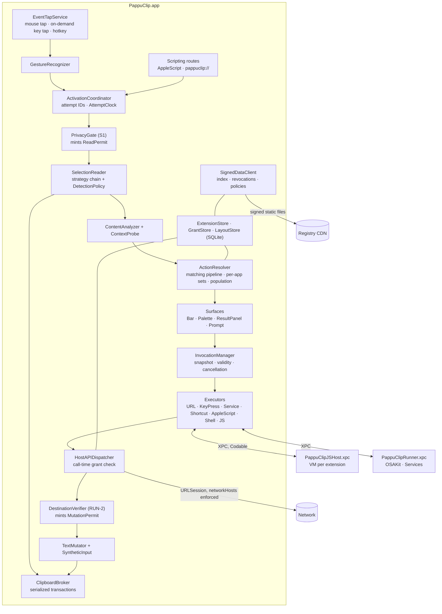
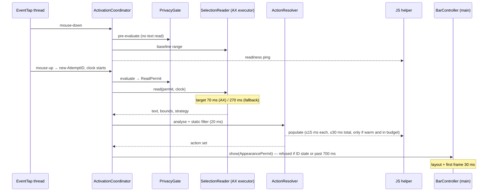
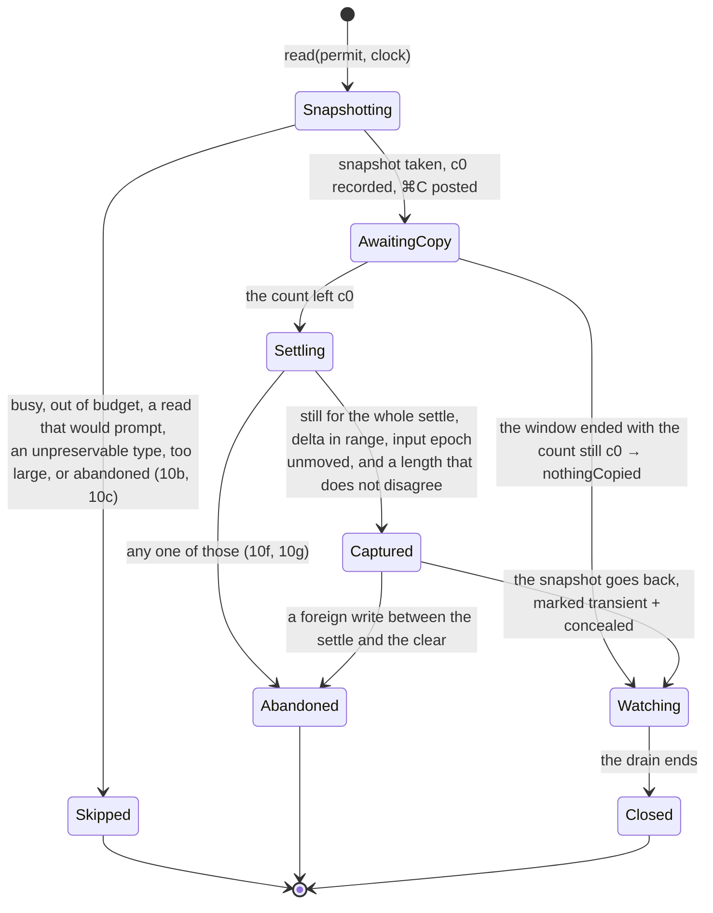
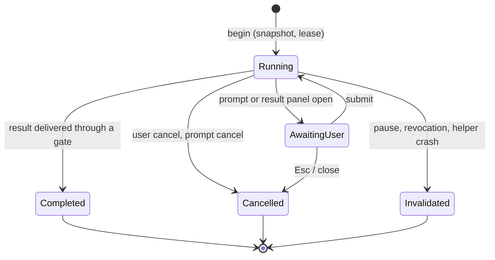

# PappuClip — Architecture

| | |
|---|---|
| **Status** | Draft v0.1, derived from PRD v0.4 |
| **Date** | 2026-09-20 |
| **Companion documents** | [PRD](PRD.md), [Extension platform specification](spec/extension-platform.md), [Safety specification](spec/safety.md), [Implementation plan](implementation-plan.md) |

**How to read this document.** It turns the PRD's §12 recommendation into a concrete design: processes, modules, data model, protocols and the mechanisms that enforce each safety requirement. Requirement IDs (ACT-10, RUN-2, SEC-7) point to the PRD and the two specifications. Statements marked *(M0)* are hypotheses that a spike in the implementation plan must confirm; statements marked *(unverified)* are platform facts I could not confirm from documentation alone. §19 lists the places where the PRD needs a decision or a small revision.

---

## 1. Architecture drivers

These are the requirements that shape the design most. Everything else fits inside them.

| Driver | Source | Design consequence |
|---|---|---|
| Zero wrong-destination mutations, zero lost clipboard writes, zero privacy-block violations | §3.3, RUN-1–5, ACT-10, ACT-12, ACT-17 | Safety rules are enforced by **types and chokepoints**, not by convention: a selection cannot be read, a bar shown, text mutated or extension code loaded without a permit object that only the responsible gate can create (§3) |
| ≤ 150 ms p95 mouse-up to first frame; 700 ms hard cutoff | §3.3, §11.1 | One monotonic clock per attempt; pre-work on mouse-down; pre-built panel; cached icons and parsed manifests; population only against a warm helper |
| Late work must never have an effect | ACT-16, RUN-3 | Every unit of work carries an attempt or invocation ID. **Work is not cancelled reliably, so effects are gated instead**: a stale ID cannot pass a gate |
| Third-party code must not crash or stall the bar | SEC-1, §11.2 | JavaScript in a sandboxed XPC helper; AppleScript and Services in a second helper; shell and Shortcuts as child processes. The app process never runs extension code |
| Consent reflects what code can do, checked when it does it | EXM-5, SEC-7 | One capability analyser shared by the app and registry CI; every host call is authorised against local grants at call time |
| No server to run | G3, §9 | Registry is a git repo; CI signs; the app reads signed static files and verifies them with pinned keys |
| Sync arrives in 1.x without migration | §7.9, SYN-1 | Stable IDs, logical revisions, tombstones and fractional ordering keys are in the 1.0 store |
| A rename must be cheap | §14 | App name, bundle-ID prefix, file extensions, URL scheme and reserved identifier prefix live in one `AppIdentity` constant set |
| One developer | §15, §17 | Few processes, one SwiftPM package, permissively licensed dependencies, tests that run without a GUI wherever possible |

---

## 2. System overview

### 2.1 Processes

| Process | Sandbox | Role | Lifetime |
|---|---|---|---|
| **PappuClip.app** | None (required for Accessibility and event posting). Hardened runtime, Apple Events entitlement | Event taps, selection reading, UI, storage, consent, host API, network on behalf of extensions, child-process execution (shell, `shortcuts`) | Login item (`SMAppService`), menu bar agent (`LSUIElement`) |
| **PappuClipJSHost.xpc** | App Sandbox, **no** network, **no** file entitlements, no JIT entitlement | Runs all extension JavaScript: one `JSVirtualMachine` + `JSContext` + thread per extension (SEC-1b). Also hosts the tooling VM (sucrase transpile, acorn capability scan) | Warm while any enabled extension is `dynamic` (JS-19); otherwise lazy. Restarted on crash |
| **PappuClipRunner.xpc** | None, hardened runtime | Executes AppleScript (OSAKit) and `NSPerformService`. Exists so blocking, uncancellable system calls never run in the app, and so cancellation can kill the process (RUN-3d) | Lazy; exits when idle |
| Child processes | Inherit | Shell Script actions and `/usr/bin/shortcuts run` | Per invocation |
| **pappuclip** CLI | None | `pappuclip run` harness (DEV-2); registry checks and packaging (`pappuclip registry …`) used by CI | Per command |

The JS helper never touches disk or network. The app sends it source text and receives host-call requests back; bundled libraries ship inside the helper's own bundle, which the sandbox can read.

### 2.2 Component map



### 2.3 Trust boundaries

| Boundary | What crosses it | Check on entry |
|---|---|---|
| Other apps → app (Accessibility, pasteboard, events) | Selection text, bounds, pasteboard contents | PrivacyGate before any read; ClipboardBroker ownership rules; size bounds (ACT-13) |
| Extension code → app (XPC host calls) | Method name, arguments, invocation ID | Invocation still valid (RUN-3b); method within grants (SEC-7b); arguments validated; mutation needs a `MutationPermit` |
| Registry CDN → app | Index, packages, revocations, policies | Pinned-key signature, sequence number ≥ stored (SEC-9), declarative schema that cannot express a loosening |
| Files, snippets, URL scheme, sync, import → app | Extension packages | Staged validation, identity resolution (SEC-8), consent before any code loads (EXM-5a) |
| AppleScript / URL scheme → app | Activation and settings commands | Same PrivacyGate as every other route (S1); installs always confirmed in-app (SCR-2) |

---

## 3. Core mechanisms

These five mechanisms are used everywhere. They are the reason the "0 occurrences" metrics in §3.3 are testable.

### 3.1 Permit types

A permit is a small, non-copyable value whose initialiser is visible only inside the module that owns the rule. APIs with side effects take a permit as a parameter, so a code path that skips the rule does not compile.

| Permit | Minted only by | Required by | Rule it carries |
|---|---|---|---|
| `ReadPermit` | `PrivacyGate.evaluate(route:target:secureInput:)` | `SelectionReader.read`, `ContextProbe`, `BrowserMetadata.read` | S1 steps 1–3: secure input, hard blocks, pause, activation mode. Holds route, target pid, scope and the gate's decision trace (for DIA-2) |
| `SyntheticCopyPermit` | `DetectionPolicyStore.syntheticCopyPermit(attempt:route:target:coexistence:)` | `ClipboardBroker.read` | ACT-10j: the policy allows strategy 5 on this route, its `CopyDelta` is not empty, and PopClip is not running. Carries the app's expected delta and whether a clipboard manager is, which is what sizes the settle. `Coexistence` is a value today; the monitor that fills it from the running-application list is M3 (ONB-6) |
| `ExecutionApproval` | `GrantStore` | `ExtensionLoader.loadCode`, population, every executor | EXM-5a, EXM-15d, SEC-8c: this identity and content digest are approved and not revoked |
| `MutationPermit` | `DestinationVerifier.verify(invocation:)` | `TextMutator`, `SyntheticInput`, Cut | RUN-2a–h: tier, freshness, privacy recheck (RUN-2f). Single use; expires with the verification |
| `AppearancePermit` | `ActivationCoordinator` | `BarController.show` | ACT-16b: the attempt is current and inside the hard cutoff |

Permits are `~Copyable` structs consumed by the call that uses them. Remote data has no API that produces a permit, which is how SEC-9's "cannot loosen" rule is kept.

A permit's initialiser is internal to the module that declares it, so each permit lives with the rule that mints it. `ReadPermit` and `PrivacyGate` are therefore both in `PappuCore`: `ContextProbe` and `BrowserMetadata` (`PappuAnalysis`) need the permit and do not depend on `PappuSelection`; they reach Accessibility through `PappuAX`, which is the seam on its own and sits below both (§15). Gathering the state the gate judges stays on the system side — `SecureInput` in `PappuSelection` for `IsSecureEventInputEnabled`, the AX actor for the focused element's role.

### 3.2 IDs and validity

- `AttemptID` — one per selection attempt, monotonically increasing. `ActivationCoordinator` holds the single current ID. A newer attempt, a focus change, a privacy-state change or the cutoff replaces it (ACT-16a).
- `InvocationID` — one per action run. `InvocationManager` holds each invocation's state (`running`, `cancelled`, `completed`, `invalidated`). Cancellation, pause and revocation flip it synchronously (RUN-3a, RUN-3f).
- Every async result, XPC message and clipboard transaction is tagged with its ID. Gates compare IDs; nothing else decides staleness.

### 3.3 AttemptClock

One `ContinuousClock` instant is captured at mouse-up (or at hotkey press). It exposes `remaining(in: .targetBudget)`, `remaining(in: .stage(.read))` and `isPastHardCutoff`. Stage budgets from §11.1 are data in one table, so M0 can retune them without touching code. A fallback strategy inherits elapsed time; it never starts a new timer.

### 3.4 InputEpoch

A counter incremented by the event taps on every mouse-down, key-down and scroll that did **not** land on a PappuClip surface and was not posted by PappuClip. The quiescence tier (RUN-2) is then a cheap comparison: `epoch == snapshot.epoch`.

- Events on our own surfaces are recognised by the window number under the pointer (`kCGMouseEventWindowUnderMousePointer`) matching one of our panels.
- Events we post are tagged in `CGEventField.eventSourceUserData` with a per-launch random value and ignored by the counter.

### 3.5 Effect chokepoints

All side effects leave through four functions, each of which demands a permit and re-checks the ID: `BarController.show`, the broker's transactions (`ClipboardBroker.read` and `ClipboardBroker.paste`; a host-API write when the host API needs one), `TextMutator.replaceSelection`, `HostAPIDispatcher.perform`. The lifecycle test suite instruments exactly these four.

---

## 4. Activation and selection detection

### 4.1 Event taps (ACT-15, ACT-19)

| Tap | Events | Type | Installed |
|---|---|---|---|
| Mouse tap | left down, dragged, up, scroll wheel | Session tap. Active (`.defaultTap`) and pass-through if M0 spike 2 confirms that the Accessibility grant alone authorises it; listen-only taps are gated by Input Monitoring, which would mean a second prompt *(M0)* | Always, while not paused and permission is granted |
| Key tap | key-down | Active, so BAR-9 navigation keys can be consumed | Only while a bar is visible or an invocation that may mutate text is in flight (ACT-19, RUN-2g). Created and destroyed by a reference-counted `KeyTapLease` |
| Hotkey | — | `RegisterEventHotKey` (no permission, not a tap) | While a shortcut is configured |

- Both taps run on a dedicated thread with its own run loop, so a busy main thread cannot get the tap disabled. The callback copies a small value (type, location, flags, click count, timestamp, window number, user data) and returns; all logic runs elsewhere.
- Health: the callback handles `tapDisabledByTimeout` and `tapDisabledByUserInput` by re-enabling. `CGEvent.tapIsEnabled` is also checked on wake, session-active and app-activation notifications, and the tap is rebuilt if it is gone. No timer polls it. `TapHealthMonitor` is what calls `checkHealth()` on those three notices, over a `HealthTriggering` seam; `WorkspaceHealthTriggers` is the `NSWorkspace` side of it. It does not throttle: a check is cheap and the notices are rare.
- Modifier state for ACT-7 and BAR-11 is read from mouse-event flags, never from a key tap.
- What the callback is handed (its `userInfo`) is one object per kind of tap, shared by every tap of that kind and never freed. M0 spike 6 lost a run to a tap-disabled notice that arrived with a context whose memory was gone; a callback that comes after its tap was removed now finds an empty slot and passes the event on.
- `EventTapService` reports a tap that was off, rebuilt or refused as `interrupted`. Consumers reset the recogniser, since a mouse-up may have gone by, and `InputEpoch` counts it as input, since anything may have.
- A lease holder's handler runs on the tap thread, because whether a key is consumed has to be answered before the callback returns. Every holder sees every key-down; it is consumed if any of them says so.
- The hotkey is a sibling of the taps, not part of them. `HotkeyShortcut` holds the combination and enforces ACT-5's rule — ⌃, ⌥ or ⌘, or a bare function key, since ⇧ and a letter is typing — and refuses anything else before it is registered. `HotkeyService` holds one at a time over a `HotkeyRegistering` seam and reports whether it was registered, cleared, refused or already taken by another app; a refused or taken choice leaves no shortcut rather than quietly restoring the old one. `SystemHotkeyRegistrar` is the Carbon side: `RegisterEventHotKey` and a single application-target handler, both on the main thread.

### 4.2 Gesture recogniser (ACT-1–3, 7, 8, 14)

A pure state machine (`Idle → Pressed → Dragging → Released`, plus `LongPressArmed`) fed by the copied event values. It has no AppKit or AX dependency, so recorded gesture corpora replay through it in unit tests.

| Output gesture | Evidence |
|---|---|
| `dragSelect(direction)` | Down → movement beyond slop → up. Direction is kept for BAR-3 |
| `multiClick(count, dragged)` | Click state 2 or 3 at mouse-up, including click-and-hold-then-drag (ACT-2) |
| `shiftClick` | Shift flag at mouse-down following an earlier press in the same window. Any press counts, not only a plain click: a word picked by double-click and then extended is as common |
| `longPress` | One-shot 0.5 s timer armed at mouse-down, cancelled by movement or mouse-up. The recogniser owns no timer: it asks for one and is told when it fires, which is what lets a recording replay exactly |
| `suppressed` | ⌘ held at any point in the gesture (ACT-7) |

Keyboard-only selection never reaches the recogniser because no key tap exists at that time (ACT-8, ACT-19).

**False-positive control (ACT-14).** A gesture is only a candidate. The decision to show a bar uses several signals: the gesture type; the AX role of the element under the mouse-down point; whether the selected range differs from a **baseline range read at mouse-down** (range only, never text, and only after the PrivacyGate allows reading); and, as a weak signal only, cursor shape. The synthetic-copy path demands stronger evidence than the AX path because it has side effects.

### 4.3 Mouse-down pre-work

At mouse-down, off the latency budget: resolve the frontmost app and its `DetectionPolicy`, run PrivacyGate steps 1–3, read the baseline range, and ping the JS helper (JS-19). Secure input is rechecked at mouse-up because it is cheap and can change mid-gesture.

The AX half is `AXFocusProbe`, which runs on the `AXActor` global actor and talks to the system only through the `AXWorld` seam. One probe answers with the focused element's role and subrole, the role under the mouse-down point when there is one, and any fault; a second call reads the baseline range, and takes a `ReadPermit` to do it. The focused element itself never leaves the actor, so the only element a baseline read can reach is the one the gate judged, and the permit alone chooses the process. `AXAttribute` is a closed list with a `carriesText` flag, so "the mouse-down probes read structure and never content" is a property the tests assert rather than a convention. Every element is given the accessibility read budget as its `AXUIElementSetMessagingTimeout`, clamped to at least a millisecond and never past the hard cutoff.

### 4.4 PrivacyGate (S1, ACT-12, 17, 18)

One function serves all four routes (automatic, hotkey, AppleScript, URL scheme):

1. `IsSecureEventInputEnabled()` or a focused `AXSecureTextField` → deny.
2. App hard block or pause → deny. Pause is an absolute expiry date in defaults, so it survives relaunch (ACT-18).
3. Activation mode: appearance exclusions and per-app Automatic / Hotkey only. The hotkey route may pass here; routes never pass steps 1–2.
4. Website hard blocks (ACT-17b): if any are configured and the frontmost app is a browser, the gate returns a `ReadPermit` restricted to **metadata only**. The URL is read first; an unknown URL fails closed with an explanation. A full `ReadPermit` follows only if the URL is allowed.

Every denial produces a reason code that feeds the bar message (BAR-13), the hotkey explanation (ACT-18) and the inspector (DIA-2). No reason code ever contains selection text: a `PrivacyDenial` is a code plus a trace of route, pid, bundle identifier, activation mode and the steps that passed, and a test asserts that its written form has no other field.

The gate judges; it does not look. Secure input and the focused element's role are read by the caller and passed in — the system-wide flag by `SecureInput`, the role by `AXFocusProbe` — and the rules come from settings through a closure, so a change in the menu applies to the next attempt rather than the next launch. Appearance exclusions and per-app modes are one value, `AppActivationMode` (`automatic`, `hotkeyOnly`, `off`): an appearance exclusion *is* `hotkeyOnly`, and `off` is the per-app choice ALM-8 adds in 1.0. A process with no bundle identifier cannot be named in a rule, so it takes the default mode; every rule that does not name an app still applies to it.

A role the app will not give is reported as not secure rather than as secure. The system-wide `IsSecureEventInputEnabled()` flag is what actually catches password fields, including in apps that expose no AX tree; failing closed on an unreadable role would refuse the whole Chromium and Electron half of the Mac on no evidence. The two signals are therefore not symmetric: step 1 fails closed on the flag and open on the role.

### 4.5 Selection reader (ACT-9, 11, 13)

`SelectionStrategyChain` is the whole chain behind one call, `SelectionReading.read(_:attempt:chain:clock:)`. It consumes the `ReadPermit` and reports the strategy that answered, for DIA-2.

| # | Strategy | Mechanism | Notes |
|---|---|---|---|
| 1 | AX attributes | Focused element → `AXSelectedText`, `AXSelectedTextRange`, `AXBoundsForRange` | All AX calls run on a dedicated serial executor with `AXUIElementSetMessagingTimeout` set from the stage budget, because AX calls block on the target app |
| 2 | WebKit text markers | `AXSelectedTextMarkerRange`, `AXStringForTextMarkerRange`, `AXBoundsForTextMarkerRange` | Safari, Mail, WKWebView hosts |
| 3 | AX-tree enabling | `AXManualAccessibility` for Electron; `AXEnhancedUserInterface` for Chromium, set narrowly and recorded per pid | Side effects and the enable/disable window are decided by M0 spike 4 |
| 4 | AppleScript | Browser-specific scripts | Needs Automation consent and, for page JavaScript, a user-enabled browser setting, so expected coverage is low *(M0 spike 3 measures it)* |
| 5 | Synthetic ⌘C | `ClipboardBroker.read` | Needs a `SyntheticCopyPermit`; never automatic for unlisted apps, whole-line-copy apps, or while PopClip runs. §5 |

- **Bounds.** AX bounds use a top-left origin; they are converted to AppKit coordinates against the primary display. Unknown bounds fall back to the pointer location (BAR-3).
- **Large selections (ACT-13).** Text longer than a threshold is held as one `String` with analysis bounded to a prefix window and detections capped; nothing copies it per action.
- **Invalidation (ACT-16).** While an attempt is pending, an `AXObserver` on the app the attempt is about (`selected-text-changed`, `focused-element-changed`), `NSWorkspace` activation notifications and the mouse tap can each retire the `AttemptID`. They all say so the same way, by calling `ActivationCoordinator.invalidate(_:)` with a reason; the coordinator keeps the reason against the attempt it retired, so a read that is still out reads its own. See §19 item 1 for the one gap this leaves.
- **The watchers (`AttemptWatcher`).** The two that live outside the coordinator are one component, because both have the same problem: the notice that says the user has moved on looks exactly like the echo of the gesture that started the attempt. The mouse tap sees mouse-up before the app does, so the app settles the selection, posts `selected-text-changed` and activates itself *after* the attempt has begun. Two rules tell them apart. A selection or focus notice counts only once the strategy chain has answered — the app posts it while handling the mouse-up and answers our read afterwards, so a notice that arrives before the answer describes what the answer contains, and only one after it means what we hold has gone stale. An activation notice counts at once, because it names the app that came forward and the attempt's own app is filtered out by pid. The watcher decides nothing else: it raises an `AttemptNotice` carrying the attempt it was watching, `ActivationCoordinator.watch(_:)` is the one consumer, and `invalidate(_:of:)` retires that attempt or nothing, since a newer one may be current by the time the notice lands. Registration is per app and made at mouse-down, off the latency budget; the routes with no pointer pay for it themselves.

#### The reader as built (M1 week 2)

Strategies 1 and 3 are `AXSelectionReader`, and they are one body of code because strategy 3 *is* strategy 1 with a switch thrown first. It is `@AXActor`, so it shares the one serial queue with `AXFocusProbe`: a wedged app costs a timeout on that queue and nothing anywhere else. Every element it touches has `AXUIElementSetMessagingTimeout` set from what is left of the read stage, with a floor of 1 ms, because AX reads zero as "use the global default" and that hands a wedged app the queue for seconds.

**A caret is answered from the range alone.** An empty `AXSelectedTextRange` is a caret by definition (ACT-3), so in the case where there is nothing selected the attribute holding the user's text is never asked for. That is a round trip saved and, more to the point, a read of somebody's document not made.

**Strategy 3 enables and holds.** The switch is a message to another process about itself, so it is written once per pid and not once per read; only a write that was taken is remembered, so an app that faulted is asked again next time. A faulted switch still reads — an app that answers `.unsupported` to `AXManualAccessibility` may have had its tree on all along, from a screen reader or the user's own setting — and the fault rides into the trace instead of becoming a refusal. `release(_:)` and `releaseAll()` put every process back, so nothing we did to another program outlives us. Which spelling is safe to hold per app is still M0 spike 4's to answer.

**The chain's one decision is stop or go on,** and `StrategyRead.Finding` is what makes it: a strategy that could not run (`unavailable`) leaves the question open, one that ran and found nothing (`nothing`) closes it, and the attempt comes back `refused` only when every strategy has said the first. That is what stops an app with no Accessibility tree being reported as an app with no selection, and it is why `StrategyRead` and `SelectionRead` are two types. A caret ends the chain rather than falling through, because strategy 5 at a caret would ⌘C whatever that app thinks ⌘C means with nothing selected — in a good many of them the whole line (ACT-10j). A range an Accessibility strategy could see but not read is carried to strategy 5 as `expectedCharacters` (ACT-10e), and an ambiguous transaction is `unavailable` and never `nothing`, because "we cannot tell" is not "there is nothing there".

**Still open.** Strategies 2 and 4 are named in `SelectionStrategyChain.unimplemented` and skipped rather than answered, so a chain containing them still reaches strategy 5. Strategy 2 wants `AXTextMarkerRange`, an opaque Core Foundation type the `AXWorld` seam does not carry yet; strategy 4 wants Automation consent and the per-browser scripts of M0 spike 3. Nothing assembles the chain into a running app: that is the product target, and it is the next step.

### 4.6 Detection policies (ACT-11)

Bundled JSON at `Resources/DetectionPolicies/detection-policies.json`, schema-versioned, one record
per bundle identifier plus a `default`, and a `prefixes` map for identifier families:

```json
{
  "schema": 1,
  "sequence": 1,
  "default": { "strategies": ["ax", "webkitMarkers", "axEnable", "appleScript"],
               "autoAppear": true, "autoSyntheticCopy": false,
               "hotkeySyntheticCopy": true, "quiescence": true },
  "prefixes": {
    "com.jetbrains.": { "copiesLineWhenEmpty": true },
    "com.sublimetext.": { "copiesLineWhenEmpty": true }
  },
  "apps": {
    "com.microsoft.VSCode": { "axEnable": "manualAccessibility", "copiesLineWhenEmpty": true },
    "com.google.Chrome": { "axEnable": "enhancedUserInterface" }
  }
}
```

An exact `apps` entry wins; otherwise the longest matching prefix; otherwise the default. Prefixes
exist because a vendor's editors share a quirk and ship under one identifier family: enumerating them
means the next release is unflagged, and for `copiesLineWhenEmpty` an unflagged app is a paste of the
wrong line, not a missing feature. A process with no bundle identifier cannot be named in a policy and
takes the default, the same rule the gate uses.

**The chain is not the order.** `strategies` is the declared order for strategies 1–4. Strategy 5 is
never in it: whether synthetic copy runs is a matter of route, and `DetectionPolicy.chain(for:)`
appends it from `autoSyntheticCopy` on the automatic path — minus PopClip (ONB-6) — and from
`hotkeySyntheticCopy` on the three deliberate ones (ACT-9, ACT-10j). Strategy 3 is dropped from the
chain for an app with no `axEnable` kind to set, because with nothing to enable it is strategy 1 run
twice. `DetectionPolicy` is immutable and everything, decoding included, goes in through one
initialiser, so `autoSyntheticCopy` is already false wherever `copiesLineWhenEmpty` is true (ACT-11a)
and a caller reading the field cannot get an answer the chain would not have given.

`autoAppear` is the *app's* say — an app where auto-appear is hopeless or harmful. It is not the
user's appearance exclusion, which is `AppActivationMode` and belongs to the `PrivacyGate`; the
coordinator needs both.

The effective policy is `min(bundled-or-remote policy, user ceilings)`. `DetectionPolicyStore` reads
both through closures, as the gate reads its rules, so a settings change applies to the next attempt
rather than the next launch. A ceiling is a sparse record, and the store spends it by applying it
*to the policy it is about to restrict* and then merging the two restrictively — so a field the user
left alone cancels out, and a field set more permissively than the bundled policy also cancels out,
because the merge keeps the smaller side. There is no spelling of a ceiling or of a remote record that
turns something on. That, plus a schema with no field that could express a privacy rule, is why a
remote update (ACT-11b) cannot loosen anything (SEC-9, RUN-2h), and it is a property of the arithmetic
rather than a convention each new field has to remember: `restricted(by:)`'s test asserts the result is
at least as restrictive as both inputs over a generated space of policies. `copiesLineWhenEmpty` merges
the other way round, since it is a warning about the app rather than a permission, so either side
raising it wins.

The shipped file's per-app strategy order and flags are M0 spike 3's output and the `axEnable` kinds
are spike 4's; nothing in it is set from a measurement yet, and its `note` field says so. What is not
provisional is the default — no synthetic copy on the automatic path for an unlisted app — and the
whole-line-copy flags, which ACT-11a names by hand.

### 4.7 Auto-appear timeline



`ActivationCoordinator` is built, with every seam around it faked: the strategy chain, the bar and the long-press timer. It is an actor, and its reentrancy is the point — an attempt runs in a task of its own, so the tap keeps being pumped while a read is outstanding, which is the only way a *later* event can retire an *earlier* attempt (ACT-16a). Two orderings are deliberate: the gesture recogniser is fed synchronously, before anything is awaited, so that the order it sees events in is the order they happened in; and an attempt becomes the current one synchronously at mouse-up, so a gesture that finished later is never overtaken by one whose read came back first.

The weighing of ACT-14 is a pure function, `ActivationRules.verdict(for:)`, over the route, the gesture, the focus, the baseline range and what came back from the read. Every outcome is a named verdict — a selection, a caret, an unchanged range, nothing textual, unreadable, suppressed, out of budget — which is what makes each one a test and what DIA-2 will show. The cursor shape is not among the signals at all: nothing in the decision reads it, which is a stronger statement than "never on its own", and if it is ever added it can only break a tie.

`AppearancePermit` closes ACT-16b structurally rather than by checking: `BarPresenting.show` cannot be called without one, only the coordinator mints one, and it mints one only for the attempt that is still current and inside the 700 ms. What is left of the cutoff rides on the permit, so the bar's own work is inside the same budget. Every attempt, including the ones that were suppressed, refused or retired, lands in a bounded `AttemptTrace` of codes, identifiers and counts — `characters` says how much was read and nothing says what.

The watchers that retire an attempt from outside are built as well, as `AttemptWatcher` (§4.5): the coordinator tells it which attempt is armed and when the read came back, and it tells the coordinator, through `watch(_:)`, that the user has gone somewhere else. `SystemAXObserver` and `WorkspaceActivationWatcher` are the two implementations, and neither is covered by a test — they need a live session, and so does the rule that a selection notice arrives before the read it belongs to answers.

Still to come: the strategies the reader stands in for (§4.5), the bar itself, and the third source of invalidation, a privacy state that changes mid-attempt (`privacyStateChanged`), which waits on settings having something to say when it changes.

---

## 5. ClipboardBroker (ACT-10, ACT-16)

The broker is the only code that touches `NSPasteboard.general`. It is an actor with an explicit **single open-transaction slot**; actor isolation alone is not enough, because reentrancy at suspension points would let two transactions interleave (ACT-10c). A second caller is refused with `.brokerBusy`, never queued, and for the same reason the broker is a plain actor on the cooperative pool rather than an `AXActor`-style dedicated queue: it has to stay answerable while a transaction is open. Every call that can block — the snapshot, the text read — goes out through `ClipboardScheduling.run(within:)`, which runs it somewhere the broker can walk away from, because M0 spike 6 found that a read of a hung lazy provider blocks until that provider answers or dies (12 s seen) and cannot be cancelled.

A transaction is one promise: **the user's clipboard is the way we found it, or we say so.** The second half is the part that can always be kept, and most of what follows is in service of it.



`ClipboardPhase` is those states and `ClipboardTransactionRecord.phase` is the furthest one reached, which is what the inspector shows (DIA-2).

- **Snapshot (10a, 10b).** Every item and every representation, byte for byte, including types this build has never heard of — the snapshot is not allowed to understand the clipboard in order to put it back. `NSPasteboard.accessBehavior` is read first, so `ask` or `alwaysDeny` ends in `Skipped` without ever raising a prompt (§19 item 3). A file promise, or a listed type that hands back no data, is unrestorable and also ends in `Skipped`; so does anything past the byte ceiling, and so does a snapshot that does not come back inside its own deadline, which is the only sign available that an app is sitting on a lazy provider.
- **The window (10d).** Sized from what the attempt's clock actually has left, not from `windowMs`: the snapshot has already been paid for by the time the ⌘C goes out. Below `minimumWindowMs` the transaction is skipped rather than opened, because a ⌘C nobody has time to watch the result of is the one outcome worse than no bar.
- **The count moves on the clear, not on the write.** Spike 6's central finding, and the reason `Settling` exists. At the moment the count moves there may be nothing readable on the pasteboard at all — 0.14–0.28 ms at p50 for a prompt writer, unbounded for a slow one — so the count moving is not evidence of a finished write and the text is read after the settle, inside `textWaitMs`.
- **Attribution (10d, 10g).** A change is ours only if the count stayed still for the whole settle, the delta is inside the app's `CopyDelta`, keystrokes could be watched at all, the input epoch has not moved, and, when the reader supplied one, the text's length does not disagree with the selection's. Anything else is `ClipboardAmbiguity`, and every ambiguity ends the same way: **the pasteboard is left exactly as it stands.** Not restored — restoring over a write we cannot explain would destroy somebody else's content, and a change we cannot explain is more likely to be theirs than ours.
- **The settle (10i).** 30 ms, and 90 ms when a clipboard manager is running, because a manager reads and often rewrites after every copy, so a quiet 30 ms says much less. Which one applies rides on the permit, so the whole transaction is decided from one reading of the world.
- **Restore (10e).** Only while the count is still the one attribution was decided on, and only ever the snapshot, marked. The broker keeps what `clearContents()` returned so it can recognise its own write afterwards.
- **The gap (10f).** Between the last count check and `clearContents()` there is a gap — p95 0.13–0.15 ms idle, 0.36 ms with another writer at work — in which a newer write is destroyed. It cannot be closed. It can be *known*, by comparing what clearing returned against the checked count plus one, and that is `destroyedANewerWrite`: a safety event on a transaction that otherwise succeeded.
- **The drain (16c).** The transaction is not over when it has answered. For `drainMs` afterwards the slot stays held and the pasteboard stays watched, because an app that was merely slow will land its copy with nobody looking: a late copy that still attributes is restored over (`lateCopyRestored`), a foreign write is left alone (`foreignWriteDuringDrain`), and a drain that ends with a copy still outstanding says so (`lateCopyPossible`). Spike 6 is explicit that no finite drain closes this; `drainMs` only decides how big the hole is.
- **Marking (10h).** Everything the broker writes carries `org.nspasteboard.TransientType` and `org.nspasteboard.ConcealedType`, added once — a clipboard that already asked managers to ignore it, a password manager's copy, gets one of each back and not two. The beep from ⌘C with nothing selected is *not* solved: it is the target app's own answer to a key equivalent it cannot use, made before any write exists to mark, and nothing the broker posts can silence it. What remains feasible is not posting at all, which is ACT-10j's decision, and checking the app's Copy menu item through AX first (`EditMenuProbe`, §6.2) where that is reliable. Open at M1's exit.
- **Waiting** is a bounded 1 ms poll of `changeCount` inside the open transaction. `NSPasteboard` offers no notification, so this is the one deliberate exception to "no polling"; a `changeCount` read is 0.0006 ms at p95 and not a round trip, so the poll costs less than the timer that would replace it, and it never runs while idle.
- **Other clients.** `paste-result`, Paste-as-plain, `restorePasteboard` and `pasteboard.*` host calls all go through the same broker and the same ownership rules. Pasting needs a settle before restoration because an app's read after ⌘V cannot be observed; that delay is policy data.

**The first-writer hole.** A write from another program that lands *between* the ⌘C and the app's own copy passes every attribution check above — spike 6 hit it 10 times out of 10 when it tried. Four things are done about it and none of them is a fix: the settle, which catches the common shape, a writer that is still going; `expectedCharacters`, a length from a strategy that found the selection's range but could not read its text, which is the only *positive* evidence available and must be a fresh reading rather than ACT-14's mouse-down baseline; ACT-10j, which keeps strategy 5 off the automatic path for every unlisted app, so what is left exists only where somebody decided this app was worth it or the user asked by name; and saying so, because an ambiguous end is a recorded safety event and not a silent one.

**Numbers** are `ClipboardTiming`, deliberately not `BudgetTable`: a budget is one number for a stage of any attempt, while these are the shape of one transaction, and two of them move in opposite directions — a longer settle is safer, a longer drain is riskier for the next attempt. `ClipboardTiming.initial` is 180 ms window, 40 ms text wait, 30/90 ms settle, 400 ms drain, 1 ms poll, 30 ms minimum window, 120 ms snapshot, 50 MiB. They do not all fit inside the 270 ms read stage at once, which is the point: the window is sized from what is left.

**Still open**, and the reason the numbers above are provisional: spike 6 measured a private pasteboard and a cooperating writer, so per-app copy latency and a real app's ⌘C are unmeasured (the window and the settle are what that run will change); ACT-10i's named clipboard-manager matrix is a measurement, not code; and the beep is unsolved. See `docs/spikes/spike-6-clipboard.md`.

The pasteboard is behind `PasteboardProviding`, so `ScriptedPasteboard` drives the state machine on a fake clock: 160 seeded interleavings of copies, foreign writes, bare clears and keystrokes, asserting on every one of them that at most one write reaches the user's clipboard, that it is the snapshot and marked, that no ambiguous outcome ever writes, that `destroyedANewerWrite` is reported exactly when a gap write happened, and that no string anywhere inside the record is the clipboard's (DIA-2). The suite also asserts that all eleven outcomes and safety events are reached, so a generator that stopped exploring cannot pass quietly (§17).

---

## 6. Content analysis and action resolution

### 6.1 ContentAnalyzer (FLT-2)

`NSDataDetector` for links and emails, plus custom detectors for scheme-less domains (against a bundled TLD list), non-http schemes (the scheme list is data, §7.4) and file paths (`~` and `..` expanded, existence checked off the main thread with a time cap). Each detection records its ranges. Output is an immutable `AnalyzedSelection`.

### 6.2 ContextProbe (FLT-3, FLT-6)

| Fact | Source |
|---|---|
| App name, bundle identifier | `NSRunningApplication` |
| Editable | `AXUIElementIsAttributeSettable(AXSelectedText)`, element role, Chromium/WebKit editable-ancestor attributes |
| `canCut`, `canCopy`, `canPaste` | Editability plus `EditMenuProbe`: the app's Cut/Copy/Paste menu items located once per pid by command character (not localised title), cached, then only their `enabled` state is read. The menu narrows what editability allows and never widens it, which is where FLT-6 is held: Chromium leaves both items enabled over read-only web content |
| `hasFormatting` | AX attributed-string support on the element: the parameterized-attribute *names*, never the value, so it costs one call and reads no text |
| Browser URL and title | `BrowserMetadata`: AX first (`AXWebArea` → `AXURL`, window title), AppleScript second (needs Automation consent, ONB-5). A per-browser capability table records what each browser supports (§11.5) |

HTML, RTF and Markdown forms are captured only when a visible action sets `captureHtml` or `captureRtf` (FLT-4), following the documented fallback chain. Sanitising uses an allow-list sanitiser in the app; Markdown is generated from the sanitised HTML.

### 6.3 ActionResolver (FLT-1, FLT-5, §8.5, ALM-8)

Pure function over `(AnalyzedSelection, SelectionContext, LayoutSnapshot, OptionValues, GrantSnapshot)`:

1. Drop items whose extension lacks an `ExecutionApproval`, is disabled, suspended or revoked.
2. Apply `requiredApps`, `excludedApps` and option-value conditions.
3. Evaluate `requirements` with negation and the legacy synonyms; narrow and normalise the text.
4. Apply `regex` (ICU via `NSRegularExpression`) to the narrowed text.
5. Apply per-app visibility, which can only remove items (ALM-8).
6. Ask `dynamic` extensions to populate, within the remaining budget and only if the helper is warm (JS-16). Reserved slots are laid out first, and late population is dropped rather than shifting buttons.

The bar and the palette call the same resolver, so they always show the same effective set (ALM-8, BAR-16).

#### The resolver as built (M1 week 5)

Steps 1, 2, 3 and 5 exist; step 4 (`regex`) waits on M2's parser and step 6 on M3's helper. (Step 4 arrived in M2 week 1; see §9.1.) The split is not between "written" and "not written" but between two modules, and that is the interesting part.

**§8.5 itself is pure and lives in `PappuCore`,** over `MatchingFacts` — a value holding the text, the detected addresses, the bundle identifier and the three Edit-menu answers, and nothing else. `ActionMatching.match` is a function from a manifest and those facts to `shown(Match)` or `hidden(Refusal)`. Writing it this way costs nothing and buys two things: the registry's conformance CI can run an extension's filters against a corpus with no AX tree and no running app, and every rule in §8.5 that is easy to get subtly wrong is a test over a literal — an app in both `requiredApps` and `excludedApps` is excluded, an unrecognised requirement is refused *even when negated*, only the first non-negated narrowing requirement narrows, and the full selection stays reachable after it has.

**`ActionResolver` is the part that cannot be pure,** and it is in `PappuRuntime` because it is the first module allowed to see an `AnalyzedSelection`, a `SelectionContext` and the extension store together (§15). It converts the first two into facts, runs each catalog action through `ActionMatching`, and returns both halves of the answer: the actions to show, in catalog order, and a dictionary of **why each of the others is not there** — disabled, filtered by a named requirement, refused by a built-in's own condition, or without a runner in this build. DIA-2's inspector answers "why is Cut not here" and this is the only moment at which that answer exists; keeping it costs a dictionary and keeps DIA-4's rule, since a refusal is keys and reasons and never the selection's text.

**The five built-ins are files** (§19 item 2), in `Resources/BuiltinExtensions/`, each a real manifest whose `executor` names the reserved `builtin` form that `validate(origin:)` accepts only from `.appBundle`. They are read in `BuiltinAction.allCases` order rather than by sorting a directory, because that is PRD §7.4's order and a product decision. Two of PRD §7.4's "shown when" clauses are not expressible in §8.5's vocabulary — Paste needs text on the *clipboard*, Search has a maximum length — and rather than invent two requirement spellings, which would add to a vocabulary that is a public API this project does not own, they are `BuiltinConditions` and the resolver applies them after the shared pipeline. The third, "Search unless the selection is only a URL", needed nothing new: it is the requirement list `[text, !isurl]`.

**Still open.** `regex` and option-value conditions landed in M2 week 5 (§9.6). Per-app visibility is ALM-8 and M4. `wantsPrimaryDisplay` rides along from the manifest to the bar and nothing honours it yet; `stayVisible` is honoured since M2 week 3 (§9.5). A resolved action does run: `BuiltinRunner` stands behind the reserved executor (§8.7), and `SelectionBridge` is where the resolver, the bar and `InvocationManager` are assembled (§13.1). An extension's URL, Key Press and Shortcut executors run through `ExtensionRunner` since M2 week 3, and Service, AppleScript and Shell Script since week 4 (§9.5); JavaScript waits on M3.

---

## 7. The bar and interactive surfaces

| Surface | Window | Key focus | Content |
|---|---|---|---|
| **Bar** (BAR-1–13) | One pre-built `NSPanel`, `.nonactivatingPanel`, borderless, `canBecomeKey == false`, joins all Spaces, full-screen auxiliary. Level and collection behaviour set by M0 spike 1 | Never | AppKit views drawn directly; `NSVisualEffectView` background; callout arrow; pre-rendered template icons |
| **Palette** (BAR-16) | Non-activating panel that **can** become key | Yes, without activating PappuClip, so the source app stays frontmost | Search field + list; ranking is prefix, then word-boundary, then subsequence, with ties in user order |
| **Result panel** (BAR-17) | Same as palette | Yes | `NSTextView` (TextKit 2), selectable; Markdown via swift-markdown and our own renderer |
| **Prompt** (JS-18) | Same as palette | Yes | One labelled field, Submit and Cancel |
| Settings, consent sheets, Manage Extensions | Normal activating windows | Yes | SwiftUI |

- **Focus (BAR-1, RUN-1c).** Because the key-capable panels are non-activating, the source app remains the active application and its focused element does not change. That makes focus restoration trivial and keeps destination verification meaningful while our surface is open. `InvocationManager` records "PappuClip surface is key" as its own state, not as a destination change. *(M0 spike 1 confirms the AX focused element is stable in this state.)*
- **Safe Markdown (BAR-17).** The renderer emits attributed text only. Raw HTML is shown as text, images are never loaded, and links are inert until clicked, then opened through an explicit confirmation of the destination host.

### 7.1 The bar as built (M1 week 4)

`PappuSurfaces` holds the bar. The shape of the module comes from one constraint: **CI has no window server**, so an `NSPanel` cannot even be constructed there — the process traps. Every rule therefore lives in a value type that takes no AppKit at all, and AppKit is confined to a single file, `BarPanel.swift`, that no test touches. What that file does is draw what it is handed; what it is handed is decided somewhere a test can reach.

`BarController` is the one `BarPresenting`, and it is the seam `ActivationCoordinator` has been calling into since week 2. It has **two isolation domains and they are not a mistake**. Key presses arrive on the event tap's thread and must be answered at once (ACT-15), so the controller keeps a small `Live` struct — is a bar up, which attempt, its window rectangle, its `BarKeyboardMode` — behind a `Mutex`, and the tap handler reads, advances and answers inside that lock. The main actor catches up afterwards: it moves the highlight, posts the announcement, hides the window. The lock is also what closes the race that matters — a handler that dismisses clears `isUp` *inside* the lock, so a second key arriving behind the dismissal finds no bar and passes through to the app rather than being eaten by a bar that is already on its way out.

The rules, each a value and each tested:

- **Placement (BAR-2, BAR-3).** `BarLayout.place` takes an anchor, measured button widths, a position preference, the metrics and the displays, and returns a frame, a side, an arrow and how many buttons fit. Nothing in it touches AppKit, so a selection on a second display, a selection at the top of the screen with no room above it, a selection straddling two displays and a bar wider than the display it is on are tests rather than things to try on hardware nobody has. A single-line selection follows the user's preference; a multi-line one goes below the pointer if the drag went down and above the selection if it went up. The side flips for room, and when neither side has room the bar is clamped and **loses its arrow**, because an arrow that points at nothing is a lie about where the selection is. `itemsThatFit` is the seam BAR-5a's paging grows from in M4.
- **Coordinates.** Everything in the module is in **top-left screen coordinates** — what CGEvent and `AXBoundsForRange` give — and AppKit's flipped space is entered exactly once, by `BarScreen.flipped(_:inMainDisplayHeight:)` inside `BarPanel.swift`. One conversion, in one place, with a test that flipping twice gives the rectangle back.
- **Keyboard mode (BAR-9a, ACT-6a).** `BarKeyboardMode` is a value for the reason above: the decision is made on the tap thread. The highlight **clamps rather than wraps**, so holding ← never cycles past the button the user was aiming for. A bar that appeared by itself is **not** in keyboard mode until a navigation key arrives — a bar that grabbed ← on sight would take the key that deselects text away from every app on the Mac. The shortcut is the exception, because the user asked by keyboard and their hands are already there. ↑ and ↓ are ordinary keys until folders arrive in BAR-9b.
- **Which keys are ours (ACT-19).** A key held with ⌘, ⌃, ⌥ or ⇧ is not the bar's, whatever it is. That one rule is what keeps ⇧← extending the user's selection and ⌘C copying in the app underneath. `BarKeyOutcome.disposition` is the tap's answer, so "only navigation keys are consumed" is a property of a switch rather than a promise.
- **Dismissal (BAR-10).** `BarDismissal.reason(for:barFrame:)` is a function of an event and a rectangle. There is no clock in it and nowhere to put one, which is the requirement stated as a signature. The rectangle it is given is `BarPlacement.windowFrame(metrics:)` — the bar **plus its arrow** — because the arrow is part of the bar to look at and to press.
- **Appearance (BAR-8a, BAR-14).** `BarAppearance.resolve` maps the colour preference and the three accessibility settings onto a background style, a highlight style, a border and a motion. Reduce Transparency makes the background solid, Increase Contrast adds a border and a plain highlight in place of the accent tint, and Reduce Motion turns the failure shake into a still X while leaving the spinner turning.
- **Feedback (BAR-12a).** `BarFeedback` holds the state and what to say about it, and refuses to say the same thing twice running. The bar's half of RUN-3 is here — a press while a spinner is up takes the running action back rather than starting another — over a `cancelRunningAction()` that defaults to a no-op. What the app passes in is `SelectionBridge` (§13.1), which takes the run back through `InvocationManager` (§8.5); the no-op is what a test gets when it is not the subject, not what ships.
- **Strings (BAR-14).** Every word the bar says goes through `BarStrings` into `en.lproj/Localizable.strings`, and a test walks the catalogue so a string written in place fails rather than shipping unlocalised.

The window is behind `BarWindowing` and is deliberately dumb: it draws what it is told and reports exactly one thing back, a button press with the modifiers that were down at the time (BAR-11). **Hovering is not on that list.** The pointer moving over a button changes the highlight and shows a tooltip, and both are the window's own business; nothing the controller decides turns on them.

**Still open.** Three things, and none of them is a value waiting to be filled in:

1. **Pointer departure (BAR-10).** The requirement names it and it is not implemented. The mouse tap carries no moved events; a tracking area sees only the bar's own window, not the pointer arriving back over the app; and what "departure" should mean — immediately, after a grace period, only if the pointer never came back — is a design question the hover work has to answer first. `BarDismissalReason` has no case for it rather than a case nothing raises.
2. **`BarPanel.swift` is untested, by construction.** `canBecomeKey` returning false, the collection behaviour, the vibrancy view, the arrow's path and the tooltip are checked by hand: `docs/checklists/voiceover-bar.md`, which is written and not yet run, and spike 1's matrix. `BarPanelConfiguration.bar` says **provisional** in its own doc comment until that run happens.
3. **Assembled, not yet lived in.** `AppAssembly` builds `BarController` over a real `BarWindow` and hands it to `ActivationCoordinator` (§13.1), so the seam the coordinator has been calling into since week 2 is a fake in tests rather than everywhere. But a bundle that builds and signs is not a bar anyone has used: everything about it that needs a window server — the placement on a second display, the vibrancy, the arrow, VoiceOver — is still what the checklists say it should be rather than what anybody has seen, and those runs are M1's exit.

---

## 8. Invocation lifecycle and text mutation (RUN-1–5)

### 8.1 Snapshot

`InvocationManager.begin` captures, immutably: input text and detections, modifiers, option values, the extension's identity digest, and a `DestinationSnapshot` — pid, bundle identifier, focused window element, focused element, selected range, a hash of the selected text, the strategy that read it, `InputEpoch`, and the monotonic time (RUN-1a). If the action may mutate text, the manager takes a `KeyTapLease` for its whole life (RUN-2g).



### 8.2 DestinationVerifier (RUN-2)

| Tier | Check |
|---|---|
| Accessibility-verified | Same pid, window and focused element (`CFEqual`); element still editable; selected range and text hash unchanged |
| Quiescence-verified | Read strategy was 4 or 5; same frontmost pid and window; `InputEpoch` unchanged; elapsed ≤ policy window (initially 3 s); policy allows the tier |
| Unverifiable | Anything else. No permit. The result goes to the result surface for explicit copy and is **not** written to the clipboard (RUN-2c, 2d) |

The verifier re-runs PrivacyGate steps 1–2 every time (RUN-2f). Replace and Insert buttons call it at click time and show why they are disabled when it fails (RUN-2e).

### 8.3 TextMutator (RUN-4)

Mutation is "put text on the pasteboard through the broker, then issue Paste", because that is what gives one native Undo step in the widest set of apps. Paste is issued by synthetic ⌘V, or by pressing the cached Paste menu item where the policy says that is more reliable. Insert first collapses the selection to its end through AX, which is only possible at the Accessibility-verified tier; otherwise Insert is disabled. Setting `AXSelectedText` directly is not used by default because most apps do not register it with Undo. Unsupported targets are listed in the compatibility guide.

**As built (M1 week 5).** The ⌘V path is built and is the only one: `TextMutator.replaceSelection(with:using:)` consumes a `MutationPermit`, re-checks that the invocation is still live, and hands the text to `ClipboardBroker.paste`, which is described in §8.6. The other two paths wait on something real. The cached Paste menu item needs a policy field and a measurement saying which apps need it — `EditMenuProbe` already finds and caches the item, so what is missing is the reason to use it. Insert needs an Accessibility *write* to collapse the selection, which `AXWorld` deliberately does not have; it lands with BAR-17's Replace and Insert controls in M4 (DIF-1a).

### 8.4 Cancellation (RUN-3)

`cancel(id)` flips the state first, then stops owned work: terminates child processes (SIGTERM, then SIGKILL), asks the Runner to abort and kills it if it does not, and tells the JS helper to drop the invocation. Any later host call or result carrying that ID is rejected at `HostAPIDispatcher` and at the result gate. If a delegated action (Shortcut, Service, AppleScript, shell) had already started, the UI says it may have completed (RUN-3e).


### 8.5 The runtime as built (M1 week 5)

`PappuRuntime` holds the safety substrate, built before the actions that spend it. Four types and one rule: **a permit is the only way to mutate text, and only the verifier can mint one.** `MutationPermit.init` is internal to the module and `DestinationVerifier` is its sole caller, so a mutation path that skipped verification is a compile error rather than a review comment.

**The snapshot (RUN-1).** `DestinationSnapshot` is immutable by construction and nothing updates it; every later event — an app switch, a focus change, a keystroke — is recorded *beside* it in the `InvocationRecord`, which is RUN-1b as a type rather than a rule. Two of its fields differ from §8.1 for reasons the code could not avoid:

- **It holds a digest, not the text.** `TextDigest` is a SHA-256 and a character count. Keeping the selection for the life of an invocation would put a second copy of the user's text in a second place to answer a question a hash answers. The digest is deliberately absent from `InvocationRecord` too: a digest of "yes" is a digest of "yes" to anyone who tries the obvious inputs, and a trace that outlives the invocation is the wrong place for one. A `Mirror` walk over the record is a test, so no field can be added that could hold a selection.
- **It holds a handle, not elements.** An `AXUIElement` may never leave `AXActor` (§4.3) and a snapshot is `Sendable` and `Equatable`, so `AXDestinationProbe` issues an opaque `DestinationHandle` and keeps the focused window and element behind it. They are released when the invocation ends, so a finished invocation has no grip on a window that has since closed — asserted by a held-count in the fakes, both on completion and on cancel.

**The tiers (RUN-2).** The table in §8.2 is what the verifier does, with two deviations found while writing the tests:

- **An Accessibility read whose app has gone quiet falls through to the quiescence tier.** The table reads as though the middle tier belongs to strategies 4–5. But an app that will not answer `AXFocusedUIElement` at execution time leaves exactly the evidence a strategy-5 read leaves, and refusing it would refuse paste in the apps that need it most. Silence is not agreement at the *top* tier — an unanswered element check can never be an Accessibility-verified match — but it is not a refusal either.
- **A contradiction never falls through.** An app that answers with a *different* range or a different digest has not gone quiet; it has said the selection moved. That is `.selectionMoved` or `.selectionChanged` at every tier, and no fall-through. Without this rule an app whose selection had visibly changed could be pasted into at the quiescence tier, which is the hole the rule closes.

Everything else is as stated: all four "where" facts (frontmost, window, element, editable) plus both "what" facts for the top tier; a nil `InputEpoch` — the key tap could not be installed, so PappuClip is blind to keystrokes — can never reach the quiescence tier, and says `.inputUnwatchable` rather than assuming nothing was typed (RUN-2g); and a detection policy, or a user's ceiling over it, can take the middle tier away but can never grant it (RUN-2h). RUN-2f is structural: `PrivacyGate.evaluateAtExecution` runs steps 1 and 2 and mints the very `ReadPermit` the re-read spends, so a verification that skipped the gate would have nothing to read with.

**The manager (RUN-3).** `InvocationManager` is an actor. It takes the listen-only `KeyTapLease` for the whole life of any run that may mutate text and reads the epoch *after* taking it; it rewrites a focus change into our own surface as `focusEnteredOwnSurface` rather than a destination change, which is §7's focus rule as code (RUN-1c); and `invalidateAll` ends everything in flight on pause, revocation or a privacy state that changed. **Cancellation is synchronous by construction**: `cancel` flips the state before its first `await`, and `verifyDestination` re-checks liveness *after* its own, so a permit cannot outlive its invocation by one Accessibility round trip. Work is cancelled over a `CancellableWork` seam that says whether it is owned or delegated: owned work races the 2 s grace against its own stopping, delegated work is only ever *asked*, and the report says `mayHaveCompleted` rather than `stopped` (RUN-3e). `ScriptExecutor`'s conformance — SIGTERM then SIGKILL — is M2.

**The mutation (RUN-2d, RUN-4).** `TextMutator` is the fourth type and the smallest: it takes a `MutationPermit`, asks the manager whether the run is still live, pastes, and marks the record as mutated if it went. RUN-2a, RUN-2c and RUN-2d needed no code, which is the design working — a blocked verification mints no permit, `replaceSelection` cannot be called without one, and it is the only thing in the program that puts an action's result on the user's clipboard. **There is no "the paste failed, so copy it for them instead" path, and its absence is RUN-2d.** The liveness check in front of the transaction is not the verification's: a permit is minted before the clipboard work and spent after it, and Escape does not wait its turn (RUN-3b). A contested clipboard — somebody else wrote while our result was up — is reported as a mutation all the same, because the ⌘V went out and may well have landed; saying otherwise would be a guess in the user's disfavour.

**Not built.** `InvocationTiming` — the 3 s quiescence window, the 2 s cancellation grace — says **provisional** in its own doc comment until spike 6's `live` run, and `ClipboardTiming.holdMs` says it for a harder reason (§8.6). RUN-4's actual claim — one action, one ⌘Z — cannot be held by any test here and is rows 1–8 of `docs/checklists/m1-manual.md`, which is written and not yet run. And none of it has run against a live session: `AppAssembly` wires the manager to `BuiltinRunner` and to the bar's `cancelRunningAction()` (§13.1), but every verification the tiers describe has so far been judged against a fake AX world.

### 8.6 The clipboard's write path (M1 week 5)

`ClipboardBroker.paste` is the read transaction backwards and sharper. Between the clear that puts our result up and the restore that takes it down the user's clipboard **is gone**, and the only thing that makes that acceptable is that it is milliseconds long and always put back. Four rules follow, and none is optional:

1. **No snapshot, no transaction.** A clipboard that cannot be read faithfully — a file promise, a dead lazy provider, an `accessBehavior` that would prompt — cannot be put back, so nothing is written at all. The result is offered for explicit copy instead (RUN-2c), which costs a click where this would cost the clipboard.
2. **The hold is blind.** A paste moves no change count and leaves no type behind, so nothing signals that the app took the text. `ClipboardTiming.holdMs` is 120 ms and says **provisional** for exactly that reason: too short and the app pastes the user's own clipboard over their selection, too long and their clipboard is missing for no reason. It is the one number in the broker nothing can measure for us, and row 11 of the M1 manual checklist is what turns it into a measurement.
3. **A stranger's write wins.** If the count moves while our text is up, somebody else owns the pasteboard: the restore does not run, the user's clipboard is not put back over theirs, and the record says `foreignWriteWhileHeld` — the same trade as the read path, recorded rather than silent.
4. **An unposted ⌘V takes the text straight back down.** Holding the user's clipboard for a paste nobody was ever asked for is the one shape this must never take, so a refused keystroke does not serve out the hold.

The held write carries ACT-10h's transient and concealed markers, as the restore does: it is a value the user never copied, and a clipboard manager recording it would be a worse leak than the duplicate entry the markers exist to prevent. Verification is not the broker's business and cannot be — RUN-2a is answered by `MutationPermit`, which lives in PappuRuntime and which PappuSelection cannot name. What the broker guarantees is narrower and complete: **the user's clipboard survives the paste.**

**The third path: the write the user asked for.** `ClipboardBroker.write` replaces the clipboard and leaves it replaced — Copy, and ⌥ Open Link's list of addresses (§8.7). It is not a transaction and inverts three of the rules above, each for the same reason: there is nothing to give back. **No markers**, because the user pressed Copy and a clipboard manager *should* have it, which is the exact opposite of the held write's case. **No `accessBehavior` check**, because that property governs reading somebody else's clipboard and nothing is read. **No restore, no drain, no attribution.** One rule carries over unchanged, and it is the one about the broker rather than about the clipboard: a write while a transaction is open would land on a snapshot that is about to be restored over it, so it is refused with `.brokerBusy`. ACT-10f's gap is not closed either — a write that lands between the count check and `clear()` is destroyed by it — so `.destroyedANewerWrite` is recorded here as everywhere else. `ClipboardBroker.plainText()` is its counterpart and the only read in the file that opens nothing: it answers `BuiltinConditions.clipboardHasText` and feeds ⇧ Paste, and it answers nil while a transaction is open, because during a hold the pasteboard holds *our* text.


### 8.7 The built-in executor as built (M1 week 5)

`ActionExecutor` has one case in M1 and `BuiltinRunner` is what stands behind it. The five built-ins are reached through the same manifests, the same matching pipeline, the same `InvocationManager` and the same broker as anything a user will install in M2 — a built-in is verified, cancelled, traced and finished like everything else, and that property is what the milestone is for. Each one is one of three shapes:

| Built-in | Shape | Permit |
|---|---|---|
| Cut | the app's own ⌘X (`SelectionEditor`) | yes |
| Paste | the app's own ⌘V (`SelectionEditor`) | yes |
| ⇧ Paste | `TextMutator`, holding the clipboard's plain text | yes |
| Copy | a kept clipboard write (§8.6) | no |
| ⌥ Open Link | a kept clipboard write of the addresses | no |
| Search, Open Link | `NSWorkspace`, behind the `URLOpening` seam | no |

**`SelectionEditor` is `TextMutator`'s sibling, and the difference is who writes the text.** The mutator holds an action's *result* on the clipboard for a moment and asks the app to take it; the editor holds nothing and asks the app to do something it already knows how to do. Both put synthetic input into another process, so **both take a `MutationPermit`** — RUN-2a names "synthetic input" and RUN-2b lists "key presses" among what a verified destination permits. Nothing in the editor touches the clipboard, which is the point of using the app's own commands: ⌘X puts the app's own flavours up and removes the selection as one undoable edit (RUN-4), ⌘V takes whatever is there, and PRD §7.4 says pasted text stays on the clipboard. A transaction around either would be a second chance to lose the user's clipboard for no gain.

**Copy is not a ⌘C, and this is the one real departure from §7.4 in M1.** A synthetic ⌘C is synthetic input, so it would need a permit; `DestinationVerifier` mints one only for an editable destination (`.notEditable` fails at both tiers); and Copy is offered wherever there is text — a web page, a PDF, a log. A permit-shaped Copy would therefore be permanently broken in exactly the places people copy from most. Writing the text PappuClip already read is not a second-best: it sends nothing into the other process, needs no verification, and cannot land in the wrong window. In M1 it also produces precisely what a ⌘C would, because M1 has no rich-text model at all (FLT-4, M3). When M3 brings one, the ⌘C-for-flavours path arrives with it, together with the ⇧ plain-text modifier that is the only way to tell the two results apart. **⇧ Cut and ⇧ Copy do nothing different in M1** for the same reason, and are ignored rather than approximated: nothing short of reading the clipboard back and rewriting it could be honestly called plain-text-only, and that is a transaction, a race and a lost clipboard away from what it is trying to be.

**The modifiers that are here.** ⇧ Paste pastes as plain, through the mutator and the broker's `plainText()`. ⌥ Search wraps the term in quotes; ⇧ Search opens behind. ⇧ Open Link opens its tabs behind; ⌥ Open Link copies the addresses as a list — the *normalised* values, so a bare `example.com` in the selection is `https://example.com` in the list, because that is the address it means.

**The browser rule** — "searches and links open in the current app if it is a known browser, otherwise in the default browser" — is one line, and it reads `SelectionContext.browser`: a page is what `ContextProbe` found an `AXWebArea` for, which no non-browser has. Everything else goes to the scheme's default handler, which is exactly right for the `omnifocus:` and `mailto:` addresses Open Link also opens. `URLOpening` exists so that Search and Open Link are testable without a browser; `SystemURLOpener` opens sequentially and awaits each one, because a browser handed three addresses at once opens them in whatever order its own queue settles on, and that order is what the user then has to read.

**Ending the run.** `BuiltinRunner.run` always finishes the invocation — `completed`, `blocked` or `failed` — except when it was already invalidated, which is the one case with nothing left to finish (RUN-3c). So a caller that begins a run does not have to remember to end it. `nothingToDo` is named apart from `notPerformed` on purpose: an empty clipboard at ⇧ Paste, or a search template with no placeholder, is not a failure of the machinery, and a diagnostic should not send anybody looking for a bug.

---

## 9. Extension subsystem

### 9.1 Parsing (FMT-1–6, §8.3, Appendix A)

| Stage | Component | Notes |
|---|---|---|
| Detect form | `SnippetDetector`, `PackageInspector` | Marker rules, 5,000-character limit for selected-text installs (EXM-2), exactly one `Config.*` file |
| Decode | YAML (Yams with a **YAML 1.2 core-schema resolver**, because libYAML's 1.1 defaults would read `yes`, `no` and `on` as booleans), JSON, plist (`<false/>` → null) | Tabs rejected as indentation |
| Normalise keys | `KeyNormalizer` | FMT-5 rules, then the legacy map; table-driven and tested against every spelling |
| Build model | `ManifestBuilder` → `ExtensionManifest` | Top-level action keys become defaults; `dynamic` exclusivity; module restrictions; API-level gate (§8.1) |
| Code snippets | `CodeSnippetParser` (FMT-2) | Comment-header extraction for `//`, `--` and `#` |

`ExtensionManifest` is a plain `Sendable`, `Codable` value. The parser lives in the UI-free core module, so the CLI and registry CI use exactly the same code.

#### The parser as built (M2 week 1)

The pipeline is `ExtensionLoader`, in `PappuCore/Parsing/`, and every stage's refusal becomes the same thing: a `ManifestLoadFailure` carrying `ManifestDiagnostic`s. A diagnostic has a path written the way the author spelled the key (`Config.plist: Actions[0].Script Interpreter`), and warnings travel with errors so that one reload shows everything. The table's `CodeSnippetParser` did not survive as a separate type: finding a code snippet's header is the same scan as finding a config snippet's marker, so `SnippetDetector` returns either `.config(yaml:)` or `.code(yaml:body:)`, and the builder decides what the body is from the comment style, the file's extension and the shebang.

**`ManifestBuilder` reads every PopClip action type,** not only the ones that can run. A URL, key-press, Service, Shortcut, AppleScript, shell or JavaScript action builds into its `ActionExecutor` case, and `ActionResolver` refused it with `.noRunner` until its runner landed (M2 weeks 2–4, M3). This is the "absent rather than half-present" rule applied to a whole milestone: the parser is tested against every real manifest now, and a runner arriving later changes one `switch`. The last runner, TypeScript's, arrived in M3 week 2, and `.noRunner` went with it.

**The frozen corpus** is PopClip-Extensions at a pinned commit, a submodule at `Tests/corpus`, and CI's `corpus` job runs `pappu-dev corpus load` on every commit. At the pin, 368 of 381 extensions load: 264 are ready and 104 are JavaScript that parses and waits for M3. The 13 that fail are listed with reasons in `Tests/corpus-expected-failures.txt`. Five have two config files, two are stubs, one has an empty config, one has a malformed identifier, and the others are described in the file. The job fails on an unlisted failure *and* on a listed package that starts loading, so the list cannot go stale. The corpus decided several of the builder's leniencies:
- `appleScriptCall` may carry its own `file`.
- Comment lines may come before a shell snippet's marker.
- Legacy icon-option keys (`flipHorizontal`, `preserveImageColor`, `iconOptions`) fold into the §8.11 specifier.
- Website metadata (`Credits`, `Version`, `Note`) is read and dropped without a warning, so that the warnings that remain are worth reading.

**Step 4 of §8.5 now exists.** `ActionMatching` compiles the action's `regex` and runs it on the value that step 3 narrowed to. The first match becomes the value and its capture groups are kept for M2's URL and script runners. An action whose regex does not compile is hidden; the builder refuses such a manifest in the first place, so this only guards a hand-built one.

### 9.2 Identity and provenance (SEC-8)

- Each installed extension gets a `LocalIdentity` (UUID). The manifest `identifier` is an attribute, never the key.
- `Provenance` is either `registry(namespace, publisherRecord, keyID)` or `local(originKind, contentDigest)`, where the digest is SHA-256 over a canonical list of file paths and hashes.
- Grants and Keychain items are keyed by `LocalIdentity` + instance ID, and each grant stores the identity digest it was given to. A content change in local code no longer matches, so the extension returns to "pending approval" before it can run (SEC-8c).
- `IdentityResolver` implements the EXM-2 and SEC-8d collision table: same identifier and same trusted provenance → offer replacement; anything else → separate install with a new `LocalIdentity`, or an explicit trust transition (SEC-8e–g).

### 9.3 Capabilities and consent (EXM-5, EXM-15, SEC-7)

`CapabilityAnalyzer.effective(manifest, files) -> CapabilitySet`:

- **Non-JavaScript actions:** derived from the action type and its keys — fixed or option-derived URL host, key combinations, Service or Shortcut name, shell and AppleScript (always gated), and applications named in AppleScript `tell` blocks as known destinations (SEC-7a).
- **JavaScript:** entitlements, `networkHosts`, and the set of reachable host methods. The scan runs acorn in the helper's tooling VM over the transpiled source **as data**; the extension's code does not execute. Any access it cannot bound — computed member access, aliasing the `popclip` object, `eval`, `Function` — marks the extension "cannot be bounded", which is gated once and lists the sensitive methods (EXM-5f, SEC-7c).
- **Registry packages** carry a signed capability record that replaces the scan as the bound (EXM-5e).

The analysis exists for **disclosure**. **Enforcement** is separate and happens at call time in `HostAPIDispatcher` (§10.4), so a scan that misses something cannot grant anything.

`ConsentPresenter` turns a `CapabilitySet` into the two-level sheet using the phrase table in safety spec §S4. The batch sheet (EXM-15) uses the same model: one confirmation for listed-only extensions and one default-off switch per gated extension.

### 9.4 Install pipeline (EXM-1, 2, 9, 12)

`stage → validate form → resolve identity → verify signature (registry) → analyse capabilities → consent → activate → record`.

Staging happens in `Staging/<uuid>` on the same volume. Activation is one `rename(2)` into `Extensions/<LocalIdentity>/<versionDigest>/` plus one SQLite transaction that moves the `active_version` pointer and snapshots non-secret options. Version folders are immutable; the previous one is retained for rollback (EXM-13). A failure at any step deletes the staging folder and changes nothing. M2 builds this shape; M5 adds downloads, update policy, rollback UI and safe mode on top of it.

#### The store and installer as built (M2 week 2)

`PappuExtensions` holds three pieces: `ExtensionStore`, an actor over one GRDB `DatabaseQueue` in `Store/pappuclip.sqlite`; `ExtensionLibrary`, the pipeline over `Extensions/` and `Staging/`; and `IdentityResolver`, a pure function that implements EXM-2's collision table.

**Files first, then rows, then cleanup.** Files and rows cannot commit in one transaction, so the install does three things in order. It renames the staged folder into `Extensions/<LocalIdentity>/<digest hex>/`. It then commits the rows in one transaction. Only after that commit does it delete folders that no row points at. A kill before the commit leaves a folder with no row. A kill after the commit leaves at most a superseded folder. `ExtensionLibrary.recover()` runs at launch: it empties `Staging/` and removes every version folder that has no `extension_version` row. The tests simulate a kill at each of the three checkpoints by copying the whole support folder, database included, at that point. They then relaunch on the copy and check that it matches the state before the install.

**Staging reads nothing twice.** A folder is copied, a zip is unpacked with a per-entry containment check and a size cap, and snippet text is written as `Snippet.pappucliptxt`. The copy loads the manifest, and the digest is computed over the copy, so what the user reviews is what activates. A symbolic link or special file anywhere in a package makes staging refuse it. `.DS_Store` and `__MACOSX` are left out so that the same package gets the same digest on every Mac. Unzipping keeps the executable bit and drops the set-ID bits.

**The review is a seam.** The pipeline hands a `Proposal` (manifest, warnings, provenance, digest, decision) to a `Reviewer` closure. The answer is `install`, `installSeparately`, `replaceByTrustTransition(identity)` or `cancel`. An answer that the decision did not offer is refused, so a name collision cannot be turned into a replacement by the caller. Week 5 puts the consent sheet and grants behind this seam.

**The identity rules in practice:**
- Identical bytes are `alreadyInstalled`.
- The same declared identifier from local code installs separately. Local code has no publisher who could vouch for it.
- Only two registry provenances with the same namespace and publisher offer a replacement. That case is modelled now and reachable in M5.
- A trust transition gets a *new* `LocalIdentity`. The existing list items are re-pointed, so their places and IDs are kept, and non-secret option values are copied. The old identity is then uninstalled. Grants and secrets, keyed on the old identity, are therefore left behind.

**Rows are sync-shaped (SYN-1, SYN-2).**
- Instances and list items have UUIDs, a `revision`, a `device_id` (minted once into a `meta` table) and a `deleted_at` tombstone.
- The list is ordered by `(order_key, id)` with fractional-index `OrderKey`s.
- A new key is always placed after the last key ever issued, tombstones included, so a deleted item's key is never reused.

**Built-ins are rows with no folder.** `seedBuiltins` adds each built-in the store has never seen, once. So if a user deletes a built-in's actions, the next launch does not bring them back; `restoreBuiltins` does (EXM-9). Deleting an installed extension's last live action uninstalls it: the row and version rows go, instances and items become tombstones, and the folders are removed after the commit.

**Not yet wired:** the app still builds its catalog from the bundled built-ins alone. Three things wait on that integration: reading `placedActions()` into `ActionCatalog`, the Open handler for extension files, and the bar's Install Extension offer. `ActionKey.extensionIdentifier` is also not unique once two separate installs share an identifier, so that integration has to key catalog entries by instance rather than by identifier. *(Settled in week 5: `ExtensionHost` builds the catalog from the store, `AppAssembly.open` handles files, and the bar offers to install a selected snippet; see §9.6. Per-install keys remain a known gap there.)*

#### Snippet files as code, and dropping on the icon (M3 week 2, EXM-3)

`.js`, `.ts` and `.yaml` files are snippet files. `ExtensionLibrary.Source.file` reads them as `.snippetFile`, so each is snippet text: it needs a marker, and a file with none is refused as a snippet with none would be. The suffix says nothing about the language, which the header decides (FMT-2). What they install is recorded as a snippet with the `snippetFile` origin, as a `.popcliptxt` is.

The app declares these suffixes as an **Alternate** handler in `Info.plist`, so they are in the Finder's Open With and the app never becomes their default. `ProductIdentity.FileExtension.codeSnippet` lists the same suffixes.

**Dropping.** The status item's window is registered for file URLs and sends the drag to `MenuBarItem`, its delegate, so the button keeps its own clicks and menu. A drag that holds no extension file, by `Source.file`, is refused before it lands. The files that are extensions go to `AppAssembly.open`, the Finder's route, so each gets the one review (EXM-5). The drop itself is checked by hand (m3-manual rows 15a and 15b).

### 9.5 Executors

| Type | Where it runs | Mechanism | Cancel |
|---|---|---|---|
| URL | App | Template expansion with encoding options; `NSWorkspace.open` with the current browser if known, `activates = false` for background tabs; adjacent-tab control through per-browser AppleScript (P1) | — |
| Key Press | App | Combo parser → tagged `CGEvent`s to session, pid or HID target; needs a `MutationPermit` | Stops the remaining sequence |
| Service | Runner | `NSPerformService` with a unique private pasteboard | Kill Runner |
| Shortcut | Child process | `/usr/bin/shortcuts run <name>` with stdin/stdout files; never brings Shortcuts forward | Terminate |
| AppleScript | Runner | OSAKit (built with `NSAppleScript`, §9.5); placeholder substitution or handler call with parameters; structured error numbers (502 → settings) | Kill Runner |
| Shell Script | Child process | `Process` with `POPCLIP_*` and `PAPPUCLIP_*` variables, package working directory, `shellMode` and interpreter rules from §8.4; exit 2 → settings | Terminate, then kill |
| JavaScript | JS helper | §10 | Drop invocation; kill helper if it does not yield |
| `builtin` (reserved) | App | Native implementations for bundled extensions only (§19 item 2) | Per action |

`StepPipeline` runs `before`, the executor, then `after`, checking invocation validity between steps; every step that writes the clipboard or mutates text goes through the broker and the verifier (§8.6 of the extension spec).

#### The executors as built (M2 week 3)

`ExtensionRunner` in `PappuRuntime` is the step pipeline, and it runs URL, Key Press and Shortcut actions. It has no separate `StepPipeline` type. `before`, the executor and `after` run in that order. Before each stage the runner asks `InvocationManager.accepts` again, so Escape, a pause or a revocation between stages stops the run there. It ends the invocation the same way `BuiltinRunner` does. `ActionResolver` now offers the three executors. Service, AppleScript, shell script and JavaScript actions are still refused with `.noRunner`.

**URL.** `URLTemplate` in `PappuCore` is pure:
- `{popclip text}`, `{pappuclip text}` and `***` get the selection. Before it goes in, the text is trimmed, cleaned if the manifest asks, quoted under ⌥ and percent-encoded against the unreserved set; `spacesAsPlus` then turns `%20` into `+`.
- Option placeholders go in unencoded, because the corpus uses them for hosts.
- ⇧ opens the URL in the background.
- A page read from a browser opens the URL in that browser.
- Every option expands to nothing until option values exist in M3.

**Key Press.** The builder reads every combo at load time through `KeyCombo`:
- Named keys, `f1`–`f20`, hex codes up to 0x7F and the keypad are accepted.
- The legacy key code and modifier mask are read too.
- A combo that cannot be pressed refuses the extension at load, so it is never refused halfway through a sequence.

`KeyPresser` pays one `MutationPermit` for the whole sequence. Verifying between combos would refuse the second half of "select all, then copy", because the first half changes the selection. Liveness is still checked before each combo and after each `wait`. `SystemSyntheticKeyPress` in `PappuSelection` does the posting:
- The tag and the numeric-pad flag are set on every event.
- Characters are mapped through the current layout, with the ANSI table as the fallback.
- `session` goes to the session tap, `hid` to the HID tap, and `app` to the process the permit was minted for.

**Shortcut.** `SystemShortcutRunner` runs `/usr/bin/shortcuts` as a `ChildProcess`:
- Input and output go through files in a private temporary folder.
- It asks for `public.plain-text` output.
- The run is `.delegated`. Stopping the tool does not stop the Shortcuts daemon it asked, so a cancel reports `askedToStop`, and a result that arrives after the cancel is dropped.

`ChildProcess` is written to serve the shell-script runner in week 4 as well:
- Both outputs are read while the process runs, so a large output cannot fill the pipe and stall it.
- Standard input is written off-thread.
- A cancel sends SIGTERM to the process group, waits out a grace period, then sends SIGKILL, so a script's own children stop with it.

**`after`.** Every value goes through the same two gates as the built-ins:
- Anything that edits the other app is verified.
- Anything that writes the clipboard is a kept write through the broker.

`paste-result` is the step with the most branches:
- Where Paste is available, it replaces through `TextMutator` and leaves the result on the clipboard, unless the manifest sets `restorePasteboard`.
- Where it is not, it copies instead.
- If the destination has gone stale, it neither pastes nor copies. A result pasted into the wrong place is worse than a result lost, and copying instead would overwrite the clipboard without saying so.

`show-result` and `preview-result` copy the result and show its first 160 characters. An empty result skips the result step.

**What the bar does with it.** `SelectionBridge` sends every non-built-in action to `ExtensionRunner`. The invocation is marked `mayMutate` from `ActionManifest.mayMutateTheDestination`: a Key Press, or a `before` or `after` that cuts or pastes. The ending decides what the bar does:
- A result becomes `BarFeedbackState.result`. The bar is re-placed at the text's measured width, capped at `resultMaximumWidth`, and the text is drawn on one line and truncated at its tail. It stays until an ordinary BAR-10 dismissal, because a clock under something being read is one the reader loses to.
- `popclip-appear` puts the buttons back.
- `stay visible` shows the tick for its moment, then brings the buttons back.
- Every other ending shows its answer for its moment, then dismisses the bar.

While a result is on screen, a press runs nothing.

**Known gaps:**
- If the extension used `before: cut`, a following `after: paste-result` is refused by its own verification, because the cut changed the selection. That is the safe outcome, and no extension in the corpus does it.
- A child that backgrounds a daemon and exits keeps `ChildProcess.result()` waiting on the pipes. *(Settled in week 4 by the output drain; see below.)*
- Click-to-paste on a result (BAR-12b) is M3.

#### The executors as built (M2 week 4)

`ExtensionRunner` now also runs Service, AppleScript and Shell Script actions, and `ActionResolver` offers them. Only JavaScript is still refused with `.noRunner`. All three kinds go through the same wait as a Shortcut:
- The run is attached to the invocation before the wait, so Escape reaches a script that hangs.
- A result that arrives after a cancel is dropped at the gate.
- Two endings are new. Shell exit 2 or AppleScript error 502 fails the run with `Report.attention = .settings`. AppleScript error -1743 fails it with `.automationPermission` (ONB-5).

`SelectionBridge` shows the X first, then hands the attention to an `AttentionPresenting`. In the app, `ScriptAttention` opens the Settings window for `.settings`; since week 5 it also opens the extension's options sheet (§9.6). For `.automationPermission` it shows an alert whose button opens Privacy & Security → Automation.

**§8.7's variables.** `ScriptVariables` in `PappuCore` is one pure table read two ways:
- A shell script gets every value as an environment variable under both `POPCLIP_` and `PAPPUCLIP_`.
- An AppleScript gets `{popclip …}` placeholders written into its source, each value escaped for an AppleScript string literal. A brace this table does not name is left alone.
- An `appleScriptCall` handler gets its parameters looked up by the same names.
- A missing value is an empty string, never an unset variable.

`URLS`, `EMAILS` and `PATHS` come from the analysed selection, which the bridge now passes in `Request.selection`. Options are filled in since week 5 (§9.6).

**Shell Script.** `ShellInvocation` in `PappuCore` decides what runs; `SystemShellScriptRunner` runs it as a `ChildProcess`:
- `interpreter` is split on whitespace and given the script's path. An inline script with no interpreter and no `#!` runs under `/bin/sh`.
- `shellMode: login` (the default) runs the command through `<shell> -l -c 'exec "$@"'`, so PATH is the user's and a bare `python3` from Homebrew is found. `nonlogin` drops `-l`. `none` runs the program itself, resolving a bare name in a fixed system PATH and refusing one it cannot find.
- The shell is the user's if it is an absolute path to a POSIX shell; otherwise `/bin/zsh`.
- The environment is deliberately small: `HOME`, `USER`, `LOGNAME`, `SHELL`, a UTF-8 `LANG`, the system `PATH`, a private `TMPDIR`, and the variables. The app's own environment is not passed on.
- `stdin` names the value written to standard input.
- The working directory is the package folder. A snippet with no folder of its own runs in its private temporary folder, which is also where an inline script is written.
- A script file is resolved inside its package with symbolic links followed (`PackageFile`), so a link or a `../` out of the package is refused at run time, not only at staging.
- Standard output, less one trailing line break, is the result.

A shell script is `owned`, so a cancel is `stopped`. `ChildProcess` no longer waits for its pipes to close: once the process has exited it gives them `outputDrain` (250 ms) to finish, so a script that leaves a daemon behind no longer holds the result open. That was week 3's known gap.

**PappuClipRunner.xpc.** AppleScripts and Services run in an XPC service embedded in the app. It is the one target with `com.apple.security.automation.apple-events`; the app still has no such entitlement.
- `PappuRunnerBridge` is the wire format and depends on nothing.
- `PappuRunnerHost` is what the service runs, and the layering lint keeps every app-side module out of it.
- `RunnerListener` answers `identify` in line. Every other request is handed to the main queue with `handoffReply(to: .main)`, because `NSAppleScript` and `NSPerformService` want the main thread.
- `RunnerHost` uses `NSAppleScript` rather than OSAKit, which the table above names. Both run a script and call a handler. `NSAppleScript` is in Foundation and gives the error number directly, and no script in the corpus needs anything OSAKit adds.
- A handler is called with a `kASSubroutineEvent` event; AppleScript knows handlers by their lower-case names.
- A result with a text form becomes text, and a list becomes its items one per line.
- A Service gets the text on a pasteboard with a unique name, released afterwards, so the user's clipboard is not touched. The Service's output is discarded, which matches PopClip.

`RunnerClient` in `PappuRuntime` opens one `XPCSession` when first needed. Its first message learns the Runner's process ID. Cancelling kills that process with SIGKILL and drops the session, and the next job opens a new one. It is the only way to interrupt a script blocked on an app that will never answer. Jobs are `delegated`, so a cancel reports `askedToStop`.

`PappuClip --check-runner` runs this against the real service and quits. It is the week's "done when", and an embedded service answers no one but its own app, so it cannot be a `swift test`. On the first run:
- A script returned in 75 ms.
- A hung `delay 30` was cancelled and ended `stopped` at once.
- Error 502 came back as `needsSettings`.

**Known gaps:**
- launchd does not start a job again sooner than 10 s after its last start. A Runner killed within 10 s of its launch therefore holds up the next AppleScript until that time is up. That was 10 s in the check above; the same check with a Runner that had been up for 11 s relaunched it in 77 ms. The fix, if it matters in use, is for the Runner to run each script in a child process of its own and kill that child, so the Runner itself survives.
- Killing the Runner stops every job in it. Only one runs at a time in practice, because the bar runs one action at a time.
- Option values are empty until the options sheet in week 5. *(Settled in week 5; see §9.6.)*
- No one has yet granted and refused Automation for a real target app by hand, so the alert is untested there.

### 9.6 Options, secrets, icons

- **Options UI (ALM-6, §8.9).** A SwiftUI form generated from the option schema. Values are stored per instance. `secret` values go to the Keychain under `LocalIdentity` + instance + option ID; `password` values exist only for the duration of an `auth` call.
- **Icons (§8.11).** `IconSpecifierParser` → `IconSpec` (modifiers + base) → `IconRenderer` → template `NSImage`, cached in memory and on disk by specifier hash and scale. Iconify lookups are made by the app, cached, and disclosed in the privacy policy.

#### Consent, options and the bar as built (M2 week 5)

**Capabilities.** `CapabilityAnalyzer` in `PappuCore` reads a manifest into a `CapabilitySet`: `ListedCapability` values (§S4's table: a host, a Service, a Shortcut, keys) and `GatedCapability` values (`script`, `network`, …). The gated raw values are the grant keys in the store, so a case is only ever added, never renamed. `ConsentPresenter` in `PappuSettings` turns the set into the review: one title, the listed sentences read together, a provenance line ("from this Mac" for selected text, SEC-8b), each gate as a switch that starts off, and any collision by the installed extension's name. `consent(_:granting:)` grants only the switches turned on, and Cancel grants nothing (EXM-5c–d).

**One reviewer.** `ConsentWindow` is the only `ExtensionLibrary.Reviewer` in the app. Every route hands its proposal to it: a file the Finder opens, the bar's Install Extension offer, and later a drag or a link. So "a gated capability defaults to Don't Allow on every route" rests on one place, not on each route getting it right.

**Approval as a token.** `ExecutionApproval` (§9.3) is minted by the store for the active bytes of an enabled extension, or by `bundled(_:)` for a built-in. Its initialiser is internal. `ActionResolver` takes an `approvals` closure, refuses an action without a token as `.notApproved` and one whose gates are not granted as `.notGranted`, and does so before matching: an unapproved extension's requirements are its own code's claims. `ExtensionRunner.Request` cannot be built without a token. No extension code path is reachable without one, and the types enforce it; no caller has to remember.

**`ExtensionHost`** in `PappuApp` is what the bridge reads. It holds one `Snapshot` behind a `Mutex`:
- the catalog, built-ins first;
- approvals by `LocalIdentity`;
- option values by manifest identifier, with no secrets;
- installed extensions by owner.

All four are replaced together by `reload()`, so a catalog from after a revocation never sits beside approvals from before it. The store is the only place a decision is made. The snapshot caches it, and a failed load keeps the built-ins and nothing else. `start()` recovers interrupted installs, seeds the built-ins' records, and reloads. `install(_:review:)` reloads after each file, so a second file's review can name the first as a collision.

**Revocation (SEC-4b).** Extension Info (`ExtensionsModel` and `ExtensionsView`, the Extensions tab) lists each install with its approval, its gates and its state. Revoking, uninstalling or turning a gate off is announced as `.revoked` or `.removed`. `ExtensionHost.handle(_:)` reloads first, so the bar cannot redraw the button in the gap, and then calls `InvocationManager.invalidate(ownedBy:)`. A running invocation finds itself cancelled at its next checkpoint. An option change is `.updated`, which reloads and stops nothing. Approving again restores the approval with its gates off (EXM-5d).

**Options (ALM-6, §8.9).** The options sheet is generated from the manifest's option schema and opens in two ways:
- from an action's gear on the Actions tab;
- from a script that exits asking for its settings. `ScriptAttention` opens Settings and calls `SettingsModel.showOptions(_:owner:)`.

`OptionValues.effective` is the one place defaults are applied. It serves the sheet, the matcher's option conditions and the run. Values are stored per instance in the store. `secret` values go to `KeychainSecretStore`, as generic passwords under one service with an account of identity + instance + option id, `AfterFirstUnlockThisDeviceOnly` and never synchronisable, and they are deleted with the install (SEC-3). The matcher sees stored values and defaults only. The run is handed the Keychain's values too, read at the click through `runtimeOptions(for:)`, so a secret is fetched only for something about to run.

**Icons and matching.** `IconSpec` in `PappuCore` parses the whole §8.11 grammar. The bar draws text, file and SF Symbol bases as `BarIcon`; Iconify, `svg:` and `data:` are kept as `.unread` and fall back to the title until M4. The resolver now runs every §8.5 step, including `regex` and option conditions. Each extension's conditions are checked against its own options table (FLT-5).

**Installing from a selection (EXM-2).** `SnippetOffer` in `PappuCore` reads the selection on each appearance. Text that is not a snippet costs a look at its head, and only text within the 5,000-character limit is parsed. `SelectionBridge` puts **Install Extension "Name"** first on the bar, because the bar drops what does not fit. Over the limit, or when the snippet does not load, the same words are dimmed with the reason (BAR-17). A press is not an invocation: nothing is written into the source app, so nothing goes through `InvocationManager`. The bar is put away, and the text goes to `AppAssembly` as a `SelectionInstalling`, which installs it through `ExtensionHost.install(sources:)` and the same review as a file. The bridge offers it only when an installer is attached, which the app does only when the library opened.

**Opening files.** `Info.plist` declares `pappuext`, `pappuextz` and `pappucliptxt` as the app's own document types, and PopClip's three as Alternate. `application(_:open:)` passes them to `AppAssembly.open`, which queues any that arrive before launch finishes. Each failure is shown in an alert.

**Known gaps:**
- `ActionKey` and the options table are keyed by manifest identifier, so two installs of one identifier share a key. The first install wins on the bar and keeps its options. The second is listed in Settings and reaches the bar only once the first is uninstalled. Per-install keys are ALM-2a, M4.
- The review and the Extensions tab have not yet been tried by hand with VoiceOver. That, the Keychain, a revocation during a real script and every install route are `docs/checklists/m2-manual.md`, which is written and not yet run.

---

## 10. JavaScript runtime (JS-1–19, SEC-1–3, SEC-6)

### 10.1 Helper structure

- One `ExtensionVM` per extension: its own `JSVirtualMachine`, `JSContext`, thread, module cache and timer queue. Nothing is shared (SEC-1b).
- One tooling VM for sucrase (TypeScript, `import`/`export` → `require`) and the acorn scan. Transpiled output is cached by the app, keyed by content digest.
- No JIT entitlement: JavaScriptCore runs in its interpreter tiers. *(M0 spike 5: population fits with room to spare, p95 0.2 ms for the slowest fixture against 15 ms. The interpreter is 8 to 13 times slower than the JIT on calls and regular expressions, which matters for heavy actions and not for population. See `docs/spikes/spike-5-js-helper.md`.)*

### 10.2 Bridge

Transport is the Swift `XPCSession` API (macOS 14+) with `Codable` messages. *(M0 spike 5 found no problem with it, including a blocking host call made while the app is waiting on the helper, so the `NSXPCConnection` fallback is dropped.)*

The helper's listener takes `XPCReceivedMessage` and answers with `handoffReply(to:)` from the VM's own queue. The plain handler, `Codable` in and `Encodable` out, answers in line and is used only for messages that never touch a VM (`ping`, status). Without this, §10.1's thread per VM does not make the VMs independent: one busy VM held a 0.1 ms `populate` for another extension, and `ping`, for 549 ms *(measured, spike 5)*.

Messages:

| Direction | Message | Purpose |
|---|---|---|
| App → helper | `load(extension, sources, approvalDigest)` | Create or refresh a VM. Sent only with an `ExecutionApproval` |
| App → helper | `populate(extension, attemptID, input, context, deadline)` | JS-13; options are sent without secrets |
| App → helper | `invoke(extension, invocationID, action, input, context, options)` | Run an action; secrets included for the owning extension only |
| App → helper | `drop(invocationID)`, `ping`, `unload(extension)` | Cancellation, warm-up, teardown |
| Helper → app | `hostCall(invocationID, callID, method, args)` → reply | Every `popclip.*`, `pasteboard.*`, XHR, module resolution and external-script call |
| Helper → app | `log(extension, line)` | `print()` → Debug Console (DIA-1) |

Host calls come in blocking form (the VM's own thread waits for the reply; used by synchronous APIs such as `pasteboard.text`) and promise form (XHR, `promptText`, `runShellScript`). Pure utilities — hashing, Base64, query building, UUIDs — are implemented inside the helper and never cross the bridge. Dictionary and spelling lookups are host calls.

### 10.3 Module loading (JS-10, JS-14)

The helper asks the app to resolve `(extension, specifier, fromPath)`. The app enforces containment (no absolute paths, no escape from the package), returns the source text, and the helper caches the result. Bare specifiers fall through to the bundled libraries in the helper's bundle.

### 10.4 HostAPIDispatcher (SEC-7b)

For every host call, in order: the invocation is still valid (RUN-3b) → the call kind is permitted in this phase (population rejects everything, JS-13) → the method and its arguments fall within this identity's grants → for mutating methods, obtain a `MutationPermit` → perform. A refusal rejects the JavaScript promise or throws, and is written to the Debug Console without selection content.

Examples of argument-level checks: `openUrl` host against the reviewed capability record; XHR host against `networkHosts` and the https rule (JS-8); `pressKey` against the gated synthetic-input grant; `runShellScript` against the `script` grant.

### 10.5 Network (SEC-1c, SEC-6)

`XMLHttpRequest` in the helper is a shim over a `httpRequest` host call. The app performs it with an ephemeral `URLSession` — no cookies, no credential storage, no redirects to hosts outside `networkHosts` — and streams back status, headers and body.

### 10.6 Population and the warm helper (JS-13, 16, 19)

- The app starts the helper at launch if any enabled extension is `dynamic`, and loads those modules. It re-creates them after a crash or a memory-pressure teardown.
- A population request carries a deadline computed from `AttemptClock`. The app does not wait past it; late replies are dropped by `AttemptID`. If the helper is cold, population is skipped for that appearance and the omission is recorded (without content) for DIA-2. *(M0 spike 5: a cold helper reaches a first populated reply in about 50 ms at p95, against a 30 ms stage, so skipping is right. It is also shorter than a drag selection, so mouse-down pre-work (§4.3) could start and warm a cold helper, not only notice that it is cold. Proposed for M3.)*
- During population the VM runs with a phase flag: no timers, no `popclip` methods, no secrets, and the dispatcher rejects any host call tagged with a population ID.
- Population cost is linear in the selection's length, and one regular-expression extension over 100 KB used a whole function's 15 ms *(spike 5, 15.9–16.2 ms at p95, all of it inside the helper)*. **Proposed:** population is given at most the first 16 KB of the selection's text with the full length alongside (2.5 ms for the same fixture); invocation always gets the full text. To be checked in M2 against the corpus for population functions that look at the end of the text. Until that is settled the deadline is the only bound.

### 10.7 Watchdog and crash handling (SEC-1d, SEC-2)

JavaScriptCore's execution-time limit is private API, so the watchdog is process-level. While any VM is executing, the app samples the helper's CPU and memory footprint; a runaway kills the helper. The app always knows which extensions had code running, so it attributes the failure, fails those invocations with an explanation, restarts the helper and re-warms it. Three attributed crashes within a window suspend the extension (state `suspended`, shown in Extension Info). Killing the helper also fails unrelated invocations that were in flight; that is rare and accepted in exchange for a single warm process. User-initiated actions have no fixed timeout.

launchd does not restart a helper that died before it was ten seconds old until those ten seconds are up; after that a restart takes about 25 ms *(M0 spike 5)*. Three things follow. "Cold, population skipped" (§10.6) is the state for the whole of that wait and is not a second failure. The suspension window is counted in attempts to run the extension, not in wall-clock retries, because every retry inside the wait fails the same way. And an extension whose code was loading when the helper died is suspended on the first attributed crash, not the third, since a crash loop during warm-up costs ten seconds a lap.

### 10.8 Developer support (DEV-1, DEV-2)

Development mode sets `JSContext.isInspectable` for Safari Web Inspector and enables verbose logging for an approved development folder. `pappuclip run <file> [function]` loads a module in the same helper code, with host calls served by a headless stub, and exits 0 or 1.

#### The helper as built (M3 week 1)

**PappuClipJSHost.xpc** is embedded in the app next to the Runner. Its only entitlement is `com.apple.security.app-sandbox`, with no JIT. `main.swift` calls `JSHostListener.run()` and nothing else. Everything it runs is `PappuJSHost`, and the layering lint keeps every app-side module out of that. `PappuJSBridge` is the wire format: `JSHostRequest` (`identify`, `load`, `invoke`, `drop`, `unload`), `JSHostReply`, and `JSHostEvent.log`.

**The listener** decodes each request and answers with `handoffReply(to:)` on a concurrent queue. The reply is made whenever the world settles it, often after the handler has returned. `--check-js-host` confirms that XPC allows this. Log lines go back as events on the session that loaded the extension.

**`JSHost`** keeps one `ExtensionVM` per extension:
- **`load`** makes a fresh world at the given generation (the approved bytes' digest) and replaces the old one. Anything the old one still owed is answered `dropped`.
- **`invoke`** runs in the world at that generation. With no world, or one at another generation, the answer is `notLoaded`.
- **`drop`** answers at once and discards whatever the script settles to later.
- **`unload`** forgets the world.

Each of these runs on the world's own serial queue, so a slow extension holds up only itself.

**`ExtensionVM`** has its own `JSVirtualMachine` and `JSContext`. A JavaScript prelude does three things:
- It captures `eval`, `Object.freeze` and `Object.defineProperty` before any extension code runs.
- It implements CommonJS `require` over the files the world was loaded with, with the module cache inside the prelude.
- It defines `print` and `console`, and wraps each action's script in an async function called with its own `require`. `popclip` is a frozen global holding `input` (`text`, `matchedText`) and `options`.

A returned string is the result and any other value is none. A throw is reported as its message (JS-11).

`print` lines are cut at 4,096 characters. `require` takes only `./` and `../` specifiers. `ModulePath` resolves them the way Node does, and refuses a path that is absolute or leaves the package.

**This differs from §10.3.** The helper does not ask the app for each module. `load` carries the text of every `.js`, `.cjs` and `.json` file in the package. `PackageSources` reads them in the app, skips hidden files and links, keeps to the package, and refuses more than 1 MB per file, 8 MB in all or 2,000 files. That is one round trip per load and none per `require`, and the helper still reads no file. Bare specifiers (bundled libraries) and TypeScript are not supported yet, and `ActionResolver` still refuses a TypeScript action as `.noRunner`.

**`JSHostClient`** in `PappuRuntime` is the app's side. `ExtensionRunner` now runs `.javaScript` actions through it with `runScript`, like any other script:
- **Connecting.** It opens one `XPCSession` when first needed; its first message learns the helper's process ID.
- **Loading.** An extension is loaded on first use, and again when its generation changes. A new connection starts with nothing loaded.
- **Cancelling.** Jobs are `owned`. A cancel sends `drop`. If that is not answered within 500 ms, because the script is in a loop that never yields, the helper is killed with SIGKILL, logged as `hung`, and the job ends `stopped`.
- **SEC-1d.** When the helper goes away, every request in flight fails at once and the connection is forgotten. The next action opens another, and launchd starts a new helper. Each extension that had code running and was not being cancelled is charged with a crash. Three within ten minutes suspend it in memory until the app restarts. §10.7's rule of suspending on the first crash during loading is not implemented.

**The Debug Console (DIA-1).** `DebugConsole` in `PappuDiagnostics` keeps up to 2,000 lines in memory: printed text, load failures, returns, throws, stops, crashes, hangs and suspensions, each with the extension's name. `DebugConsoleWindow` in `PappuApp` opens from the menu bar's **Debug Console** and offers Copy All and Clear.

`PappuClip --check-js-host` runs the week's "done when" against the real helper. On the first run:
- A script returned in 0.5 s, including the launch.
- Two extensions did not see each other's globals.
- A waiting script was dropped in under a millisecond without a restart.
- Killing the helper from outside failed the action in it at once.
- The next action ran in a new helper after 10 s of launchd's throttle.
- A `while (true) {}` was stopped by a restart in about 0.5 s.

**Known gaps:**
- launchd's 10-second throttle applies here as it does to the Runner (§9.5 as built). A helper killed within 10 s of its launch holds up the next JavaScript action for the rest of that time.
- Killing the helper stops every extension's code in it. This is the trade §10.7 accepts.
- There is no host API yet: no `popclip.*` methods, `pasteboard`, XHR, timers or population (weeks 2 onward). No CPU or memory watchdog yet (SEC-2).
- Suspension is not persisted and is not shown in Extension Info.

#### The language environment as built (M3 week 2)

A world is now the language plus what JS-2 lists, apart from the host API and the network: `util`, `pasteboard`, `RichString`, `$` and the `popclip` methods (week 3), and `XMLHttpRequest` (week 4).

**Where it comes from.** `Resources/JavaScript` is a small npm project with pinned versions. `Scripts/update-js-environment.sh` builds it with esbuild into `PappuJSHost/JavaScript`, and that output is checked in, so neither the app build nor CI needs Node. The output is:
- `environment.js`: `URL`, `URLSearchParams`, `structuredClone`, `atob`, `btoa` and `DOMException` from core-js; `Buffer`; `TextEncoder` and `Blob`.
- One self-contained CommonJS bundle per JS-9 library.
- `libraries.json` and the third-party notices.

The helper reads these as SwiftPM resources of `PappuJSHost` through `Bundle.module`, which works in the sandbox because the files are in its own bundle. This differs from §15, which puts JavaScript libraries in `Resources/`: the sources are there, and the files the helper reads live with the module that reads them. `Resources/JavaScript/README.md` has the choices that make it PopClip's environment, and the licence audit:
- `Buffer` is buffer 6.0.3 with `base64url` added at build time.
- `Blob` has node-blob's shape.
- `TextEncoder` is UTF-8 into a `Buffer`, and there is no `TextDecoder`.
- turndown is built from its Node entry, so it has a DOM.

**The prelude** gained the rest. Timers are kept in the world and timed by the host with `asyncAfter` on the world's own queue, so a timer callback never runs beside the world's other code, and a world that is replaced or unloaded fires nothing more. A repeating timer waits at least 4 ms, and at most 10,000 may wait at once. `sleep` is a promise over a timeout, `window` is the global object, and `pappuclip` is `popclip`. Every file and every action's script gets its own `require`, `module`, `exports`, `define` and `defineExtension`, as CommonJS files do in Node. They come from a scope just outside the script's own, so a script that declares one of those names itself shadows it, as it could shadow PopClip's globals, rather than failing to parse. `define` and `defineExtension` are one function, PopClip's partial AMD.

**`require`** follows PopClip's documented order. `./` and `../` are relative to the requiring file. Anything else is tried at the package root and then among the bundled libraries. An absolute path or one that leaves the package throws "Cannot find module", as in week 1. Anything else not found is `undefined`, as PopClip documents, where week 1 threw; the Debug Console gets a line saying so. A library's own `require` reaches only other libraries. `buffer` is the environment's, so `require("buffer").Buffer` is the global.

**Transpiling (JS-14).** `.ts` files, `.mjs` files, `.js` files with an `import` or `export` statement at the start of a line, and TypeScript actions are transpiled to CommonJS by sucrase, whether a file is required or is an action's own. Types are removed and not checked, newer syntax is left for the engine, and line numbers are kept. Against the corpus, all 78 TypeScript files transpile, and none of its 68 JavaScript files is taken for an ES module, which would add a `"use strict"` it was not written for. Sucrase runs in one tooling world for the whole helper (§10.1), which evaluates no extension code. Its output is kept in memory by a SHA-256 of kind and source, up to 8 M UTF-16 units. **This differs from §10.1,** where the app keeps that cache: the helper keeps it and it is lost when the helper is. Moving it to the app would mean sending output back with each `load`, and it will be measured before that is done. `JSInvoke` carries whether an action is TypeScript. `ActionResolver` now offers TypeScript actions, and `PackageSources` also sends `.ts` and `.mjs` files.

**Measured without the JIT** (the WebKitGTK `jsc` 2.52 shell with `--useJIT=false`, standing in for the helper's interpreter on a Linux x86-64 container; to be measured again on a Mac):
- `environment.js` (187 KB) takes 17 to 22 ms to evaluate. Every new world pays this, once.
- Libraries load in 0.2 ms (rot13-cipher) to 36 ms (entities, linkedom), on first `require` in a world.
- Sucrase loads in about 40 ms, once per helper.
- Transpiling takes 10 to 27 ms for each of the three largest `Config.ts` files in the corpus (5 to 6 KB). The cache keeps that to once per file.

**The conformance suite** starts here. `Tests/conformance/environment` is a package whose `suite.js` checks the environment from inside a world and returns `ok` or its failures, and `theEnvironmentSectionOfTheConformanceSuitePasses` runs it in `ExtensionVM`. It passes in `jsc` without the JIT in 0.4 s, most of it loading every library. `--check-js-host` gained two lines that run the environment, a library and a TypeScript action in the real sandboxed helper, which is what shows that the resources reached its bundle.

**Known gaps:**
- A module extension's actions were not read from what it exports (JS-12). The next section builds that.
- EXM-3 was not built here. §9.4 has it, as built later in week 2.
- JS-1's polyfills for built-ins newer than the engine are not added. On macOS 15 before 15.4 that leaves out the iterator helpers, which PopClip says are always there.
- Six library majors are not yet confirmed against PopClip's documentation (`Resources/JavaScript/README.md`).

#### Module extensions as built (M3 week 2, JS-12)

A module extension's actions are what its module exported, and nothing can know them without running the module. So they are learned from the helper after approval, never at install. §10.2 already says `load` needs an `ExecutionApproval`, and describing a module is a load and a run.

**Describing.** `JSHostRequest.describe` names the module: a package file, which is `Config.js`, `Config.ts` or what `module` names, or a snippet's own text. The helper loads it as `require` would and takes the extension object from `defineExtension`, `module.exports`, `export default` or the named exports. It answers with that object as JSON with every function taken out:
- An action whose code is a function becomes `code: true`. The helper drops a `code` that is not a function, so nothing else in the data can claim to be code.
- Top-level functions (a population function, `auth`, `test`) are listed by name.
- Regular expressions become ICU patterns with their `i`, `m` and `s` flags inline.
- The output is bounded in depth, count and size.

A module still loading after 5 s is stopped as a script that will not yield is: the helper is killed.

**Reading.** `ModuleExports` goes into `ManifestBuilder` beside the config, as a second input, and is read with the config's own rules. The module's top level sits over the config's:
- Its `options` replace the config's.
- Its `action` and `actions`, when it has them, replace the config's actions.
- Its other action keys are defaults for its actions.
- Keys only a config may set (`name`, `identifier`, `entitlements` and the rest, as PopClip's types list them) are ignored with a warning.

Every action it builds is a `JavaScriptAction` whose `export` is `action` or `actions.3`. Its source is the module, and it needs the same gates as any JavaScript action. So describing discloses nothing the approval did not already cover: a module extension was judged `unboundedCode` at install. An action with no code is left out with a warning (PopClip shows it disabled). A separator or submenu waits for M4, and a population function for week 5.

**Running.** `JSInvoke.export` makes `invoke` call the function at that path in what the module exported, as PopClip does: `code(input, options, context)`, with the action object as `this`. `popclip.context` is an empty object until week 3.

**Where it is kept.** `ExtensionHost.reload()` asks `JSHostClient.describe`, in the background, about every module extension that has an approval for its current bytes, once per set of bytes. It then gives the answer to `ExtensionLibrary.remember`, which `installed()` reads back into that extension's manifest. The bar never waits: a module's buttons appear once it has been described. Exports that do not build (one bad regex) leave the config's manifest, and the Debug Console gets the reason, so the extension does not become unreadable. The exports are kept in memory, so the next launch describes each approved module again. That starts the helper at launch when there is one, which JS-19 would otherwise leave lazy. Keeping them in the store, by digest, is the obvious next step if that start is measured to matter.

**LZFSE.** PopClip reads a module or library compressed with LZFSE, and eight corpus packages ship one. `PackageSources` decompresses `*.js.lzfse` and its siblings with Compression's streaming filter, stops as soon as the output passes the per-file limit, and sends the text under the file's own name.

The week 1 limits of 1 MB a file and 8 MB a package were too tight for real extensions: Calculate's mathjs is 1.7 MB once decompressed and Evernote's bundle 1.3 MB. They are now 8 MB and 16 MB, measured after decompression.

**Against the corpus.** Of the 84 module extensions in PopClip-Extensions, the helper describes 75 (measured in `jsc` without the JIT, with LZFSE files decompressed by the reference `lzfse` tool as `PackageSources` would).
- 12 of them build their actions in a population function, so they offer none until week 5.
- One more, OpenAIPrompt, describes but has an action with a `submenu`, which the builder refuses until M4, as it does in a config.
- The other 9 call `util.localize` or `util.clarify` while loading, and `util` is week 3.

`CorpusModuleTests` runs all 84 through the real client and builder. It names the 10 that cannot load yet, with their reasons, and fails when that list is wrong in either direction. Six `Config.js` files in the corpus look like modules by name but are single action scripts, and the parser's detection already runs them as scripts. Four of those need `popclip.openUrl`, which is week 3.

Since week 3 built `util`, those 9 describe too: all 84 do in `jsc`, and `CorpusModuleTests` now names only OpenAIPrompt.

**Known gaps:**
- Population functions (JS-13) and `auth` (§8.10) are week 5.
- Described exports are not persisted.
- The action list (ALM, M4) does not yet get items for module actions: nothing reads the list yet.

#### The host API as built (M3 week 3, first part)

Scripts can now act. Every `popclip` method, `pasteboard`, `RichString`, and the dictionary and spelling lookups in `util` are host calls: the helper asks, and the app decides (§10.2, §10.4). HTML and RTF capture (FLT-4), load errors in the bar (BAR-13) and the Missing App alert (EXM-10) are the rest of the week, below.

**The wire.** `JSHostCall` goes from the helper to the app on the session that loaded the extension, and expects a `JSHostAnswer`: `done`, a JSON `value`, `refused` or `failed`. A call names the method and carries its arguments as one JSON object. The invocation number and extension name are filled in by the world the script runs in, so a script cannot speak for another extension's run. The app answers with `handoffReply`, from wherever its dispatcher finishes, so a call that waits holds up nothing else. `JSInvoke` now carries all of `popclip.input` (`regexResult`, the detections with their UTF-16 ranges, `content`, `isUrl`), `context`, `modifiers`, and which options are booleans.

**In the helper.** Each invocation gets its own frozen `popclip`, built from JSON the app sends. Its methods check their arguments' shape, so a mistake throws where it was made, and each call names that invocation.
- `showText`, `showSuccess` and the other methods that answer nothing are sent and not awaited. A refusal of one is reported by the app, not thrown.
- **An invocation settles only once every call it made has been answered.** A script may end with an un-awaited `popclip.copyText(result)`, as PopClip allows. Its run must not end, and the copy be refused, before the app has made it.
- `pasteboard`, `RichString` and the lookups read as values, so they are synchronous calls. The world's queue waits for the answer for at most 10 s, and a `drop` ends the wait from outside that queue. They are for the invocation whose code is running, and throw outside one: while a module loads, or in a timer after its action ended.
- The rest of `util` never crosses. Base64, query strings, `clarify`, random values (`SecRandomCopyBytes`), `hash` and `hmac` (CryptoKit, and CommonCrypto for SHA-224 and every HMAC), the locale and time zone, `htmlToMarkdown` (turndown) and `cleanHtml` (sanitize-html). `localize` answers the English: the helper has no translations.
- External scripts (JS-5) reject with a message until week 4, rather than being missing.

**`HostAPIDispatcher`** is made for each JavaScript run by `ExtensionRunner`, with the approval's grants, and `JSHostClient` hands it each call for that run. It checks, in this order, before any effect:
1. The invocation is still running (RUN-3b). A cancelled run's calls all stop here, which is JS-15's "a promise that resolves after cancel has no effect".
2. The phase allows calls. A population function may make none (JS-13), which week 5 will need.
3. The method exists.
4. The grants cover it (SEC-7b). `pressKeys`, `performService` and `share` need the synthetic-input grant.
5. Its arguments decode.
6. For `pasteText`, `pasteContent`, `performCommand` and `pressKeys`, a `MutationPermit` from a fresh verification (RUN-2a).

A refusal rejects the script's promise. The client writes it to the Debug Console as "Not allowed", with the method and the reason. No reason carries what the script passed.

**Method groups.** Methods beyond `HostMethod` come in as a `HostCallHandling` group, so week 4's `httpRequest` is added without touching the dispatcher. A group names its methods, says which gated capability each needs, and performs a call once checks 1 to 4 have passed; its arguments and any argument-level rule (for the network, `networkHosts` and the https rule) are its own, and a `HostCallRefusal` it throws is logged like any other refusal. `ExtensionRunner` takes the groups as `hostCalls` and gives every JavaScript run's dispatcher the same ones, with the action in `Run.action` for rules that are the extension's. A group never gets a name `HostMethod` has, and when two name the same method the first has it.

**What each method does:**
- **`pasteText` and `pasteContent`** go through `TextMutator`, as `paste-result` does. Where Paste was not available when the action was clicked, they copy instead, as in PopClip. Unless `restore`, the value is left on the clipboard afterwards. `ClipboardBroker` and `TextMutator` now take several representations, so `pasteContent` holds HTML and RTF beside the plain text.
- **`copyText` and `copyContent`** are kept writes. `notify` shows "Copied".
- **`performCommand`**: cut and paste are the app's ⌘X and ⌘V. Copy keeps the selection PappuClip read, as the `copy` step does. Paste with the plain transform is ⇧ Paste.
- **`pressKey` and `pressKeys`** go through `KeyPresser`. Every combo is read first, and one it cannot read refuses the whole sequence.
- **`performService`** runs in the Runner with the plain text.
- **`openUrl`** opens a web address in the browser the text came from, as URL actions do. It refuses `file:` addresses, because opening a file runs it. `openTemplateUrl` is a URL action's expansion.
- **`share`** hands the items to the named `NSSharingService`.
- **`showText`, `showSuccess`, `showFailure`, `appear` and `showSettings`** are kept by the dispatcher. `ExtensionRunner` shows them when the run ends; an `after` step that shows something of its own has the last word.

**Synthetic input is disclosed, not required.** Every extension with JavaScript now lists "Can type and press keys in the current app" as a gated capability, off by default, beside `unbounded-code`. It is checked when a script calls one of the three methods, not when the action runs. So declining it leaves the rest of the extension working, and an extension approved before this build is asked again only if it presses keys (SEC-7d).

**A cancelled run's world is not used again.** Only the run's answer is dropped, and its script may still be running in the helper. The global `popclip` would then be the next invocation's, and the old script could act through it. So a cancel forgets that the extension is loaded, and its next run loads a fresh world. The old world's timers and answers then reach nothing.

**`RichString`** is converted in the app, because what converts it is AppKit's. AppKit reads HTML with WebKit, and WebKit fetches what a page refers to. So nothing a script writes reaches it unchanged:
- RTF is read as it is.
- HTML first goes through `SafeHTML`, an allowlist of formatting tags with no attributes but a link's `http`, `https` or `mailto` address.
- Markdown is made into HTML by `MarkdownHTML`, which escapes the text and makes an image its alt text, so its output is already what `SafeHTML` keeps.

Both are in `PappuCore`, for FLT-4's sanitising to use.

**This differs from §15,** which puts `HostAPIDispatcher` in `PappuJSBridge`. It needs the invocation manager, the clipboard and the destination, which are `PappuRuntime`'s, and the bridge depends on nothing but `PappuCore`. So it is in `PappuRuntime`, with `SystemHostServices` (the Finder, sharing, Dictionary Services, the spell checker and AppKit's rich text) behind a `HostServices` seam.

**Known gaps:**
- `showText`'s `large` style is shown in the bar like `compact`: there is no Large Type window. Its `preview` click-to-paste is BAR-17's (M4).
- `performCommand`'s plain transform applies to paste only; for cut and copy it is ignored.
- `share` answers once the service has the items, not when its own window closes.
- `performService` passes plain text only.
- `util.localize` does not translate.
- The reachable-method scan that would let an extension that never presses keys skip the synthetic-input question is week 4 (EXM-5f).

#### Capture, messages and missing apps as built (M3 week 3, second part)

**HTML, RTF and Markdown (FLT-4)** are read only when an action the resolver put on the bar asks, by `captureHtml` or `captureRtf`. `SelectionBridge` asks while it prepares the bar, after the context probe and before the bar is shown, so the click does not wait on it:
- The gate is asked again for a full-text permit of its own, because the context probe spent its permit. The read happens only if the control said it has formatting (FLT-3's `hasFormatting`) and the reader gave the selection's range.
- `ContextProbe.styledText` reads `AXAttributedStringForRange` for that range, under the read budget. What comes back is kept only if its text is exactly the selection. An element whose selection moved gives nothing, not the wrong words in the right style.
- `SystemAXWorld` decodes the attributed string as Accessibility writes one (`AXFont` with a name and size, `AXUnderline`, `AXStrikethrough`) into `AXTextRun`s. `PappuAX` still imports nothing of ours, so the runs become `StyledText` in `PappuAnalysis`.
- Otherwise the selection's plain text stands in, which is FLT-4's last step. The action still gets each form.

`StyledText` (in `PappuCore`) keeps bold, italic, underline, strikethrough, size and paragraphs. Bold and italic are read from the font's PostScript name, as a font menu shows them. It writes the three forms by hand, with no AppKit and no WebKit:
- **HTML** is `<p>` per line with `<b>`, `<i>`, `<u>` and `<s>`, and the text escaped as it is written. That is already what `SafeHTML` keeps, so the sanitised and raw forms are the same string.
- **Markdown** is the same paragraphs a blank line apart, with emphasis inside the run's own spaces, and `\`, `*`, `_`, `` ` ``, `[` and `]` escaped. Underline has no Markdown and is left as text.
- **RTF** is one Helvetica font table and a group per run, with anything outside ASCII as `\uN?`.

Shell scripts and AppleScripts get `HTML`, `RAW_HTML` and `MARKDOWN` (§8.7). JavaScript gets `popclip.input.html`, `xhtml` (the HTML, which is written well-formed), `markdown` and `rtf`, each also under its pasteboard type in `content`. `ExtensionRunner` uses the capture only if its text is the run's full text, and otherwise writes the forms from the plain text.

**Messages in the bar (BAR-13).** `BarFeedbackState.message` is words in place of the buttons, in the secondary colour. It is read out as it stands and offers nothing to press. `ExtensionRunner.Report.problem` is `didNotStart` when an action's code or script could not be started at all: a package that would not read, a helper that would not load it, a missing script or interpreter. The bridge then shows "“Name” could not start. The Debug Console says why." The bar stays until the user dismisses it, as a result does. A script that ran and failed is still the X.

**Missing apps (EXM-10).** `CatalogAction` now carries the extension's `apps`. Before any stage runs, `ExtensionRunner` asks `InstalledAppChecking` about each one marked `checkInstalled`. `SystemInstalledApps` asks Launch Services by bundle identifier. An app none of whose identifiers is installed stops the action with nothing run, and `Attention.missingApp` carries its name and its link. `ScriptAttention` shows an alert naming it. The alert has an Open Website button only when the link is an `http` or `https` page. An app that names no bundle identifier cannot be checked and is taken to be there.

**Known gaps:**
- FLT-4's clipboard path is not built. An app with no attributed string, or one that will not answer for the range, gets its plain text in each form, where PopClip would copy and read the HTML and RTF flavours.
- Links, colour, lists and fonts other than Helvetica are left behind; the runs keep only what is listed above.
- The capture is decided by every action the resolver offered, not only those the bar had room to show.
- BAR-13's "App is excluded" for the shortcut in an excluded, paused or secure-input app is not built. The coordinator declines to show a bar there, and showing one with only a message is its own change.

#### Network, scripts and the scan as built (M3 week 4)

Both are `HostCallHandling` groups, the seam week 3 left: `AppAssembly` passes `NetworkHostCalls` and `ScriptHostCalls` to `ExtensionRunner(hostCalls:)`, which hands them to `HostAPIDispatcher.Effects.groups`. The dispatcher checks the run, the phase and the method, asks the group's `gate` for the grant, and only then calls `perform`. A `HostCallRefusal` from `perform` is `.refused`, "Not allowed" in the Debug Console. `CatalogAction` now carries the extension's `entitlements` and its `network: NetworkPolicy?`, so a group can decide from the run alone.

**The network (JS-8, SEC-1c, SEC-6).** The helper still has no network. The prelude's `XMLHttpRequest` is asynchronous only; `send` becomes `httpRequest` with the method, URL, headers, a base64 body and the timeout. axios's XHR adapter works through it unchanged. `NetworkHostCalls.perform`:
- needs the `network` entitlement. With `networkHosts` declared, nothing more is needed. Without them, the `network` grant is.
- asks `NetworkPolicy`: http or https only, a declared host matched exactly and without case, and https for any named host (http is allowed for `localhost`, `.local`, IP literals and dotless names). `RedirectCheck` asks the same before any redirect is followed, and ends the request at one that fails.
- makes the request on an ephemeral `URLSession` with no cookies, credentials or cache. `Cookie`, `Host` and the transport's own headers are dropped, as a browser drops them. The wait is at most 120 s and the body at most 16 MB. The request is attached to the invocation, so Escape cancels it.
- names the rule in a refusal, never the address, since the address may carry the selected text.
A timeout answers `{timedOut: true}` and becomes the XHR's `timeout` event; a refusal or an unreachable server becomes its `error` event.

**Scripts (JS-5).** `runShellScript`, `runShellScriptFile`, the `$` tag, `runAppleScript`, `runAppleScriptFile` and `runShortcut` are three host calls: `runShellScript`, `runAppleScript` and `runShortcut`. Each needs the `script` grant and the `script` entitlement both (SEC-7d). They run as the actions of the same kind do: a child process with the small environment in the package folder, a file only from inside the package, the Runner for AppleScript, and `/usr/bin/shortcuts`. A shell script answers `{status, stdout, stderr, terminationReason}` with each output capped at 4 MB. The helper resolves to the trimmed output on a zero exit, and otherwise rejects with an `Error` carrying all four. `$` quotes every interpolated value and runs `set -euo pipefail` under `/bin/zsh`.

**The scan (EXM-5f).** acorn 8.18.0 is vendored as `JavaScript/tooling/acorn.js` (provenance in `Resources/JavaScript/README.md`, licence in the notices). It runs in the helper's tooling virtual machine, beside sucrase. `JSHostRequest.scan` sends every script and module source; nothing is evaluated, so the scan can run before approval. `CodeScanner` walks every node for the gated methods, `$`, `XMLHttpRequest` and `require` of the network. It marks the reach **unbounded** for an aliased or computed `popclip`, the global object, `eval`, `Function`/`.constructor`, `with`, or a file that does not parse. `ExtensionLibrary` asks the scanner, `JSHostClient` as `CodeScanning`, when it loads a package, and keeps the answer in memory. No answer (no helper) counts as unbounded.

`CapabilitySet.reachableMethods` is what the entitlements leave reachable. Bounded code is disclosed by the methods it names and needs no `unbounded-code` gate. Unbounded code gets exactly one gate. Its sentence, `capability.gate.unboundedCode.methods`, lists every reachable method, so aliasing `popclip` is consented to once and by name. `syntheticInput` stays a switch of its own, so declining it still leaves the rest working (SEC-7b). Declared hosts are listed ("Can send data to …"), not gated.

**Known gaps:**
- The scan is kept only in memory, so every package is scanned again at each launch.
- `networkHosts` match exactly: no wildcards and no ports.
- There is no `fetch`, no synchronous XHR, and no upload progress (`upload` is an inert object). A response's download is reported once, when it is complete.

---

## 11. Storage and data model

| Data | Store | Reason |
|---|---|---|
| General and App settings, pause expiry, hotkey | `UserDefaults` | Simple, scriptable, local by definition |
| Extensions' files | `~/Library/Application Support/PappuClip/Extensions/<LocalIdentity>/<versionDigest>/` | Immutable version folders enable atomic activation and rollback |
| Layout, instances, options, grants, rules, provenance | SQLite through GRDB, `Store/pappuclip.sqlite` | Transactions for atomic install; explicit control over merge semantics, which SwiftData's CloudKit mirroring does not give (SYN-2) |
| Secrets | Keychain (`sync` or `local` per option) | SEC-3 |
| Caches (icons, transpiled code, index) | `~/Library/Caches/PappuClip/` | Rebuildable |
| Highest seen sequence numbers for signed data | SQLite | Rollback protection (SEC-9) |

**Main tables.**

| Table | Key columns | Sync-ready fields |
|---|---|---|
| `extension` | `local_identity`, `manifest_identifier`, `origin`, `provenance`, `active_version`, `state` (enabled, pending-approval, disabled, suspended, revoked), `updates_paused` | — |
| `extension_version` | `id`, `local_identity`, `version`, `content_digest`, `signature_status`, `capability_record`, `retained` | — |
| `instance` | `id` (UUID), `local_identity`, `action_key`, `name`, `icon`, `show_as`, `color` | `revision`, `device_id`, `deleted_at` |
| `list_item` | `id` (UUID), `parent_id`, `kind` (action, folder, section, page-break), `order_key`, `instance_id`, `enabled` | `revision`, `device_id`, `deleted_at` |
| `option_value` | `instance_id`, `option_id`, `value` | `revision`, `device_id` |
| `grant` | `local_identity`, `identity_digest`, `capability`, `scope`, `decision`, `decided_at` | Never synced or exported |
| `app_rule`, `site_rule`, `app_action_override` | bundle ID or pattern, mode | Local only |
| `config_snapshot` | `local_identity`, `version_id`, non-secret options | For rollback and import recovery |

- `order_key` is a fractional-index string, so concurrent reorders merge without renumbering (SYN-2).
- Deletions set `deleted_at` rather than removing rows (SYN-1).
- List edits are recorded as commands on an undo stack that maps to `NSUndoManager` (ALM-3a).
- `ConfigArchive` (CFG-1–3) is a versioned zip of a JSON document plus local package folders. The exporter reads from tables that contain no secrets or grants, so exclusion is structural rather than a filter.

---

## 12. Signing, remote data, registry and updates

### 12.1 Signatures (§8.13, SEC-9)

- Ed25519 through CryptoKit. The app pins a set of `(keyID, publicKey, role)`; roles are `package` and `data`. A rotation statement signed by a pinned key can introduce a new key; app releases can also add or retire keys.
- **Package signature:** a reserved file (`_PappuSignature.json`) holding a canonical-JSON manifest — identifier, version, every file path with its SHA-256, the reviewed capability record, any registry-supplied `networkHosts`, key ID — and the signature over it. PopClip's `_Signature.plist` is ignored.
- **Signed data documents** (index, revocation list, detection policies): `{schema, sequence, issuedAt, payload}` plus a detached signature. `SignedDataClient` verifies the signature, requires `sequence` ≥ the stored maximum, decodes into a declarative type, and only then hands it on.
- The app refuses a package version lower than the installed one unless the user started a rollback (EXM-13).

### 12.2 Registry and CI (§9.3, §9.6)

| Piece | Form |
|---|---|
| `registry` repo | `entries/<identifier>.yaml` (source repo, tag, pinned commit, optional `networkHosts`, capability record), review policy, merger list |
| Pull-request workflow | Runs `pappuclip registry check` on a macOS runner: PUB-4 limits, identifier stability, licence file, write-access proof for the pull-request author (PUB-2), and the **same** `CapabilityAnalyzer` the app uses, posting the capability summary as a check |
| Release workflow (default branch, protected environment, required approval) | `pappuclip registry build` from the pinned commit → strip files → sign → upload package → regenerate index, revocation list and website |
| Hosting | Packages as release assets, which gives per-file download counts for DIR-5 with no service of ours; index, detail files and website on static hosting behind a CDN |
| Website | Static site generated from the index; search runs in the browser over a prebuilt index |

Using one Swift code base for parsing and capability analysis in both the app and CI is deliberate: the consent a user sees and the record a reviewer approves cannot drift apart.

### 12.3 Updates, rollback, revocation, safe mode (§9.4, EXM-12–14, SEC-5)

- `UpdateService` downloads the whole static index and compares locally, so the server never learns what is installed.
- An update runs the install pipeline in the background up to the consent step. If `CapabilitySet` grew, it pauses and shows the delta (EXM-5h); the working version stays active.
- Rollback re-validates trust and capabilities, refuses revoked versions, and restores the matching option snapshot without touching newer secrets.
- The revocation list is fetched with each update check. A revoked version is disabled at once and its invocations are invalidated (RUN-3f); this still happens while updates are paused.
- **Safe mode** is decided in `main` before any store or extension code initialises: a held modifier at launch, a launch argument, or automatic entry after repeated early crashes. Only bundled extensions load; settings and Manage Extensions remain usable.

---

## 13. Settings, scripting, onboarding, diagnostics

- **Settings (§7.5).** SwiftUI over observable stores; the Actions list is an outline backed by `list_item` with drag and drop, undo and search.
- **AppleScript (SCR-1).** An `.sdef` whose command handlers call `ActivationCoordinator` with `route: .script`, so they meet the same gate as the hotkey.
- **URL scheme (SCR-2).** `pappuclip://install`, `settings`, `appear`. Install always ends in the in-app consent flow.
- **Onboarding (ONB-1–6).** Accessibility status uses `AXIsProcessTrusted` plus the distributed notification posted when the trust database changes, then verifies by creating the tap; a stale grant is detected when the process is trusted but tap creation fails (ONB-4). `CoexistenceMonitor` watches `NSWorkspace` launch and termination notifications for PopClip's bundle identifier and withholds `SyntheticCopyPermit` while it runs (ONB-6).
- **Debug Console (DIA-1)** subscribes to the log stream from both helpers and the install pipeline.
- **Inspector (DIA-2).** Every attempt writes an `AttemptTrace` — gesture, policy, gate decision, each strategy with outcome and duration, population skips, final outcome — into a small ring buffer. It holds no text.
- **Crash reports and beta diagnostics (DIA-3, DIA-4).** Opt-in. Payload types have no field that could hold text, app names or option values; latency is reported as histogram buckets from `OSSignposter` intervals.

### 13.1 The app as built (M1 week 5)

`PappuApp` is the top of the module tree and exists because of one rule. `PappuSurfaces` asks two questions the bar cannot answer — what should this bar hold, and what should a press do — `PappuRuntime` can answer both, and neither module may name the other (§15). `SelectionBridge` is that answer and `AppAssembly` is everything else, and both can live here precisely because nothing may import this module; `Scripts/lint-layering.sh` checks that nothing does.

**`AppAssembly` is the whole wiring diagram, in one `init`, in dependency order.** It is not clever and should not be: every seam in this document is a constructor argument here, so this file is the one place to read what the program actually is. Three parts of it are decisions rather than plumbing:

- **The `init` is `async`, because the Accessibility probes are not the main actor's to build.** `AXFocusProbe`, `AXSelectionReader`, `AXDestinationProbe` and `ContextProbe` are `@AXActor` classes (§4.3), so constructing them from `MainActor` is a hop and not a call. One `@AXActor` factory builds all four and returns them in a `Sendable` struct. That is also where a deliberate sharing is visible: `DestinationVerifier` and `InvocationManager` are given **the same** destination probe, because the probe is what holds the invocation's captured elements behind its handle (§8.5), and two probes would be two sets of elements with one handle between them.
- **The bar and the bridge need each other, so one is attached afterwards.** `BarController` takes the bridge at `init` and reports back to it; the bridge reports feedback to the controller. The bridge is built first and `await bridge.attach(bar)` runs in `start()`, over the `InvocationReporting` protocol that exists for exactly this — and which is also what lets the bridge be tested against a recorder.
- **Live changes travel through the stores, never around them.** Settings and the menu bar write to `PrivacyRulesStore`, `ShortcutStore`, `BarPreferences` and `OnboardingStore`, and the assembly subscribes: a new shortcut re-registers with `HotkeyService`, a new position reaches `BarController.settings`, a privacy change invalidates the coordinator's attempt (ACT-16a). Nothing in the app writes to the machinery directly, so "what is in force" has exactly one answer and it is the stored one.

`start()` installs the status item, starts the monitors, starts the tap and tells `AccessibilityMonitor` whether it came up (which is how ONB-4's stale grant is detected at all), registers the stored shortcut, and opens the three long-lived loops — tap events, watcher notices, hotkey presses — as tasks it keeps in order to cancel them. `stop()` undoes it in reverse, and `applicationWillTerminate` is what calls it.

**The product target is `App/PappuClip`**: `Main.swift`, `Info.plist`, entitlements, and nothing else. `LSUIElement` is true — an agent, with no Dock icon and no menu bar of its own — so the Settings and onboarding windows call `NSApp.activate()` to take focus. The hardened runtime is on and **the app sandbox is not**, because a sandboxed process is refused both the Accessibility grant and a session event tap; the entitlements file is near-empty on purpose and says so. `AppResources.bundled(in: .main)` reads the bundle's own documents and draws a line through them. The built-in manifests and the detection policies **are the app** — without the first there is nothing to press, and the second is the only description of how text may be read — so a bundle missing either throws, and the launch ends in the only `NSAlert` in the program rather than in a window that can do nothing. The search engines, the URL schemes and the top-level domains each have a named fallback, so a build that lost one has lost a detector and not the product: those are recorded in `failures` and the app goes on.

**Onboarding (ONB-1, ONB-4).** The rule is a value: `OnboardingState` takes one stored flag and the grant as last observed and answers with a screen — welcome, permission, repair, or nothing. First run explains itself whatever the grant says, because a user reinstalling over an old grant is still owed the sentence about what the app does; every later launch owes them a screen only if the grant is missing or stale. `AccessibilityMonitor` keeps the grant current from two facts that come from different places — `AXIsProcessTrusted` and whether the tap could be created — and re-reads both on the undocumented distributed notification that the trust database changed, so the window asking for the permission **closes itself** when it arrives (ONB-1's "detect the grant live"). A tap refusal is forgotten when trust goes away, so a grant removed and re-added is not reported as stale. The repair itself is M6; this build recognises the state and says what to do.

**What Settings covers, and what it does not.** Two tabs: General — appear automatically, the shortcut recorder over `ShortcutStore`'s refusal (ACT-5), the bar's position, the Accessibility banner — and Actions, a flat list of the five built-ins from the same catalog the bar resolves against. Per-app rules are a sheet off General, and are two independent settings rather than one choice of three (ACT-17a). The outline with drag, drop and undo in the bullet above is M4's — renaming, reordering and per-action commands are ALM-2a, ALM-3a and ALM-5 — and there is nothing to reorder yet: the list is the catalogue in `BuiltinAction.allCases` order, which is PRD §7.4's. **The `.sdef`, the URL scheme, the Debug Console and the inspector are not in this build**; the traceability entries for SCR-1, SCR-2, DIA-1 and DIA-2 are not due until their milestones. `CoexistenceMonitor` is in it, but only its detection: it reads the running applications at launch and on every launch and termination notice, and the coordinator and the strategy chain read `Coexistence` from it, so PopClip running takes synthetic copy off the automatic path (ACT-10j) and a clipboard manager running lengthens the settle (ACT-10i). The explanation and the offer to pause are ONB-6's M3 half. Both identifier lists are unverified until the ACT-10i pass (`docs/checklists/clipboard-managers.md`) confirms them.

**What an assembly is not.** The bundle builds, signs and passes every test in the package, and it has not been lived in. Nothing in §7.1's or §8.5's "still open" lists is closed by wiring: a bar nobody has watched appear, a paste nobody has undone and a grant nobody has revoked mid-session are still exactly as verified as the day before the app target existed. `docs/checklists/m1-manual.md` and the Tier A matrix are what change that, and they are M1's exit rather than this week's.

---

## 14. Concurrency model

Swift 6 language mode with complete concurrency checking.

| Isolation domain | Owns |
|---|---|
| Event-tap thread (plain thread + run loop) | Tap callbacks only; hands copied values to the recogniser |
| `ActivationCoordinator` (actor) | Gesture recogniser state, current `AttemptID`, `InputEpoch` |
| `AXActor` (global actor on a dedicated serial executor) | Every Accessibility call; blocking is confined here |
| `ClipboardBroker` (actor + explicit transaction slot) | `NSPasteboard.general` |
| `InvocationManager` (actor) | Invocation states, key-tap leases |
| `ExtensionStore`, `GrantStore` (actors over GRDB) | Persistence |
| `MainActor` | All surfaces and Settings |

Rules: no `Task.detached` without an ID; no effect without a permit; nothing on `MainActor` awaits an AX or XPC call directly — it receives results.

---

## 15. Repository layout

```
PappuClip/
├── App/                          Xcode project (XcodeGen, `project.yml`): app, two XPC services, CLI
│   ├── SpikeLab/                 throwaway host for the M0 spikes; deleted when M0 closes
│   ├── PappuClip/                entry point, Info.plist, entitlements (.sdef with SCR-1, M4)
│   ├── PappuClipJSHost/          XPC service target (sandboxed)
│   ├── PappuClipRunner/          XPC service target
│   └── pappuclip-cli/
├── Packages/PappuKit/            one SwiftPM package, several targets
│   ├── PappuCore                 IDs, clock, permits, PrivacyGate, settings state, models, manifest
│   │                             parsing, key normalisation, matching pipeline, CapabilityAnalyzer,
│   │                             signing. No AppKit
│   ├── PappuAX                   the Accessibility seam alone: AXWorld, AXElement, AXActor. Below
│   │                             PappuSelection and PappuAnalysis, because both read AX and neither
│   │                             may depend on the other. Depends on nothing
│   ├── PappuSelection            taps, gestures, privacy state, strategies, policies, ClipboardBroker
│   ├── PappuAnalysis             ContentAnalyzer, ContextProbe, EditMenuProbe, BrowserMetadata
│   ├── PappuExtensions           store, identity, install pipeline, grants, consent model, options, icons
│   ├── PappuRuntime              ActionResolver, InvocationManager, DestinationVerifier, TextMutator,
│   │                             executors, StepPipeline
│   ├── PappuJSBridge             XPC message types shared by app and helper; HostAPIDispatcher
│   ├── PappuJSHost               helper side: VMs, globals, polyfills, module loader
│   ├── PappuSurfaces             bar, palette, result panel, prompt
│   ├── PappuSettings             SwiftUI settings, consent sheets, Manage Extensions
│   ├── PappuApp                  the top of the tree: AppAssembly, SelectionBridge, the menu bar
│   │                             item, the onboarding window. The one module allowed to hold a surface
│   │                             and the runtime at once, and so the one nothing else may import
│   ├── PappuRegistry             SignedDataClient, UpdateService, revocation; registry CLI commands
│   ├── PappuDiagnostics          console, AttemptTrace, signposts, opt-in reporting
│   ├── PappuTestSupport          fakes: clock, pasteboard, AX world, event source, scheduler
│   ├── PappuHarness              dev only: results format, latency recorder, Tier A app matrix
│   └── PappuDevTools, pappu-dev  dev only: traceability checker, results digest (CI runs it)
├── Resources/                    BuiltinExtensions/, DetectionPolicies/, url-schemes.json,
│                                 search-engines.json, top-level-domains.txt, JavaScript/ (the
│                                 sources of the helper's environment and libraries; built into
│                                 PappuJSHost/JavaScript)
├── Tests/                        corpus/ (pinned submodule), gestures/, conformance/, FixtureApp/, results/, traceability.yaml
├── Scripts/                      dev-signing setup, build, run-spike, layering lint, release, notarize
└── docs/
```

The shipping app links neither `PappuHarness` nor `PappuDevTools`. The harness names apps (the Tier A matrix, per-app results), and diagnostics payloads may never carry an app name (DIA-4), so those types cannot live in `PappuDiagnostics`. `Scripts/lint-layering.sh` checks this rule, that `PappuCore` imports no UI framework, that `PappuAX` imports no module of ours at all, that `PappuAnalysis` does not reach into `PappuSelection`, that `PappuJSHost` imports no app-side module, that neither `PappuSurfaces` nor `PappuRuntime` reaches for the other, and that nothing at all imports `PappuApp`. `ActionResolver` is in `PappuRuntime` for the same reason, from the other direction: it is the lowest module allowed to hold the analysis, the context and the extension store at once, because `PappuAnalysis` may not know the store and `PappuSelection` and `PappuAnalysis` may not know each other. Everything in it that is a pure decision — §8.5, the catalog, the built-ins' conditions — lives in `PappuCore` over `MatchingFacts`, so the registry's CI and `pappu-dev` can run the pipeline with no AX tree and no running app.

Separate repositories: `registry`, `website`, `types` (MIT), `extension-template` (MIT), `extensions` (ported catalogue).

**Dependencies** (all permissive, so both licence outcomes in §13 of the PRD remain open): Sparkle 2, Yams, GRDB, swift-markdown, swift-argument-parser, ZIPFoundation; the JavaScript libraries in JS-9 plus acorn. The hotkey recorder is small enough to write ourselves.

**Build and signing.** `Scripts/setup-dev-signing.sh` creates a stable self-signed certificate so contributors keep their Accessibility grant across rebuilds (§12 of the PRD). Official builds use Developer ID, hardened runtime, notarization and Sparkle EdDSA.

---

## 16. Latency design summary

| Technique | Saves |
|---|---|
| Policy lookup, gate pre-evaluation, baseline range and helper ping at mouse-down | Most of the non-read part of the 70 ms stage |
| AX messaging timeout derived from the stage budget | Bounds the worst case of a slow target app |
| Panel created at launch; buttons are reused views; icons pre-rendered per scale | Keeps layout and first frame inside 30 ms |
| Manifests parsed once into an in-memory `LayoutSnapshot`; resolver is a pure function over it | Keeps filtering inside 20 ms with 50 extensions |
| Population only against a warm helper, with a deadline, never awaited past it | Protects the target budget (JS-16) |
| `OSSignposter` interval per stage, per attempt | Produces the p95 figures and DIA-4 histograms from the same instrumentation |

---

## 17. Testing architecture

| Layer | How | Covers |
|---|---|---|
| Pure logic | Unit tests on `PappuCore` and the pure functions (`BarLayout`, `ActionResolver`, `KeyNormalizer`, `IdentityResolver`, `CapabilityAnalyzer`, policy merge) | FMT, FLT, §8.5, BAR-3/5, SEC-7, SEC-8, SEC-9 merge rules |
| Gesture corpus | Recorded event streams with expected outcomes replayed through the recogniser | ACT-1–3, 7, 8; false-positive and missed-appearance rates |
| Race and lifecycle simulation | `PappuTestSupport` fakes behind `PasteboardProviding`, `AXWorld`, `SyntheticCopyPosting`, `ClipboardScheduling` and a manual clock; seeded interleavings run in microseconds, and the suite asserts that every outcome it means to cover was reached, so a generator that stops exploring fails instead of passing quietly; assertions sit on the four effect chokepoints | ACT-10a–j, ACT-16a–c, RUN-1–5 |
| Fixture app | A small app with a text view, secure field, web view, read-only text, a deliberately slow lazy pasteboard provider and a whole-line-copy mode | End-to-end detection, mutation, Undo |
| Compatibility corpus | Pinned submodule; CI loads every eligible package and publishes the manifest with load and functional results | G2, §3.3 |
| API conformance | JavaScript suites run by `pappuclip run` | JS-1–19, safety exceptions |
| App matrix | Scripted where possible, manual checklist otherwise, per release | §11.5 |
| Trust and recovery | Scripted install, update, interruption, rollback, revocation, downgrade, tampered signed data, safe mode | EXM-12–15, SEC-5, SEC-9 |
| Traceability | `Tests/traceability.yaml` maps each ID or lettered part to tests; CI fails if a P0 or P1 ID in scope for the current milestone has none | §16 of the PRD |

Hosted CI runners cannot grant Accessibility, so everything above the fixture-app line is designed to run without it; AX-dependent suites run on a local or self-hosted Mac.

---

## 18. Security summary

| Threat | Control |
|---|---|
| Malicious extension exfiltrates selections | Helper has no network; app-side proxy enforces `networkHosts`; "any server" is gated; URL-based transmission is disclosed |
| Extension escalates through another route | Call-time grant checks; SEC-7d denial applies across action types; gated capabilities are never unlocked by a signature |
| Extension reads another extension's data | VM per extension; options and secrets sent per invocation to the owner only |
| Identity spoofing to inherit secrets | `LocalIdentity` + provenance digest; `replaces` authorises nothing; secrets never move without a named, separate approval |
| Compromised CDN or replayed old data | Pinned keys, sequence numbers, downgrade refusal |
| Compromised signing key | Rotation, signed revocation, and the fact that gated capabilities still need local approval |
| Remote data loosens protections | Schema cannot express it; restrictive merge; no permit API |
| Late or misdirected mutation | `MutationPermit`, `InputEpoch`, invocation validity |
| Clipboard damage | Single broker, ownership state machine, abandon on ambiguity |
| Reading where forbidden | `ReadPermit`; metadata-only permit for website blocks; fail closed |

---

## 19. Decisions to confirm and PRD gaps

1. **Key events during a pending detection attempt.** ACT-19 allows the key tap only for a visible bar or a mutating invocation. Between mouse-up and the bar appearing (up to 700 ms), a keystroke that replaces the selection is invisible on non-AX paths; on AX paths the `AXObserver` catches it. Options: extend ACT-19 to cover a pending attempt (a tap that lives for at most 700 ms), or accept the gap and rely on re-validation at invocation. **Recommendation:** extend ACT-19, and keep the tap listen-only in effect (no key is consumed) during that window. *(Built that way in M1 week 3: `EventTapService.watchInput()` takes a listen-only lease and `ClipboardBroker` holds one for the length of its window and gives it back at the answer — the drain does not need one, because the drain never trusts a change. A lease that cannot be taken is `inputUnwatchable`, which is ambiguous and therefore never writes. ACT-19's wording now names the clipboard transaction as the third surface that may hold the tap.)*
2. **Built-ins before the JavaScript runtime exists.** Principle 5 says built-ins are extensions, but they ship in M1 and the JS runtime arrives in M3. **Recommendation:** M1 ships them as bundled manifests that use a reserved `builtin` executor, accepted only from the app bundle. M3–M4 move each one to the public API where the API can express it, and any that cannot stay `builtin` and are documented. *(Built that way in M1 week 5: the five manifests are files in `Resources/BuiltinExtensions/`, read out of the running app's bundle by `AppResources.bundled(in:)`, and `ExtensionManifest.validate(origin:)` refuses both the reserved executor and the reserved identifier prefix from anything but `.appBundle` — a check on the origin, which the loader knows and the file cannot claim. A bundle whose built-ins are missing refuses to launch rather than starting with a bar that can hold nothing (§13.1). One built-in departs from PRD §7.4 and it is Copy, for the reason in §8.7.)*
3. **Pasteboard privacy in recent macOS.** Apple introduced a pasteboard-privacy preview in macOS 15.4 that can prompt on programmatic reads of the general pasteboard *(unverified whether and where it is enforced)*. This would affect snapshots and strategy 5. Add it to M0 spike 6; if it is enforced, strategy 5 may need to become hotkey-only. *(M0 spike 6, macOS 26.4.1 only: `accessBehavior` reads `alwaysAllow` for SpikeLab, and a write by `pbcopy` was read 0.2–0.3 ms later with no prompt. Not tried: a write by an ordinary third-party app, the developer-preview switch, macOS 15 and the beta. `accessBehavior` can be read before the pasteboard is, so the broker can end in `Skipped` on `ask` or `alwaysDeny` without ever raising a prompt — which is how `PasteboardSnapshot.take` is built, refusing with `accessNotAllowed` before it reads anything. What is still open is whether the prompt is enforced anywhere, and therefore whether strategy 5 has to become hotkey-only.)*
4. **Mouse tap type.** Whether an active pass-through tap avoids the Input Monitoring prompt is the core of spike 2; the design works either way but onboarding copy depends on it.
5. **Strategy 4 coverage.** Reading a selection from Safari or Chrome by AppleScript needs a user-enabled developer setting, so it may not earn its place in the automatic chain. Spike 3 decides; URL and title reading through AX or plain AppleScript properties is unaffected.
6. **Runner helper.** AppleScript and Services in a separate process is more work than in-process execution but is the only way to meet "never block the UI thread" with real cancellation. Fallback if it misbehaves with Automation consent attribution: `/usr/bin/osascript` as a child process.
7. **Registry CI on macOS runners.** Needed to reuse the Swift analyser (JavaScriptCore is not available on Linux). Free for public repositories, slower than Linux runners.
8. **Install counts.** Hosting packages as release assets gives download counts without a service; confirm this satisfies DIR-5 before designing the website around it.
