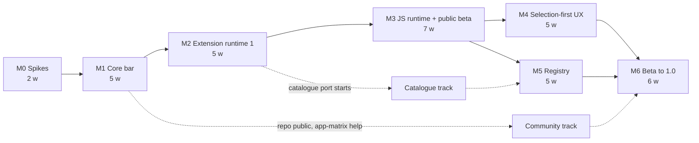

# PappuClip — Implementation plan

| | |
|---|---|
| **Status** | Draft v0.1, derived from PRD v0.4 |
| **Date** | 2026-09-20 |
| **Companion documents** | [PRD](PRD.md), [Architecture](architecture.md), [Extension platform specification](spec/extension-platform.md), [Safety specification](spec/safety.md) |

**How to read this document.** It sequences the PRD's milestones (§6, §15) into weekly work packages for one full-time developer with AI assistance. Each package names the components from the architecture document, the requirement IDs it closes, and a "done when" test. Durations are the PRD's estimates (35 weeks to 1.0) and are re-estimated at M0 exit. Component names such as `ClipboardBroker` or `PrivacyGate` are defined in the architecture document.

---

## 1. Planning rules

1. **Risk first.** The order inside each milestone puts the item most likely to invalidate the design at the front. M0 exists for the same reason.
2. **Safety mechanisms before features that use them.** Permits, IDs, the broker and the verifier land in M1 before the first action can mutate text. No later milestone retrofits them.
3. **Definition of done** for every package: code merged; tests mapped in `Tests/traceability.yaml` for each ID closed; signposts in place if the code is on the latency path; strings externalised; accessibility labels present on any new control; the compatibility guide updated if behaviour differs from PopClip.
4. **Build the shape early, the polish late.** Staged atomic install is built in M2 even though EXM-12 is a P1 that completes in M5; stable IDs and tombstones are in the M2 schema even though sync is 1.x.
5. **P1.x and P2 never enter a milestone's scope.** If a week runs over, §9 lists what moves, in order.
6. **A regression pass on the Tier A gating apps ends every milestone.** Results are published in the repo from M1.

---

## 2. Sequencing and critical path

- **Critical path:** M0 → M1 → M2 → M3. Everything user-visible after the beta depends on the JavaScript runtime.
- **M4 and M5 are independent of each other.** A solo developer runs them in sequence (M4 first, because the palette and rich results are the reasons to switch); a second contributor could take M5 in parallel.
- **The catalogue port is a background track** from M2, when packages first load. It is the best place for outside contributors and does not block any milestone until M5's exit.

---

## 3. M0 — Spikes (2 weeks)

One throwaway app, `SpikeLab`, signed with the stable development certificate. The spike **code** is discarded; the **measurement harness** (latency logger, app-matrix runner, results format) is kept and becomes the M1 test tooling.

| # | Days | Question | Method | Output and the decision it drives |
|---|---|---|---|---|
| 2 | 1–2 | Which tap type needs which permission? Can the key tap be created and destroyed on demand without delay or prompts? | Create listen-only and active session taps under each TCC state; measure create/destroy cost; confirm re-enable after timeout; confirm synthetic events from a properly signed build | Tap types for §4.1 of the architecture; onboarding copy; confirms or drops the *(unverified)* ad-hoc-signing claim in PRD §11.4 |
| 1 | 2–3 | Which window level and collection behaviour put a non-activating panel above fullscreen apps, in every Space, under Stage Manager, on macOS 15, 26 and the current beta? Does a key-capable non-activating panel leave the source app's AX focus intact? | Matrix of levels × behaviours × OS versions; record AX focused element while the palette prototype is key | Panel configuration; confirms the focus model behind BAR-1 and RUN-1c |
| 3 | 3–6 | Success rate and latency of strategies 1–5 in every Tier A app | Harness selects known text by scripted gesture, runs each strategy, logs outcome and time; include strategy 4's dependence on browser developer settings | First `DetectionPolicies.json`; the final Tier A gating list; stage budgets; whether strategy 4 stays in the automatic chain |
| 4 | 5–6 | Can the AX tree be enabled for Chromium and Electron apps without window-animation side effects? How long does it take to populate? | `AXManualAccessibility` and `AXEnhancedUserInterface` per app; observe side effects; measure time to first successful read | Enable-and-hold versus enable-per-read; per-app policy fields |
| 6 | 7–8 | Are clipboard ownership and the quiescence tier sound? Does pasteboard privacy in recent macOS affect programmatic reads? | Fixture app with delayed and lazy pasteboard providers; inject user copies at scripted offsets; measure change-count deltas per app; test `InputEpoch` against real input; test reads on macOS 15.4+ and 26 | Attribution rules and drain window for the broker; quiescence time window; per-app disable list; whether strategy 5 can remain on the automatic path anywhere |
| 5 | 9–10 | JavaScriptCore in a sandboxed XPC helper without JIT: cold start, warm memory, population round trip, host-proxied XHR | Minimal helper with one VM per extension; load three real dynamic extensions; measure ping-on-mouse-down; try `XPCSession` with Codable | Transport choice; warm-helper memory budget (§11.1); whether 15 ms population is achievable interpreter-only |

**Also in M0:** repository skeleton, development-signing script, CI that builds and runs unit tests, and the traceability file with every requirement ID listed and unmapped.

**Exit (PRD §15):** six spike reports with measurements; unsafe paths listed; gating list, hard cutoff, quiescence window and stage budgets revised; estimates for M3–M5 revisited; **source licence decided** from whether any GPL selection-detection code will be reused; PRD gaps in the architecture document's §19 resolved or carried as open items.

---

## 4. M1 — Core bar (5 weeks, P0)

Goal: a bar that appears reliably, five built-in actions, and the full safety substrate.

| Week | Work package | Closes | Done when |
|---|---|---|---|
| 1 | **Foundations.** `PappuCore`: IDs, `AttemptClock`, budget table, permit types, `AppIdentity` constants. `EventTapService` with health and rebuild; `KeyTapLease`; hotkey registration. `GestureRecognizer` with corpus replay | ACT-1, 2, 3, 7, 8, 15, 19 | Recorded gestures replay to the expected outputs; the tap survives a forced disable; no key tap exists while idle (asserted by test) |
| 2 | **Gate and reading.** `PrivacyGate` with reason codes; secure-input checks; pause with absolute expiry; app exclusions and hard blocks. `AXActor`; strategies 1–3; `DetectionPolicyStore` with the unknown-app default; `ActivationCoordinator` with invalidation through `AXObserver`, app activation and the mouse tap; baseline range at mouse-down; `AttemptTrace` ring buffer | ACT-9 (1–3), 11a, 12, 14, 16, 17a, 18 | A read is impossible without a `ReadPermit` (compile-time); every S1 precedence case has a test; a newer attempt always retires an older one in the simulation suite |
| 3 | **Clipboard and analysis.** `ClipboardBroker` state machine, snapshot rules, attribution, draining, transient marking; strategy 5 behind `SyntheticCopyPermit`; strategy 4 if spike 3 kept it. `ContentAnalyzer`; `ContextProbe` with `EditMenuProbe` | ACT-9 (4–5), 10a–j, 16c; FLT-2, 3, 6 | The race suite passes across seeded interleavings with zero lost newer writes and zero unattributed restores; read-only Chromium text offers no Cut or Paste |
| 4 | **The bar.** Pre-built panel from spike 1; `BarLayout`; button views, tooltips, callout arrow, vibrancy, accent highlight; feedback states; keyboard mode through the key tap; event-driven dismissal; VoiceOver labels and announcements; Reduce Motion, Reduce Transparency, Increase Contrast | BAR-1, 2, 3, 6, 8a, 9a, 10, 11, 12a, 14; ACT-5, 6a | Layout tests pass for multi-display and edge clamping; the bar never becomes key; keyboard mode consumes only navigation keys; a VoiceOver pass is recorded |
| 5 | **Actions and lifecycle.** `InvocationManager`, `DestinationVerifier` (both tiers), `TextMutator`, cancellation. Minimal manifest model and the reserved `builtin` executor; Cut, Copy, Paste, Search (presets and custom URL) and Open Link (multi-URL, scheme list as data) as bundled manifests. Menu bar item, Settings → General and a basic Actions list, onboarding permission flow. Static `ActionResolver` | RUN-1–5; FLT-1; built-ins (P0 five); ALM-1; ONB-1; Settings P0 | RUN-5 scenarios pass in simulation and in the fixture app; Notes → Terminal switch never pastes; Undo is one step in TextEdit, Notes and Safari text areas |

**Exit (PRD §15):** auto-appear in ≥ 80% of Tier A gating apps; the five P0 built-ins; bundled policies with the unknown-app default; exclusions, hard blocks and pause; keyboard and VoiceOver access; clipboard-race and lifecycle suites green. **The repository goes public** with the chosen licence, contribution guide and code of conduct.

---

## 5. M2 — Extension runtime 1 (5 weeks, P0)

Goal: PopClip snippets and packages with the six non-JavaScript action types, behind two-level consent.

| Week | Work package | Closes | Done when |
|---|---|---|---|
| 1 | **Parsing.** `SnippetDetector`, YAML 1.2 resolver on Yams, JSON, plist; `KeyNormalizer` with the legacy map; `ManifestBuilder`; API-level gating; identifier rules. Add the frozen-corpus submodule and a CI job that loads every package | FMT-1, 3, 4, 5, 6; §8.1, §8.3 | Every spelling variant in FMT-5 normalises correctly; the corpus load rate is reported on every commit (non-JS packages must load; JS packages must parse) |
| 2 | **Store and install.** GRDB schema with stable IDs, revisions, tombstones and `order_key`; `ExtensionStore`; `LocalIdentity`, provenance digests, `IdentityResolver`; staged install with atomic activation; install from file and from selected snippet text; uninstall when the last action is deleted; restore built-ins | FMT-7; EXM-1, 2, 9; SEC-8a–d | A killed install leaves no trace; a name collision never replaces; an identifier collision from another origin installs separately |
| 3 | **Executors 1.** `StepPipeline` for `before` and `after`; URL (all placeholders and modifiers), Key Press (combos, `wait`, three targets), Shortcut through a cancellable child process; compact result display for `show-result` and `preview-result` | §8.4 (URL, Key Press, Shortcut), §8.6; BAR-12b (display part) | Each `after` value has a test, including the stale-destination branch of `paste-result` |
| 4 | **Executors 2.** `PappuClipRunner.xpc`; AppleScript (text, file, compiled with handler, error 502) and Service (private pasteboard); Shell Script with `shellMode`, interpreter rules, stdin, both variable prefixes; Automation-permission handling; kill-to-cancel | §8.4 (Service, AppleScript, Shell), §8.7; ONB-5; RUN-3d, 3e | A hung AppleScript does not stall the bar and cancels cleanly; exit code 2 opens settings |
| 5 | **Consent, options, icons, matching.** `CapabilityAnalyzer` for non-JS types; `ConsentPresenter` with listed and gated levels; `GrantStore` and `ExecutionApproval`; minimal Extension Info with grant inspection and revocation; generated options sheet with Keychain-backed secrets; icon specifiers for text, file and SF Symbol; the full §8.5 matching pipeline | EXM-5a–d, 5g; SEC-4a–b, SEC-7a, c, d; ALM-6; FLT-5; §8.9; §8.11 (P0 forms) | No extension code path is reachable without an `ExecutionApproval`; a gated capability defaults to "Don't Allow" on every route; revoking approval invalidates a running invocation |

**Exit (PRD §15):** snippets and packages work with all six non-JS types; options; two-level consent on every install route; identity collisions never silently replace code. **Catalogue track starts.**

---

## 6. M3 — JavaScript runtime and public beta (7 weeks, P1)

Goal: API level 6221 in an isolated helper, the native additions, Import from PopClip, and a notarized public beta.

| Week | Work package | Closes | Done when |
|---|---|---|---|
| 1 | **Helper and bridge.** Sandboxed `PappuClipJSHost.xpc`; `XPCSession` transport and message types; `ExtensionVM` per extension; lifecycle (load, invoke, drop, unload); crash detection and restart; `print()` to a first Debug Console | SEC-1a, 1b, 1d; JS-1; DIA-1 | Two extensions cannot see each other's globals or module caches; killing the helper mid-action fails that action and nothing else in the app |
| 2 | **Language environment.** Globals and polyfills (timers, URL, `TextEncoder`, `Blob`, `structuredClone`, Base64, `Buffer`); bundled libraries with licence audit; module resolution through the app with containment checks; sucrase for TypeScript and ES modules; code snippets; transpile cache | JS-2, 9, 10, 11, 12, 14; FMT-2; EXM-3 | The conformance suite's environment section passes; a path escape is refused |
| 3 | **Host API.** `HostAPIDispatcher` with phase, validity and grant checks; all `popclip` state and methods; `util`; `pasteboard`; `RichString`; HTML, RTF and Markdown capture with sanitising; spinner and cancellation for async actions; load errors in the bar | JS-3, 4, 6, 7, 15; FLT-4; SEC-7b; BAR-13; EXM-10 | A call outside the grants fails and is logged without content; a promise that resolves after cancel has no effect |
| 4 | **Network, scripts, analysis.** `httpRequest` proxy with the https rule and `networkHosts`; `XMLHttpRequest` shim (axios works); external scripts and the `$` tag under the `script` grant; acorn-based reachable-method scan with the "cannot be bounded" fallback; consent phrases for JS | JS-5, 8; SEC-1c, 6; EXM-5f | A request to an undeclared host fails; consent names the hosts; an extension that aliases `popclip` is gated once with its method list |
| 5 | **Dynamic, warm helper, watchdog, auth.** Population under deadline with phase restrictions; launch-time warm-up, mouse-down ping, re-creation after teardown; CPU and memory watchdog with attribution and suspension; `auth` flow with a loopback callback listener and identity-scoped `authsecret` | JS-13, 16, 19; SEC-2, 3; §8.10 | Population never delays a bar past the target budget; a cold helper skips population and records it; three attributed crashes suspend the extension |
| 6 | **Native additions and switching.** `pappuAfter: rich-result`, `showResult`, `promptText` with functional (unpolished) panels, cancellation and click-time re-verification; Import from PopClip with the batch approval sheet; PopClip coexistence; alternate-handler registration for PopClip file types; development-folder approval and Web Inspector | JS-17, 18; RUN-2e; EXM-4, 11, 15; ONB-6; DEV-1 | An imported set with gated extensions arrives disabled until switched on; synthetic copy is withheld while PopClip runs |
| 7 | **Beta engineering.** Developer ID signing, hardened runtime, notarization script; Sparkle 2 with EdDSA and a beta channel; Settings → App tab; opt-in crash reports and beta diagnostics with text-free payload types; `pappuclip run`; conformance suite green; move built-ins to the public API where it can express them; beta notes and known-issues list | DIA-3, 4; DEV-2; §11.4; Settings (App) | A clean Mac installs, updates and runs the beta; the compatibility corpus functional pass rate is published |

**Exit (PRD §15):** API conformance; module, dynamic and auth extensions; per-extension isolation with proxied network and `networkHosts`; warm helper inside its budget; capability-checked host calls; native result and prompt APIs with cancellation and destination checks; Import from PopClip with batch approval; coexistence; **public beta released**.

---

## 7. M4 — Selection-first UX (5 weeks, P1)

| Week | Work package | Closes | Done when |
|---|---|---|---|
| 1 | **Palette.** Key-capable non-activating panel; search over names, folder paths and instance names with stable ordering; same resolver as the bar; shortcut opens the palette by default with a setting for the compact bar; focus restoration rules | BAR-16; ACT-6b; BAR-1 (palette part) | Typing never reaches the source app; closing the palette leaves the source app's focus and selection as they were |
| 2 | **Rich results and prompt polish.** TextKit 2 result panel; safe Markdown renderer; Copy, Replace Selection, Insert and Close with disabled-state explanations; results that complete after the user has moved on do not steal focus; accessible prompt | BAR-17; DIF-1a, DIF-3; RUN-2e | Replace is disabled after an app switch and says why; no network request happens while rendering any Markdown input in the fuzz set |
| 3 | **Action list.** Folders, section separators, instances, rename, specifier-string icons, Show As, duplicate; drag and drop with undo and redo; list search; bar submenus, secondary-click submenus, back-button submenus, ↑↓ folder navigation; paging with "More"; primary-button placement | ALM-2a, 3a, 4a, 5; BAR-4, 5a, 7, 9b | Undo restores any reorder exactly; nested folders work in both the list and the bar |
| 4 | **Per-app behaviour and the web.** Per-app action sets; per-app Automatic, Hotkey only and Off; website appearance rules and hard blocks with fail-closed metadata; `BrowserMetadata` capability table; address-bar activation; Dictionary, Reveal in Finder and Spelling; large-selection bounds; colour modes and size slider | ALM-8; ACT-4, 13, 17b; DIF-2a, 4a; BAR-8b; built-ins (P1 three) | A hidden action stays hidden in both bar and palette; a hard-blocked site is never read; an unknown URL blocks with an explanation; a 10-million-character selection does not hang |
| 5 | **Portability, scripting, diagnostics, management.** Configuration export and import with preview, merge or replace, and recovery snapshot; AppleScript dictionary; `pappuclip://` for settings and appear; "Why didn't it appear?" inspector over `AttemptTrace`; Manage Extensions, full Extension Info, View Source; remaining icon forms (Iconify, `svg:`, `data:`, modifiers); string externalisation audit and localisable extension strings | CFG-1–3; SCR-1, 2 (non-install); DIA-2; EXM-6, 7, 8; SEC-8h (import part); §7.12; §8.11 (P1 forms) | An export contains no secret or grant by construction; a round trip restores layout, rules and options; scripted `appear` is refused under pause with an explanation |

**Exit (PRD §15):** all P1 app UX in §7 present; accessibility verified on every new surface.

---

## 8. M5 — Registry (5 weeks, P1)

| Week | Work package | Closes | Done when |
|---|---|---|---|
| 1 | **Trust plumbing in the app.** Ed25519 package verification, pinned keys and rotation statements; `SignedDataClient` with sequence checks; remote detection policies through the restrictive merge; revocation list with immediate disable and invocation invalidation; signed capability record as the JS bound | §8.13; SEC-5, 9; ACT-11b; EXM-5e | A tampered or replayed document is rejected; a remote policy that tries to enable synthetic copy for a user-restricted app has no effect |
| 2 | **Registry repo and checks.** Entry format; `pappuclip registry check` (PUB-4 rules, identifier stability, write-access proof, capability summary from the shared analyser); pull-request workflow on macOS runners; `pappuclip-directory.yaml` with the `popclip-directory.yaml` fallback; tag rules; review policy and merger list; template repo with the tag-triggered Action | PUB-1–5, 7 | A pull request from someone without write access to the source repo fails; the capability summary on the pull request matches what the app shows at install |
| 3 | **Release workflow, index, website.** Build from the pinned commit, strip, sign in the protected environment, upload, regenerate; documented index format; static website with categories, search including descriptions, listing pages, author pages, newly added, featured; install link and plain-download fallback; "Get Extensions" | PUB-6; §9.6; DIR-1–5; STORE-1; SCR-2 (install) | Merge to live listing needs no manual step other than the environment approval; `pappuclip://install` always ends in the in-app confirmation |
| 4 | **Updates and recovery.** `UpdateService` with local comparison against the static index; background staged updates; capability-delta approval; rollback UI with revalidation; per-extension update pause; downgrade refusal; safe mode with automatic entry after repeated early crashes | §9.4; EXM-5h, 12, 13, 14; SEC-8e–g | The trust-and-recovery suite passes: interrupted download, failed validation, denied delta, rollback to a revoked version refused, safe-mode launch with a crashing extension |
| 5 | **Catalogue and author experience.** Finish the ported packages for every required workflow in §9.5, each with a verification record; Copy with Source; `replaces` mappings with reviewed option migration; TypeScript definitions written from the public documentation; developer documentation site with the differences guide | CAT-1; §9.5 gate; DEV-3, 4 | Every required workflow has a signed, functionally verified package; Copy with Source offers quotation-only output when metadata is missing |

**Exit (PRD §15):** end to end from registry pull request to installed update; atomic failure recovery, rollback, revocation, safe mode and capability-increase consent; §9.5 workflow and quality gates met.

---

## 9. M6 — Beta to 1.0 (6 weeks)

| Weeks | Work package | Done when |
|---|---|---|
| 1–2 | **Corpus and conformance.** Freeze the upstream commit; publish the manifest with eligibility, exclusions recorded before testing, load and functional results on the common denominator; fix the highest-impact failures | ≥ 98% load, ≥ 95% functional, with blocked and untested cases reported as non-passes |
| 2–3 | **App matrix hardening.** Full gesture corpus on the declared Apple Silicon and Intel reference machines with 50 extensions; tune policies; publish gating and tracked results; clipboard-manager interoperability list (ACT-10i) | 100% of gating apps; missed appearances ≤ 2%; false positives ≤ 1%; p95 latency targets met, cold and warm reported separately |
| 3–4 | **Onboarding and polish.** Try-it area, move-to-Applications offer, stale-grant recovery; accessibility audit of every surface; memory and idle-CPU checks; login-launch time | ONB-2, 3, 4 closed; < 80 MB resident, < 0.5% idle CPU, ready within one second |
| 4–5 | **Documentation and governance.** User guide, compatibility guide with every safety exception, unsupported-path list, privacy policy naming every endpoint, contributor build guide, review policy, roadmap; GitHub Discussions categories; Homebrew cask | Documents live; §9.7 and §13 governance items closed |
| 5–6 | **Release.** Legal checklist from §14 (register searches recorded, non-affiliation notices, logo review); decision on the courtesy contact; release candidate soak with opt-in diagnostics; 1.0 | Every P0 and P1 ID mapped to a passing test or signed-off checklist item; no open reproducible crash; crash-free sessions ≥ 99.8% or counts reported per §3.3 |

---

## 10. Cross-cutting tracks

| Track | Runs | Content |
|---|---|---|
| **Traceability** | M0 → 1.0 | Every ID and lettered part listed from day one; CI reports unmapped IDs in scope for the current milestone |
| **Latency instrumentation** | M1 → 1.0 | Signposts per stage; a script turns a harness run into p95 figures; results committed per milestone |
| **App-matrix regression** | End of every milestone | Gating apps each time; tracked apps from M3 |
| **Catalogue port** | M2 → M5 | Licence and bundled-code check, new identifier with `replaces`, `networkHosts`, logo review, functional smoke test on the distributed package. Tier 1 categories first (Appendix C) |
| **Compatibility watch** | Continuous | PopClip developer changelog; bump the emulated API level deliberately, with conformance tests |
| **macOS betas** | Continuous | Run the taps, panel and clipboard suites on each new beta (risk table, PRD §17) |
| **Documentation** | From M2 | Differences guide grows with every safety exception introduced |

---

## 11. Requirement coverage

Where each requirement lands. A range means the mechanism is built in the first milestone and completed in the last.

| Family | M1 | M2 | M3 | M4 | M5 | M6 | 1.x / P2 |
|---|---|---|---|---|---|---|---|
| ACT | 1–3, 5, 6a, 7–10, 11a, 12, 14–16, 17a, 18, 19 | — | — | 4, 6b, 13, 17b | 11b | — | — |
| BAR | 1–3, 6, 8a, 9a, 10, 11, 12a, 14 | 12b (display) | 12b (click-to-paste), 13, 17 (functional) | 4, 5a, 7, 8b, 9b, 16, 17 | — | — | 5b, 8c, 15 |
| FLT | 1, 2, 3, 6 | 5 | 4 | — | — | — | — |
| Built-ins | Cut, Copy, Paste, Search, Open Link | — | migrate to public API | Dictionary, Reveal, Spelling | — | — | — |
| ALM | 1 | 6 | — | 2a, 3a, 4a, 5, 8 | — | — | 2b, 3b, 4b, 7, 9 |
| EXM | — | 1, 2, 5a–d, 5g, 9 | 3, 4, 5f, 10, 11, 15 | 6, 7, 8 | 5e, 5h, 12, 13, 14 | — | — |
| RUN | 1–5 | — | 2e | 2e (polish) | — | — | — |
| SEC | — | 4, 7a, 7c, 7d, 8a–d | 1, 2, 3, 6, 7b | 8h (import) | 5, 8e–g, 8h (rollback), 9 | — | — |
| FMT | — | 1, 3–7 | 2 | — | — | — | — |
| JS | — | — | 1–19 | — | — | — | — |
| CFG, SCR | — | — | — | CFG-1–3, SCR-1, SCR-2 (part) | SCR-2 (install) | — | — |
| ONB | 1 | 5 | 6 | — | — | 2, 3, 4 | — |
| DIA | trace capture | — | 1, 3, 4 | 2 | — | — | — |
| DEV | — | — | 1, 2 | — | 3, 4 | — | 5, 6 |
| PUB, DIR, STORE, CAT | — | — | — | — | PUB-1–7, DIR-1–5, STORE-1, CAT-1 | — | DIR-6, STORE-2 |
| SYN | — | storage shape only | — | — | — | — | 1–4 |
| Localization, community | externalise from the start | — | — | audit, localisable extension strings | — | Discussions, guides | community translations |

---

## 12. Checkpoints and levers

**Go/no-go checkpoints.**

| When | Question | If the answer is no |
|---|---|---|
| M0 exit | Do strategies 1–3 reach the gating apps inside the budget? | Shrink the gating list with recorded reasons, or make more apps hotkey-only. Do not weaken clipboard rules to compensate |
| M0 exit | Is the quiescence tier sound? | Disable it by default; legacy `paste-result` falls back to explicit copy in non-AX apps; document the loss |
| M0 exit | Does interpreter-only population fit 15 ms? | Raise the helper's priority, reduce what is passed per population, or make population opt-in per extension; the target budget does not move |
| M1 exit | Are the race and lifecycle suites green with zero violations? | Do not start M2. These are the product's core promises |
| M3 week 5 | Is warm-helper memory acceptable? | Warm only recently used dynamic extensions |
| M3 exit | Is the corpus functional rate on track for 95%? | Spend M6 weeks 1–2 earlier; the rate is a release gate |
| M5 week 3 | Is a 150-package catalogue realistic? | It is a stretch target; ship on workflow coverage (§9.5) |

**If a milestone runs over**, move items in this order. Each is a P1, so moving it past 1.0 needs a PRD revision rather than a quiet slip: DIR-4 (author pages, featured slot) → ACT-4 (address-bar activation) → BAR-8b (colour modes and size slider) → EXM-8 viewer extras → strategy 4 on the automatic path → Iconify icons in 1.0. Never move: anything in the safety specification, RUN, ACT-10, ACT-16, EXM-5, EXM-12–14.

---

## 13. The first ten working days

1. Create the repository skeleton from the architecture document's §15; add the development-signing script and confirm the Accessibility grant survives a rebuild.
2. Add CI (build and unit tests) and `Tests/traceability.yaml` with every requirement ID.
3. Build `SpikeLab` with the latency logger and results format.
4. Spike 2 (taps and permissions), then spike 1 (panel and focus).
5. Spikes 3 and 4 across the provisional gating list; write the first `DetectionPolicies.json` from the data.
6. Spike 6, including the pasteboard-privacy check on current macOS.
7. Spike 5 (helper, transport, population timing).
8. Write the six spike reports; revise budgets, the gating list, the cutoff and the quiescence window in the PRD.
9. Resolve the items in the architecture document's §19, in particular ACT-19 during a pending attempt and the `builtin` executor.
10. Decide the licence; re-estimate M3–M5; open M1.
